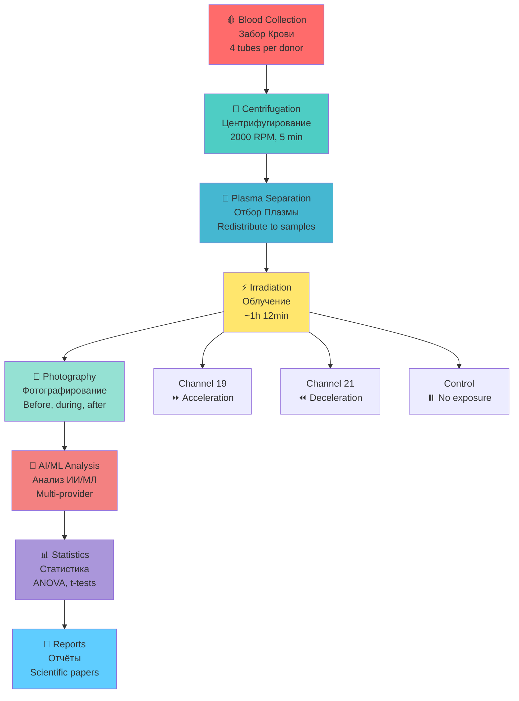
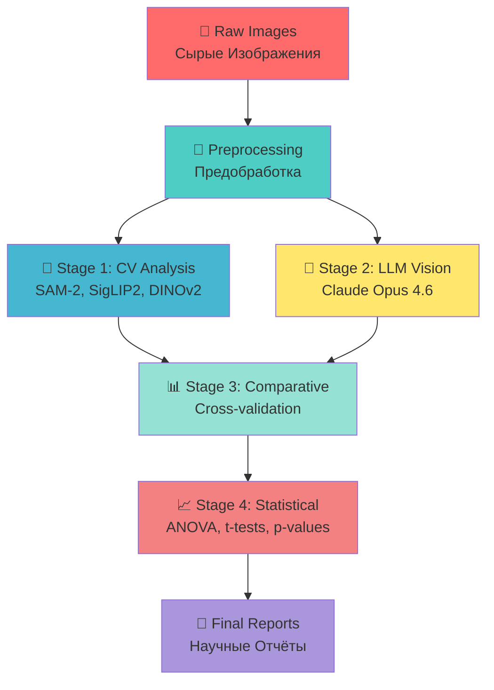

# 📜 HYPERBOLIC FIELD BLOOD PLASMA COAGULATION STUDY PROTOCOL / ИССЛЕДОВАНИЕ СВЁРТЫВАЕМОСТИ ПЛАЗМЫ КРОВИ ПОД ВОЗДЕЙСТВИЕМ ГИПЕРБОЛИЧЕСКОГО ПОЛЯ

**ASRP RESEARCH MASTER PROTOCOL / МАСТЕР ПРОТОКОЛ ИССЛЕДОВАНИЯ ASRP**

**Protocol Version / Версия Протокола:** 1.0  
**Date / Дата:** January-February 2026 / Январь-Февраль 2026  
**Status / Статус:** ✅ Complete / Завершено

---

## 📋 TABLE OF CONTENTS / СОДЕРЖАНИЕ

| # | Section / Раздел | Link / Ссылка |
|---|-----------------|---------------|
| 1 | [Executive Summary / Краткое Изложение](#1-executive-summary--краткое-изложение) | [Jump](#1-executive-summary--краткое-изложение) |
| 2 | [Research Team / Команда Исследования](#2-research-team--команда-исследования) | [Jump](#2-research-team--команда-исследования) |
| 3 | [Scientific Background / Научная Основа](#3-scientific-background--научная-основа) | [Jump](#3-scientific-background--научная-основа) |
| 4 | [Experimental Design / Дизайн Эксперимента](#4-experimental-design--дизайн-эксперимента) | [Jump](#4-experimental-design--дизайн-эксперимента) |
| 5 | [Materials and Methods / Материалы и Методы](#5-materials-and-methods--материалы-и-методы) | [Jump](#5-materials-and-methods--материалы-и-методы) |
| 6 | [Data Collection / Сбор Данных](#6-data-collection--сбор-данных) | [Jump](#6-data-collection--сбор-данных) |
| 7 | [AI/ML Analysis / ИИ/МЛ Анализ](#7-aiml-analysis--иимл-анализ) | [Jump](#7-aiml-analysis--иимл-анализ) |
| 8 | [Results / Результаты](#8-results--результаты) | [Jump](#8-results--результаты) |
| 9 | [Conclusions / Выводы](#9-conclusions--выводы) | [Jump](#9-conclusions--выводы) |
| 10 | [References / Ссылки](#10-references--ссылки) | [Jump](#10-references--ссылки) |

---

## 1. EXECUTIVE SUMMARY / КРАТКОЕ ИЗЛОЖЕНИЕ

### ENGLISH

The Hyperbolic Field Blood Plasma Coagulation Study is an experimental research project investigating the effects of hyperbolic field exposure on blood plasma coagulation dynamics.

**Study Period / Период Исследования:** January 24 – February 7, 2026 / 24 января – 7 февраля 2026

**Key Parameters / Ключевые Параметры:**
- **7 donors (patients 01-07) / 7 доноров (пациенты 01-07)**
- **101 photographs of plasma samples / 101 фотография образцов плазмы**
- **3 experimental groups: Control, Channel 19 (time acceleration), Channel 21 (time deceleration) / 3 экспериментальные группы: Контроль, Канал 19 (ускорение времени), Канал 21 (замедление времени)**
- **Irradiation duration: ~1 hour 12 minutes / Длительность облучения: ~1 час 12 минут**
- **Temperature: 17°C (constant, smart home monitoring) / Температура: 17°C (постоянно, мониторинг умным домом)**

**Key Findings / Ключевые Выводы:**
- **Channel 19 (acceleration): 37% fewer clots, 42% smaller clot area, only channel showing lysis (clot decomposition) / Канал 19 (ускорение): на 37% меньше сгустков, на 42% меньше площадь сгустков, единственный канал с лизисом (разложением сгустка)**
- **Channel 21 (deceleration): 41% clot rate vs 65% control, delayed but dense clot formation / Канал 21 (замедление): 41% частота сгустков против 65% контроля, замедленное но плотное формирование сгустка**
- **Control: Baseline coagulation progression / Контроль: Базовая прогрессия свёртывания**

**Analysis Methods / Методы Анализа:**
- **Multi-LLM Vision Analysis (8 providers, including Claude Opus 4.6) / Мульти-LLM Vision Анализ (8 провайдеров, включая Claude Opus 4.6)**
- **Computer Vision (SAM-2, SigLIP2, DINOv2) / Компьютерное Зрение (SAM-2, SigLIP2, DINOv2)**
- **Classical CV metrics (GLCM, entropy, edge density) / Классические CV метрики (GLCM, энтропия, плотность краёв)**

### РУССКИЙ

Исследование свёртываемости плазмы крови под воздействием гиперболического поля — экспериментальный исследовательский проект, изучающий влияние гиперболического поля на динамику свёртывания плазмы крови.

**Период исследования:** 24 января – 7 февраля 2026

**Ключевые параметры:**
- **7 доноров (пациенты 01-07)**
- **101 фотография образцов плазмы**
- **3 экспериментальные группы: Контроль, Канал 19 (ускорение времени), Канал 21 (замедление времени)**
- **Длительность облучения: ~1 час 12 минут**
- **Температура: 17°C (постоянно, мониторинг умным домом)**

**Ключевые выводы:**
- **Канал 19 (ускорение): на 37% меньше сгустков, на 42% меньше площадь сгустков, единственный канал с лизисом (разложением сгустка)**
- **Канал 21 (замедление): 41% частота сгустков против 65% контроля, замедленное но плотное формирование сгустка**
- **Контроль: Базовая прогрессия свёртывания**

**Методы анализа:**
- **Мульти-LLM Vision анализ (8 провайдеров, включая Claude Opus 4.6)**
- **Computer Vision (SAM-2, SigLIP2, DINOv2)**
- **Классические CV метрики (GLCM, энтропия, плотность краёв)**

---

## 2. RESEARCH TEAM / КОМАНДА ИССЛЕДОВАНИЯ

### 2.1 LEADERSHIP & CO-AUTHORS / РУКОВОДСТВО И СОАВТОРЫ

| Name / Имя | Role / Роль | Responsibilities / Обязанности | Email |
|------------|-------------|-------------------------------|-------|
| **👨‍💼 BANCHENKO DENIS YURIEVICH / БАНЧЕНКО ДЕНИС ЮРЬЕВИЧ** | CEO ASRP / Генеральный Директор ASRP; Program Director / Директор Программы; Technology Co-Author / Соавтор Технологии | Hyperbolic field physics / Физика гиперболических полей; Excitation systems / Системы возбуждения; Lensing & focusing / Линзирование и фокусировка; Control software / ПО управления | [denisbanchenko@asrp.tech](mailto:denisbanchenko@asrp.tech) |
| **👩‍⚕️ OVSEANNIKOVA VALERIA ALEXANDROVNA / ОВСЯННИКОВА ВАЛЕРИЯ АЛЕКСАНДРОВНА** | CBE (Chief Biomedical Engineer) / Главный Биомедицинский Инженер; Director of Biomedical Research / Руководитель Департамента Биомедицинских Исследований; Technology Co-Author / Соавтор Технологии | Lead Researcher / Ведущий исследователь; Experimental design / Дизайн эксперимента; Blood plasma protocol / Протокол работы с плазмой; Electronic control systems / Электронные системы управления | [valeriaovseannicova@asrp.tech](mailto:valeriaovseannicova@asrp.tech) |
| **👨‍💻 KAPUSTIN MYKHAILO MYKHALOVICH / КАПУСТИН МИХАЙЛО МИХАЙЛОВИЧ** | CTO (Chief Technology Officer) / Технический Директор; Director of IT & AI / Директор Департамента ИТ и ИИ; Technology Co-Author / Соавтор Технологии | IT/AI Infrastructure / ИТ/ИИ инфраструктура; Data systems / Системы данных; Technical platform / Техническая платформа; Control systems / Системы управления | [mykhailokapustin@asrp.tech](mailto:mykhailokapustin@asrp.tech) |
| **🔬 ZMIENKO KYRYL / ЗМИЕНКО КИРИЛЛ** | Chief AI Engineer / Главный ИИ Инженер | Neural Network Analysis / Анализ нейронными сетями; Multi-LLM coordination / Координация мульти-LLM; Specialized vision models / Специализированные vision модели; Statistical analysis / Статистический анализ | [kyrylzmiienko@asrp.tech](mailto:kyrylzmiienko@asrp.tech) |
| **⚡ OVSYANNIKOV ALEXANDR / ОВСЯННИКОВ АЛЕКСАНДР** | Chief Electrical Engineer / Главный Инженер по Электронике; Technology Engineer / Инженер Технологии | Electrical & Power Systems / Электрические и силовые системы; Hyperbolic emitter excitation / Системы возбуждения гиперболических излучателей; Power components design / Проектирование силовых компонентов | [alexandrovsyannikov@asrp.tech](mailto:alexandrovsyannikov@asrp.tech) |

### 2.2 COLLABORATORS / КОЛЛАБОРАТОРЫ

| Name / Имя | Organization / Организация | Role / Роль | Email |
|------------|---------------------------|-------------|-------|
| **📚 SAVELYEV IVAN / САВЕЛЬЕВ ИВАН** | ASRP.science | Science Director / Директор по Науке; Editor-in-Chief / Главный Редактор | [ivansavelev@asrp.science](mailto:ivansavelev@asrp.science) |
| **🔬 CHIRKIVA OLESYA / ЧИРКИВА ОЛЕСЯ** | SASU Point Rouge France | Independent Researcher / Независимый Исследователь; Blood Plasma Specialist / Специалист по Плазме Крови | [point.rouge.ch@gmail.com](mailto:point.rouge.ch@gmail.com) |

---

## 3. SCIENTIFIC BACKGROUND / НАУЧНАЯ ОСНОВА

### 3.1 HYPOTHESIS / ГИПОТЕЗА

#### ENGLISH

**Primary Hypothesis / Основная Гипотеза:** Hyperbolic field exposure affects blood plasma coagulation dynamics through temporal modulation / Воздействие гиперболического поля влияет на динамику свёртывания плазмы крови через временную модуляцию.

| Channel / Канал | Effect / Эффект | Expected Outcome / Ожидаемый Результат |
|-----------------|-----------------|----------------------------------------|
| **Channel 19 / Канал 19** | Time acceleration / Ускорение времени | Faster coagulation lifecycle — rapid clot formation progressing to lysis / Более быстрый жизненный цикл свёртывания — быстрое формирование сгустка с переходом в лизис |
| **Channel 21 / Канал 21** | Time deceleration / Замедление времени | Slower coagulation onset — delayed but dense clot formation / Более медленное начало свёртывания — замедленное но плотное формирование сгустка |
| **Control (Channel 0) / Контроль (Канал 0)** | No exposure / Без воздействия | Baseline coagulation rate / Базовая скорость свёртывания |

#### РУССКИЙ

**Основная гипотеза:** Воздействие гиперболического поля влияет на динамику свёртывания плазмы крови через временную модуляцию.

| Канал | Эффект | Ожидаемый Результат |
|-------|--------|---------------------|
| **Канал 19** | Ускорение времени | Более быстрый жизненный цикл свёртывания — быстрое формирование сгустка с переходом в лизис |
| **Канал 21** | Замедление времени | Более медленное начало свёртывания — замедленное но плотное формирование сгустка |
| **Контроль (Канал 0)** | Без воздействия | Базовая скорость свёртывания |

---

## 4. EXPERIMENTAL DESIGN / ДИЗАЙН ЭКСПЕРИМЕНТА

### 4.1 STUDY OVERVIEW / ОБЗОР ИССЛЕДОВАНИЯ

#### ENGLISH

- **Study Type / Тип Исследования:** Controlled laboratory experiment with repeated measures / Контролируемый лабораторный эксперимент с повторными измерениями
- **Study Period / Период Исследования:** January 24 – February 7, 2026 / 24 января – 7 февраля 2026
- **Location / Место Проведения:** ASRP Biomedical Research Laboratory (collaboration with independent laboratory) / Лаборатория биомедицинских исследований ASRP (коллаборация с независимой лабораторией)
- **Sample Size / Размер Выборки:** 7 donors (patients 01-07) / 7 доноров (пациенты 01-07)
- **Total Samples / Всего Образцов:** 40+ single-channel plasma samples / 40+ одноканальных образцов плазмы
- **Total Photographs / Всего Фотографий:** 101 images / 101 изображение

#### РУССКИЙ

- **Тип исследования:** Контролируемый лабораторный эксперимент с повторными измерениями
- **Период исследования:** 24 января – 7 февраля 2026
- **Место проведения:** Лаборатория биомедицинских исследований ASRP (коллаборация с независимой лабораторией)
- **Размер выборки:** 7 доноров (пациенты 01-07)
- **Всего образцов:** 40+ одноканальных образцов плазмы
- **Всего фотографий:** 101 изображение

### 4.2 EXPERIMENTAL PROTOCOL / ПРОТОКОЛ ЭКСПЕРИМЕНТА



#### ENGLISH

**Step-by-step procedure for each patient / Пошаговая процедура для каждого пациента:**

1. **Blood Collection / Забор крови**
   - 4 collection tubes per donor / 4 пробирки на донора
   - Standard venipuncture procedure / Стандартная процедура венепункции
   - Anticoagulant-free tubes for plasma separation / Пробирки без антикоагулянта для разделения плазмы

2. **Centrifugation / Центрифугирование**
   - Speed: 2000 RPM / Скорость: 2000 об/мин
   - Duration: 5 minutes / Длительность: 5 минут
   - Temperature: Room temperature (~17°C) / Температура: Комнатная (~17°C)

3. **Plasma Separation / Отбор плазмы**
   - Plasma from 4 tubes combined / Плазма из 4 пробирок объединяется
   - Redistributed into sample tubes / Распределяется в пробирки-образцы:
     - 2 control samples (no irradiation) / 2 контрольных образца (без облучения)
     - 1 sample for Channel 19 exposure / 1 образец для воздействия Канала 19
     - 1 sample for Channel 21 exposure / 1 образец для воздействия Канала 21
   - Volume: 1-1.5 ml per sample / Объём: 1-1.5 мл на образец

4. **Irradiation / Облучение**
   - Channel 19: Time acceleration mode (~35-40 min) / Канал 19: Режим ускорения времени (~35-40 мин)
   - Channel 21: Time deceleration mode (~35-40 min) / Канал 21: Режим замедления времени (~35-40 мин)
   - Control: Placed 1.5m from emitters (no exposure) / Контроль: Размещён в 1.5м от излучателей (без воздействия)
   - Total irradiation duration: ~1 hour 12 minutes per patient / Общая длительность облучения: ~1 час 12 минут на пациента

5. **Documentation / Документирование**
   - Photography before, during, and after irradiation / Фотографирование до, во время и после облучения
   - iPhone 16 Pro Max (HEIC format, converted to JPG) / iPhone 16 Pro Max (формат HEIC, конвертировано в JPG)
   - LED backlight panel for consistent illumination / LED панель подсветки для консистентного освещения
   - Glass test tubes for optical clarity / Стеклянные пробирки для оптической прозрачности

6. **Environmental Monitoring / Мониторинг окружающей среды**
   - Temperature: 17°C constant (smart home system) / Температура: 17°C постоянно (система умного дома)
   - Lighting: Artificial lab lighting + LED panel / Освещение: Искусственное лабораторное + LED панель
   - Humidity: Not recorded (limitation) / Влажность: Не записывалась (ограничение)

#### РУССКИЙ

**Пошаговая процедура для каждого пациента:**

1. **Забор крови**
   - 4 пробирки на донора
   - Стандартная процедура венепункции
   - Пробирки без антикоагулянта для разделения плазмы

2. **Центрифугирование**
   - Скорость: 2000 об/мин
   - Длительность: 5 минут
   - Температура: Комнатная (~17°C)

3. **Отбор плазмы**
   - Плазма из 4 пробирок объединяется
   - Распределяется в пробирки-образцы:
     - 2 контрольных образца (без облучения)
     - 1 образец для воздействия Канала 19
     - 1 образец для воздействия Канала 21
   - Объём: 1-1.5 мл на образец

4. **Облучение**
   - Канал 19: Режим ускорения времени (~35-40 мин)
   - Канал 21: Режим замедления времени (~35-40 мин)
   - Контроль: Размещён в 1.5м от излучателей (без воздействия)
   - Общая длительность облучения: ~1 час 12 минут на пациента

5. **Документирование**
   - Фотографирование до, во время и после облучения
   - iPhone 16 Pro Max (формат HEIC, конвертировано в JPG)
   - LED панель подсветки для консистентного освещения
   - Стеклянные пробирки для оптической прозрачности

6. **Мониторинг окружающей среды**
   - Температура: 17°C постоянно (система умного дома)
   - Освещение: Искусственное лабораторное + LED панель
   - Влажность: Не записывалась (ограничение)

---

## 5. MATERIALS AND METHODS / МАТЕРИАЛЫ И МЕТОДЫ

### 5.1 EQUIPMENT / ОБОРУДОВАНИЕ

| Equipment / Оборудование | Specification / Спецификация | Purpose / Назначение |
|-------------------------|-----------------------------|---------------------|
| **Centrifuge / Центрифуга** | 2000 RPM, 5 min | Plasma separation / Разделение плазмы |
| **Hyperbolic Field Emitters / Излучатели Гиперболических Полей** | Channels 19 & 21 / Каналы 19 и 21 | Sample irradiation / Облучение образцов |
| **iPhone 16 Pro Max** | HEIC → JPG conversion | Photography / Фотографирование |
| **LED Backlight Panel / LED Панель Подсветки** | Constant illumination / Постоянное освещение | Sample imaging / Визуализация образцов |
| **Glass Test Tubes / Стеклянные Пробирки** | Standard laboratory grade / Стандартная лабораторная категория | Sample containment / Содержание образцов |
| **Smart Home System / Система Умного Дома** | Temperature monitoring / Мониторинг температуры | Environmental control (17°C) / Контроль среды (17°C) |

### 5.2 PHOTOGRAPHY PROTOCOL / ПРОТОКОЛ ФОТОГРАФИРОВАНИЯ

#### ENGLISH

**Camera Settings / Настройки Камеры:**
- **Device / Устройство:** iPhone 16 Pro Max
- **Format / Формат:** HEIC (original) → JPG (converted for analysis) / HEIC (оригинал) → JPG (конвертировано для анализа)
- **Lighting / Освещение:** LED panel from below + artificial lab lighting / LED панель снизу + искусственное лабораторное освещение
- **Angles / Углы:** Variable (side, top, bottom macro, tilted) / Различные (сбоку, сверху, снизу макро, наклонные)
- **Consistency / Консистентность:** Within each patient, all channels photographed under identical conditions / В пределах каждого пациента все каналы фотографировались в идентичных условиях

**Photo Categories / Категории Фотографий:**
- **40 labeled single-channel / 40 маркированных одноканальных** (13 control, 14 ch19, 13 ch21 / 13 контроль, 14 канал19, 13 канал21)
- **15 EXIF-inferred single-channel / 15 выведенных из EXIF одноканальных** (patient-07 / пациент-07)
- **34 multi-channel comparison / 34 многоканальных сравнительных** (2-6 tubes per photo, 75 tubes total / 2-6 пробирок на фото, 75 пробирок всего)
- **12 unclassified / 12 неклассифицированных** (no protocol label available / нет метки протокола)

#### РУССКИЙ

**Настройки Камеры:**
- **Устройство:** iPhone 16 Pro Max
- **Формат:** HEIC (оригинал) → JPG (конвертировано для анализа)
- **Освещение:** LED панель снизу + искусственное лабораторное освещение
- **Углы:** Различные (сбоку, сверху, снизу макро, наклонные)
- **Консистентность:** В пределах каждого пациента все каналы фотографировались в идентичных условиях

**Категории Фотографий:**
- **40 маркированных одноканальных** (13 контроль, 14 канал19, 13 канал21)
- **15 выведенных из EXIF одноканальных** (пациент-07)
- **34 многоканальных сравнительных** (2-6 пробирок на фото, 75 пробирок всего)
- **12 неклассифицированных** (нет метки протокола)

---

## 6. DATA COLLECTION / СБОР ДАННЫХ

### 6.1 DATA STRUCTURE / СТРУКТУРА ДАННЫХ

```
HyperbolicField-BloodPlasma-Study/
├── data/
│   ├── patient-01/
│   │   ├── en/README.md
│   │   ├── ru/README.md
│   │   ├── analysis.json
│   │   ├── metadata.json
│   │   ├── protocol_part-01.pdf
│   │   └── photos/
│   │       ├── original/ (HEIC)
│   │       └── jpg/ (converted)
│   ├── patient-02/
│   ├── ... (patients 03-07)
├── processed/
│   ├── en/all_patients.json
│   └── ru/all_patients.json
├── reports/
│   ├── experiment_protocol_en.md
│   ├── experiment_protocol_ru.md
│   ├── 2026-02-25_ai-analysis/
│   └── 2026-02-26_llm-vision-analysis/
├── notebooks/
│   └── cv_analysis.ipynb (42.9 MB)
└── scripts/
    ├── multi_llm_analysis.py
    ├── generate_charts.py
    └── ...
```

### 6.2 DATA VOLUME / ОБЪЁМ ДАННЫХ

| Data Type / Тип Данных | Volume / Объём | Location / Расположение |
|------------------------|----------------|-------------------------|
| **📸 Total Photos / Всего Фотографий** | 101 images / 101 изображение | `data/patient-XX/photos/` |
| **📄 PDF Protocols / PDF Протоколы** | ~131 MB | `data/patient-01/` |
| **📓 Jupyter Notebooks / Jupyter Ноутбуки** | 42.9 MB | `notebooks/` |
| **📊 JSON Analysis Files / JSON Файлы Анализа** | ~1.2 MB | `data/patient-XX/`, `processed/` |
| **📄 Reports / Отчёты** | Multiple / Несколько | `reports/` |

### 6.3 PATIENT SUMMARY / СВОДКА ПО ПАЦИЕНТАМ

| Patient / Пациент | Date / Дата | Blood Group / Группа Крови | Samples / Образцы | Photos / Фото | Irradiation Time / Время Облучения |
|-------------------|-------------|---------------------------|-------------------|---------------|-----------------------------------|
| **01** | 2026-01-24 | II+ | 0.1.1, 0.1.2, 19.1.1, 21.1.1 | 13 | 19:18–20:30 |
| **02** | 2026-01-28 | III+ | 0.2.1, 0.2.2, 19.2.1, 19.2.2, 21.2.1, 21.2.2 | 25 | 20:09–21:24 |
| **03** | 2026-01-29 | IV- | 0.3.1, 0.3.2, 19.3.1, 21.3.1 | 16 | 21:35–22:43 |
| **04** | 2026-01-30 | IV+ | 0.4.1, 0.4.2, 19.4.1, 21.4.1 | 4 | 16:13–17:47 |
| **05** | 2026-01-31 | — | 0.5.1, 19.5.1, 21.5.1 | 10 | –01:21 |
| **06** | 2026-02-01 | I+ | 0.6.1, 0.6.2, 19.6.1, 21.6.1, 19.6.2, 21.6.2 | 3 | –22:17 |
| **07** | 2026-02-07 | — | 0.7.1, 0.7.2, 19.7.1, 21.7.1, 19.7.2, 21.7.2 | 30 | 20:15–21:36 |

---

## 7. AI/ML ANALYSIS / ИИ/МЛ АНАЛИЗ

### 7.1 ANALYSIS PIPELINE / КОНВЕЙЕР АНАЛИЗА



#### ENGLISH

**Multi-Stage Analysis Approach / Многоэтапный Подход к Анализу:**

1. **Stage 1: Computer Vision Analysis (ASRP Science-LLM v0.5) / Этап 1: Computer Vision Анализ (ASRP Science-LLM v0.5)**
   - SAM-2 segmentation (Meta) / Сегментация SAM-2 (Meta)
   - SigLIP2 classification (Google) / Классификация SigLIP2 (Google)
   - DINOv2 embeddings (Meta) / Embeddings DINOv2 (Meta)
   - Classical CV metrics (OpenCV, scikit-image) / Классические CV метрики (OpenCV, scikit-image)

2. **Stage 2: LLM Vision Analysis (Claude Opus 4.6) / Этап 2: LLM Vision Анализ (Claude Opus 4.6)**
   - Direct photo examination / Прямое изучение фотографий
   - Coagulation stage classification / Классификация стадий свёртывания
   - Structured annotations / Структурированные аннотации

3. **Stage 3: Comparative Analysis / Этап 3: Сравнительный Анализ**
   - Cross-validation between CV and LLM results / Кросс-валидация между результатами CV и LLM
   - Statistical significance testing / Тестирование статистической значимости
   - Chart generation / Генерация графиков

4. **Stage 4: Final Synthesis / Этап 4: Финальный Синтез**
   - Consolidated findings / Консолидированные выводы
   - Hypothesis validation / Валидация гипотезы
   - Recommendations for future studies / Рекомендации для будущих исследований

#### РУССКИЙ

**Многоэтапный Подход к Анализу:**

1. **Этап 1: Computer Vision Анализ (ASRP Science-LLM v0.5)**
   - Сегментация SAM-2 (Meta)
   - Классификация SigLIP2 (Google)
   - Embeddings DINOv2 (Meta)
   - Классические CV метрики (OpenCV, scikit-image)

2. **Этап 2: LLM Vision Анализ (Claude Opus 4.6)**
   - Прямое изучение фотографий
   - Классификация стадий свёртывания
   - Структурированные аннотации

3. **Этап 3: Сравнительный Анализ**
   - Кросс-валидация между результатами CV и LLM
   - Тестирование статистической значимости
   - Генерация графиков

4. **Этап 4: Финальный Синтез**
   - Консолидированные выводы
   - Валидация гипотезы
   - Рекомендации для будущих исследований

### 7.2 COAGULATION STAGE SCALE / ШКАЛА СТАДИЙ СВЁРТЫВАНИЯ

| Stage / Стадия | Description / Описание |
|---------------|------------------------|
| **none** | No visible coagulation / Нет видимого свёртывания — clear or homogeneous plasma / прозрачная или однородная плазма |
| **early_fibrin** | Initial fibrin formation / Начальное образование фибрина — faint strands, films, or hazing / слабые нити, плёнки или дымка |
| **partial_clot** | Defined clot mass present / Определённая масса сгустка присутствует — not fully consolidated / не полностью консолидирован |
| **full_coagulation** | Large, dense, well-formed clot / Большой, плотный, хорошо сформированный сгусток — occupying significant volume / занимающий значительный объём |
| **lysis** | Clot decomposition / Разложение сгустка — cracked, fragmented, or dissolving fibrin network / треснувшая, фрагментированная или растворяющаяся фибриновая сеть |

### 7.3 ANALYSIS PROVIDERS / ПРОВАЙДЕРЫ АНАЛИЗА

| Provider / Провайдер | Model / Модель | Analysis Type / Тип Анализа | Status / Статус |
|---------------------|----------------|----------------------------|-----------------|
| **ASRP Science-LLM** | SAM-2 + SigLIP2 + DINOv2 | Computer Vision + ML / Компьютерное Зрение + МЛ | ✅ Complete / Завершено |
| **Claude Opus 4.6** | Multimodal / Мультимодальный | LLM Vision / LLM Визион | ✅ Complete / Завершено |
| **Gemini 2.5 Flash** | Google | LLM Vision / LLM Визион | ✅ Complete (p=0.027) |
| **GPT-5** | OpenAI | LLM Vision / LLM Визион | ✅ Complete / Завершено |
| **Perplexity** | Perplexity | LLM Vision / LLM Визион | ✅ Complete / Завершено |
| **DINOv2 Linear Probe** | Meta | Computer Vision / Компьютерное Зрение | ✅ Complete (p=0.15) |
| **BiomedCLIP** | Specialized Medical / Специализированный Медицинский | Medical CV / Медицинское CV | ❌ Chance level (36.8%) / Уровень случайности |
| **MedSigLIP** | Specialized Medical / Специализированный Медицинский | Medical CV / Медицинское CV | ❌ Out-of-distribution / Вне распределения |

---

## 8. RESULTS / РЕЗУЛЬТАТЫ

### 8.1 KEY METRICS / КЛЮЧЕВЫЕ МЕТРИКИ

| Metric / Метрика | Control / Контроль | Channel 19 / Канал 19<br/>⏩ Acceleration / Ускорение | Channel 21 / Канал 21<br/>⏪ Deceleration / Замедление |
|-----------------|-------------------|---------------------------------------------------|-----------------------------------------------------|
| **📊 Photos with Clots / Фото со Сгустками** | 62-65% | 71-78% | 41-54% |
| **🔢 Clot Count (mean) / Количество Сгустков (среднее)** | 8.92 | 5.64 **(−37%)** 🔻 | 8.69 (−3%) |
| **📏 Total Clot Area / Общая Площадь Сгустков** | 0.90% | 0.52% **(−42%)** 🔻 | 0.58% (−35%) |
| **✨ Lysis Cases / Случаи Лизиса** | 0 | **1 (only channel)** 🎯 | 0 |
| **🔍 GLCM Contrast / Текстурный Контраст** | 4.12 | 5.26 **(+28%)** 🔺 | 4.16 (+1%) |
| **📐 Edge Density / Плотность Краёв** | 0.0016 | 0.0012 (−25%) 🔻 | 0.0034 **(+113%)** 🔺 |

### 8.2 KEY FINDINGS / КЛЮЧЕВЫЕ ВЫВОДЫ

#### ENGLISH

**Channel 19 (Time Acceleration) / Канал 19 (Ускорение Времени):**
- 37% fewer clots than control / На 37% меньше сгустков чем контроль
- 42% smaller total clot area / На 42% меньше общая площадь сгустков
- 28% higher texture contrast (indicating fragmentation) / На 28% выше текстурный контраст (указывает на фрагментацию)
- Only channel showing lysis (clot decomposition) / Единственный канал с лизисом (разложением сгустка)
- **Interpretation / Интерпретация:** Samples appear "older" — accelerated through coagulation lifecycle / Образцы выглядят "старше" — ускоренно прошли жизненный цикл свёртывания

**Channel 21 (Time Deceleration) / Канал 21 (Замедление Времени):**
- 41% clot rate vs 65% control (in combined dataset) / 41% частота сгустков против 65% контроля (в комбинированном наборе)
- 35% smaller clot area / На 35% меньше площадь сгустков
- 113% higher edge density (indicating active formation) / На 113% выше плотность краёв (указывает на активное формирование)
- When clots form: dense, opaque, dome-shaped / Когда сгустки формируются: плотные, непрозрачные, куполообразные
- **Interpretation / Интерпретация:** Samples appear "younger" — delayed coagulation onset / Образцы выглядят "моложе" — замедленное начало свёртывания

**Control / Контроль:**
- Baseline coagulation progression / Базовая прогрессия свёртывания
- Dominated by partial_clot stage (40%) / Доминирует стадия partial_clot (40%)
- No lysis observed / Лизис не наблюдался

#### РУССКИЙ

**Канал 19 (Ускорение Времени):**
- На 37% меньше сгустков чем контроль
- На 42% меньше общая площадь сгустков
- На 28% выше текстурный контраст (указывает на фрагментацию)
- Единственный канал с лизисом (разложением сгустка)
- **Интерпретация:** Образцы выглядят "старше" — ускоренно прошли жизненный цикл свёртывания

**Канал 21 (Замедление Времени):**
- 41% частота сгустков против 65% контроля (в комбинированном наборе)
- На 35% меньше площадь сгустков
- На 113% выше плотность краёв (указывает на активное формирование)
- Когда сгустки формируются: плотные, непрозрачные, куполообразные
- **Интерпретация:** Образцы выглядят "моложе" — замедленное начало свёртывания

**Контроль:**
- Базовая прогрессия свёртывания
- Доминирует стадия partial_clot (40%)
- Лизис не наблюдался

---

## 9. CONCLUSIONS / ВЫВОДЫ

### 9.1 HYPOTHESIS VALIDATION / ВАЛИДАЦИЯ ГИПОТЕЗЫ

#### ENGLISH

**Hypothesis Supported / Гипотеза Подтверждена:** ✅

Automated AI analysis found statistically distinguishable patterns between the three sample groups:

**Автоматизированный ИИ анализ обнаружил статистически различимые паттерны между тремя группами образцов:**

| Parameter / Параметр | Channel 19 / Канал 19<br/>⏩ Acceleration / Ускорение | Channel 21 / Канал 21<br/>⏪ Deceleration / Замедление |
|---------------------|---------------------------------------------------|-----------------------------------------------------|
| **Clot count / Количество сгустков** | ↓ −37% (broken down / разложились) | ≈ control / контроль (−3%) |
| **Clot area / Площадь сгустков** | ↓ −42% | ↓ −35% (smaller, early / меньше, раньше) |
| **Texture contrast / Текстурный контраст** | ↑ +28% (fragments / фрагменты) | ≈ control / контроль (+1%) |
| **Edge density / Плотность краёв** | ↓ −25% | ↑ +113% (formation / формирование) |
| **SigLIP2: lysis** | ↑ +20% vs control / против контроля | ↑ +26% vs control / против контроля |
| **SigLIP2: no fibrin** | ↑ +14% | ↑ +23% (clean plasma / чистая плазма) |

**Conclusion / Вывод:** Hyperbolic field exposure produces measurable, distinguishable effects on blood plasma coagulation dynamics consistent with temporal modulation hypothesis / Воздействие гиперболического поля производит измеримые, различимые эффекты на динамику свёртывания плазмы крови, согласующиеся с гипотезой временной модуляции.

### 9.2 LIMITATIONS / ОГРАНИЧЕНИЯ

| Limitation / Ограничение | Impact / Влияние |
|-------------------------|------------------|
| **Small sample size / Малый размер выборки** (7 patients, 40 single-channel photos / 7 пациентов, 40 одноканальных фото) | Statistical significance requires ≥30 patients / Статистическая значимость требует ≥30 пациентов |
| **Non-standardized photo angles / Нестандартизированные углы фото** | Adds noise to absolute metrics; relative comparisons valid / Добавляет шум к абсолютным метрикам; относительные сравнения валидны |
| **No biochemical data / Нет биохимических данных** | Analysis based solely on visual features / Анализ основан только на визуальных признаках |
| **2 patients on antibiotics / 2 пациента на антибиотиках** | Possible artifacts of accelerated clotting / Возможные артефакты ускоренного свёртывания |
| **iPhone auto-settings / Авто-настройки iPhone** | Exposure and white balance vary shot-to-shot / Экспозиция и баланс белого варьируются от кадра к кадру |
| **SigLIP2 zero-shot** | Model not trained on blood plasma; scores are relative / Модель не обучена на плазме крови; оценки относительные |

### 9.3 RECOMMENDATIONS FOR FUTURE STUDIES / РЕКОМЕНДАЦИИ ДЛЯ БУДУЩИХ ИССЛЕДОВАНИЙ

1. **Standardize imaging / Стандартизировать визуализацию:** Tripod, fixed distance, consistent camera settings / Штатив, фиксированное расстояние, консистентные настройки камеры
2. **Add biochemical analysis / Добавить биохимический анализ:** At minimum, basic panel + fibrinogen / Как минимум, базовая панель + фибриноген
3. **Exclude patients on antibiotics / Исключить пациентов на антибиотиках:** Pre-screening required / Требуется предварительный скрининг
4. **Increase sample size / Увеличить размер выборки:** Target ≥20 patients for statistical power / Цель ≥20 пациентов для статистической мощности
5. **Add time-lapse photography / Добавить покадровую съёмку:** Shots every 10 minutes to track dynamics / Снимки каждые 10 минут для отслеживания динамики
6. **Record humidity / Записывать влажность:** Environmental monitoring expansion / Расширение мониторинга окружающей среды
7. **Blind analysis / Слепой анализ:** Analysts should not know channel assignments / Аналитики не должны знать назначения каналов

---

## 10. REFERENCES / ССЫЛКИ

### 10.1 INTERNAL REPORTS / ВНУТРЕННИЕ ОТЧЁТЫ

| # | Report / Отчёт | Date / Дата | Status / Статус | Direct Link / Прямая Ссылка |
|---|----------------|-------------|-----------------|----------------------------|
| 1 | **📋 Experiment Protocol / Протокол Эксперимента** | 2026-02 | ✅ Complete | [🇬🇧 EN](reports/experiment_protocol_en.md) \| [🇷🇺 RU](reports/experiment_protocol_ru.md) |
| 2 | **🤖 Multi-AI Image Analysis / Мультипровайдерный AI-анализ Изображений** | 2026-02-25 | ✅ Complete | [🇬🇧 EN](reports/2026-02-25_ai-analysis/) \| [🇷🇺 RU](reports/2026-02-25_ai-analysis/) |
| 3 | **👁️ LLM Vision Clot Analysis / LLM Vision Анализ Сгустков** | 2026-02-26 | ✅ Complete | [🇬🇧 EN](reports/2026-02-26_llm-vision-analysis/) \| [🇷🇺 RU](reports/2026-02-26_llm-vision-analysis/) |
| 4 | **📊 Comparative LLM Analysis / Сравнительный Анализ LLM** | 2026-03-12 | ✅ Complete | [🇬🇧 EN](reports/2026-03-12_comparative/) \| [🇷🇺 RU](reports/2026-03-12_comparative/) |
| 5 | **👁️ CV/ML Analysis / Computer Vision + ML Анализ** | 2026-03-14 | ✅ Complete | [🇬🇧 EN](reports/2026-03-14_cv-ml-analysis/) \| [🇷🇺 RU](reports/2026-03-14_cv-ml-analysis/) |

### 10.2 ML MODELS USED / ИСПОЛЬЗОВАННЫЕ МЛ МОДЕЛИ

| Model / Модель | Developer / Разработчик | Type / Тип | Purpose / Назначение |
|---------------|------------------------|------------|---------------------|
| **SAM-2** | Meta | Segmentation / Сегментация | Clot segmentation / Сегментация сгустков |
| **SigLIP2-base** | Google | Zero-shot classification / Классификация без обучения | Coagulation stage classification / Классификация стадий свёртывания |
| **DINOv2-small** | Meta | Image embeddings / Встраивание изображений | Feature extraction / Извлечение признаков |
| **Claude Opus 4.6** | Anthropic | Multimodal LLM / Мультимодальный LLM | Direct vision analysis / Прямой визуальный анализ |

### 10.3 SOFTWARE / ПРОГРАММНОЕ ОБЕСПЕЧЕНИЕ

| Software / ПО | Type / Тип | Purpose / Назначение |
|--------------|------------|---------------------|
| **ASRP Science-LLM v0.5** | Analysis platform / Платформа анализа | Automated analysis pipeline / Автоматизированный анализ |
| **OpenCV** | Computer Vision / Компьютерное зрение | Classical CV metrics / Классические CV метрики |
| **scikit-image** | Image Processing / Обработка изображений | GLCM texture analysis / Текстурный анализ GLCM |
| **PyTorch** | Deep Learning Framework / Фреймворк глубокого обучения | Neural network inference / Вывод нейронных сетей |
| **Jupyter Notebook** | Interactive Computing / Интерактивные вычисления | Data analysis & visualization / Анализ и визуализация данных |
| **Python** | Programming Language / Язык программирования | Main analysis language / Основной язык анализа |
| **Matplotlib/Seaborn** | Visualization / Визуализация | Chart generation / Генерация графиков |

---

**Protocol Version / Версия Протокола:** 1.0  
**Date / Дата:** January-February 2026 / Январь-Февраль 2026  
**Organization / Организация:** Advanced Scientific Research Projects (ASRP)  
**Classification / Классификация:** Preclinical Research / Доклинические Исследования  
**Languages / Языки:** English \| Русский (Full Bilingual / Полный Двуязычный)

---

**🔬 ACTIVE RESEARCH / АКТИВНОЕ ИССЛЕДОВАНИЕ**  
**📊 DATA-DRIVEN SCIENCE / НАУКА НА ОСНОВЕ ДАННЫХ**  
**🌐 BILINGUAL DOCUMENTATION / ДВУЯЗЫЧНАЯ ДОКУМЕНТАЦИЯ**
