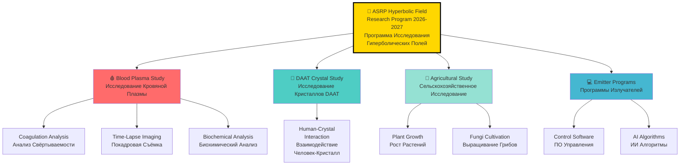
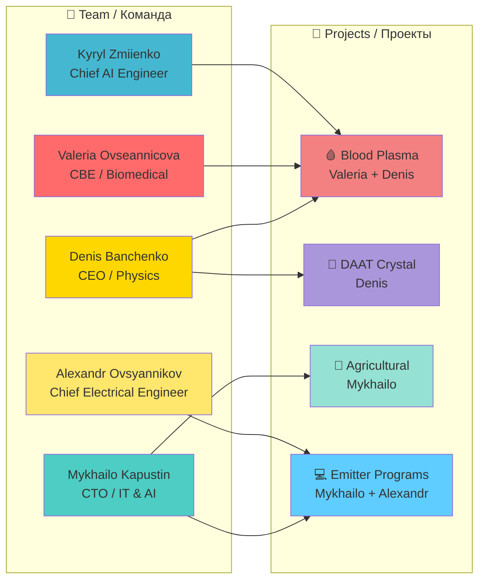
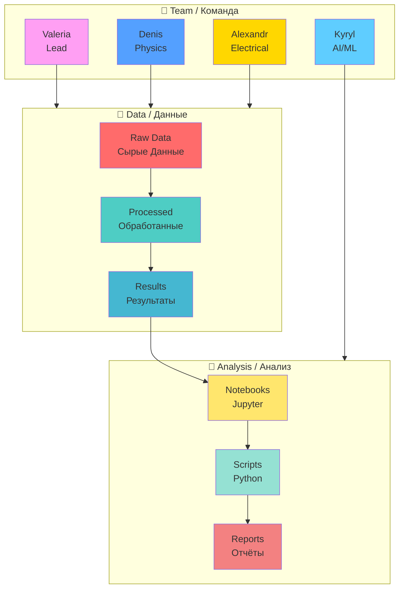
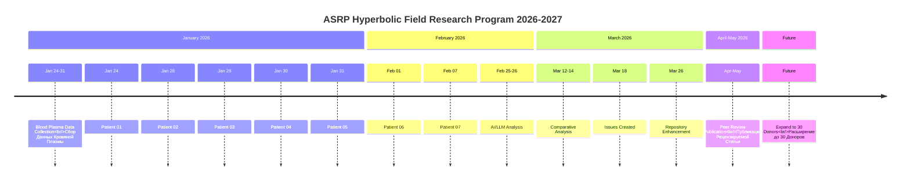

# 🔬 ASRP HYPERBOLIC FIELD RESEARCH PROGRAM 2026-2027 — MASTER PROJECT HUB

**Program Director / Директор Программы:** Denis Banchenko  
**Research Period / Период Исследования:** 2026-2027  
**Status / Статус:** 🔬 Active Research / Активное Исследование

---

## 📊 RESEARCH PROGRAM OVERVIEW / ОБЗОР ИССЛЕДОВАТЕЛЬСКОЙ ПРОГРАММЫ



---

## 👥 COMPLETE RESEARCH TEAM / ПОЛНАЯ КОМАНДА ИССЛЕДОВАНИЯ

### 👨‍🔬 LEADERSHIP & CO-AUTHORS / РУКОВОДСТВО И СОАВТОРЫ

**All 5 Team Members with Full Roles and Responsibilities:**
**Все 5 Членов Команды с Полными Ролями и Обязанностями:**

| # | Name / Имя | Primary Role / Основная Роль | Secondary Role / Вторая Роль | Responsibilities / Обязанности | Email |
|---|------------|-----------------------------|------------------------------|-------------------------------|-------|
| **1** | **👨‍💼 BANCHENKO DENIS YURIEVICH / БАНЧЕНКО ДЕНИС ЮРЬЕВИЧ** | CEO ASRP / Генеральный Директор ASRP | Program Director / Директор Программы; Technology Co-Author / Соавтор Технологии | **Physics & Engineering / Физика и Инженерия:**<br>• Hyperbolic field physics / Физика гиперболических полей<br>• Excitation systems development / Разработка систем возбуждения<br>• Hyperbolic field generator development / Разработка генераторов гиперболических полей<br>• Lensing and focusing systems / Системы линзирования и фокусировки<br>• Morphogenetic field emitters / Излучатели морфогенетических полей<br>• Form effect field emitters / Излучатели полей эффекта формы<br>• Modulation systems development / Разработка систем модуляции<br>• Control software creation / Создание программного обеспечения<br><br>**Management / Управление:**<br>• Overall strategic direction / Общее стратегическое руководство<br>• Project management / Управление проектом<br>• Technology co-authorship / Соавторство технологии | [denisbanchenko@asrp.tech](mailto:denisbanchenko@asrp.tech) |
| **2** | **👩‍⚕️ OVSEANNIKOVA VALERIA ALEXANDROVNA / ОВСЯННИКОВА ВАЛЕРИЯ АЛЕКСАНДРОВНА** | CBE (Chief Biomedical Engineer) / Главный Биомедицинский Инженер | Director of Biomedical Research Department / Руководитель Департамента Биомедицинских Исследований; Technology Co-Author / Соавтор Технологии | **Biomedical Research / Биомедицинские Исследования:**<br>• Lead Researcher / Ведущий исследователь<br>• Experimental design and execution / Дизайн и выполнение эксперимента<br>• Blood plasma protocol development / Разработка протокола работы с плазмой<br>• Coagulation analysis methodology / Методология анализа свёртывания<br>• Biochemical marker integration / Интеграция биохимических маркеров<br><br>**Engineering / Инженерия:**<br>• Electronic control systems for hyperbolic emitters / Электронные системы управления гиперболическими излучателями<br>• Time-lapse photography system / Система покадровой съёмки<br>• Laboratory equipment management / Управление лабораторным оборудованием<br><br>**Management / Управление:**<br>• Biomedical department leadership / Руководство биомедицинским департаментом<br>• Donor recruitment and screening / Набор и скрининг доноров | [valeriaovseannicova@asrp.tech](mailto:valeriaovseannicova@asrp.tech) |
| **3** | **👨‍💻 KAPUSTIN MYKHAILO MYKHALOVICH / КАПУСТИН МИХАЙЛО МИХАЙЛОВИЧ** | CTO (Chief Technology Officer) / Технический Директор | Director of IT & AI Department / Директор Департамента Информационных Технологий и ИИ; Technology Co-Author / Соавтор Технологии | **IT Infrastructure / ИТ Инфраструктура:**<br>• Data systems and storage / Системы данных и хранения<br>• Technical platform architecture / Архитектура технической платформы<br>• Cloud infrastructure / Облачная инфраструктура<br>• Version control (Git/GitHub) / Контроль версий<br><br>**AI & Software / ИИ и Программное Обеспечение:**<br>• Emitter control software / ПО управления излучателями<br>• AI algorithms development / Разработка ИИ алгоритмов<br>• Agricultural applications / Сельскохозяйственные приложения<br>• Plant & fungi growth monitoring / Мониторинг роста растений и грибов<br><br>**Management / Управление:**<br>• IT department leadership / Руководство ИТ департаментом<br>• Technical strategy / Техническая стратегия | [mykhailokapustin@asrp.tech](mailto:mykhailokapustin@asrp.tech) |
| **4** | **🔬 ZMIENKO KYRYL / ЗМИЕНКО КИРИЛЛ** | Chief AI Engineer / Главный ИИ Инженер | AI/ML Specialist / Специалист по ИИ/МЛ | **AI/ML Engineering / Инженерия ИИ/МЛ:**<br>• Neural Network Analysis / Анализ нейронными сетями<br>• Multi-LLM coordination / Координация мульти-LLM<br>• Specialized vision models / Специализированные vision модели<br>• Computer Vision pipelines / Конвейеры компьютерного зрения<br>• SAM-2, SigLIP2, DINOv2 implementation / Внедрение SAM-2, SigLIP2, DINOv2<br>• Statistical analysis / Статистический анализ<br>• Data visualization / Визуализация данных<br><br>**Analysis / Анализ:**<br>• LLM Vision analysis / LLM Vision анализ<br>• Comparative analysis / Сравнительный анализ<br>• Blinded protocol implementation / Внедрение слепого протокола | [kyrylzmiienko@asrp.tech](mailto:kyrylzmiienko@asrp.tech) |
| **5** | **⚡ OVSYANNIKOV ALEXANDR / ОВСЯННИКОВ АЛЕКСАНДР** | Chief Electrical Engineer / Главный Инженер по Электронике | Technology Engineer / Инженер Технологии; Electrical Systems Lead / Руководитель Электрических Систем | **Electrical Engineering / Электрическая Инженерия:**<br>• Electrical and Power Systems Development / Разработка электрических и силовых систем<br>• Hyperbolic emitter excitation systems / Системы возбуждения гиперболических излучателей<br>• Power components design and improvement / Проектирование и совершенствование силовых компонентов<br>• Circuit design and optimization / Проектирование и оптимизация схем<br>• High-voltage systems / Высоковольтные системы<br>• Power supply design / Проектирование источников питания<br><br>**Hardware / Оборудование:**<br>• Emitter hardware development / Разработка оборудования излучателей<br>• Electronic component selection / Выбор электронных компонентов<br>• Safety systems / Системы безопасности<br>• Testing and validation / Тестирование и валидация | [alexandrovsyannikov@asrp.tech](mailto:alexandrovsyannikov@asrp.tech) |

---

### 👨‍🔬 COLLABORATORS & ADVISORS / КОЛЛАБОРАТОРЫ И СОВЕТНИКИ

| Name / Имя | Organization / Организация | Role / Роль | Responsibilities / Обязанности | Email |
|------------|---------------------------|-------------|-------------------------------|-------|
| **📚 SAVELYEV IVAN / САВЕЛЬЕВ ИВАН** | ASRP.science | Science Director / Директор по Науке; Editor-in-Chief / Главный Редактор | Scientific Paper Author / Автор научной статьи; Data interpretation / Интерпретация данных; Scientific supervision / Научное руководство; Peer review coordination / Координация рецензирования | [ivansavelev@asrp.science](mailto:ivansavelev@asrp.science) |
| **🔬 CHIRKIVA OLESYA / ЧИРКИВА ОЛЕСЯ** | SASU Point Rouge France | Independent Researcher / Независимый Исследователь; Blood Plasma Specialist / Специалист по Плазме Крови | Laboratory Execution / Лабораторное выполнение; Blood collection and centrifugation / Забор крови и центрифугирование; Sample preparation / Подготовка образцов; Scientific consulting / Научное консультирование; Laboratory equipment provision / Предоставление лабораторного оборудования | [point.rouge.ch@gmail.com](mailto:point.rouge.ch@gmail.com) |

---

## 📋 RESEARCH PROJECTS / ИССЛЕДОВАТЕЛЬСКИЕ ПРОЕКТЫ

### 🎯 ALL PROJECTS WITH COMPLETE TEAM ASSIGNMENTS



| # | Project / Проект | Repository / Репозиторий | Status / Статус | Lead / Руководитель | Team / Команда |
|---|------------------|-------------------------|-----------------|---------------------|----------------|
| **1** | 🔬 **Blood Plasma Coagulation**<br/>Свёртываемость Кровяной Плазмы | [BloodPlasma Study](https://github.com/AdvancedScientificResearchProjects/Hyperbolic_Field_BloodPlasma_Study) | 🔬 Active | **Valeria Ovseannicova** | Denis Banchenko (Physics), Kyryl Zmiienko (AI/ML), Alexandr Ovsyannikov (Electrical) |
| **2** | 💎 **DAAT Crystal Interaction**<br/>Взаимодействие с Кристаллами DAAT | [DAAT Crystal](https://github.com/AdvancedScientificResearchProjects/Hyperbolic_Field_DAAT_Crystal_Study) | 🔬 Active | **Denis Banchenko** | - |
| **3** | 🌱 **Agricultural Applications**<br/>Сельскохозяйственные Приложения | [Agricultural](https://github.com/AdvancedScientificResearchProjects/Hyperbolic_Field_Agricultural_Study) | 🌱 Growing | **Mykhailo Kapustin** | - |
| **4** | 💻 **Emitter Control Software**<br/>ПО Управления Излучателями | [Emitter Programs](https://github.com/AdvancedScientificResearchProjects/Hyperbolic_Field_Emitter_Programs) | 💻 Development | **Mykhailo Kapustin** | Alexandr Ovsyannikov (Electrical Hardware) |

---

## 🔬 BLOOD PLASMA STUDY - DETAILED WORKFLOW / ДЕТАЛЬНЫЙ РАБОЧИЙ ПРОЦЕСС



### 📊 DATA STRUCTURE / СТРУКТУРА ДАННЫХ

| Folder / Папка | Content / Содержание | Language / Язык | Lead / Ответственный |
|----------------|---------------------|-----------------|---------------------|
| **data/** | Raw experimental datasets / Сырые экспериментальные данные | EN/RU | Valeria Ovseannicova |
| **processed/** | Processed/cleaned data / Обработанные данные | EN/RU | Kyryl Zmiienko |
| **results/** | Analysis results & imaging / Результаты анализа и визуализация | EN/RU | Kyryl Zmiienko |
| **notebooks/** | Jupyter notebooks for analysis / Jupyter ноутбуки для анализа | EN/RU | Kyryl Zmiienko |
| **reports/** | Scientific reports / Научные отчёты | EN/RU | Valeria Ovseannicova |
| **scripts/** | Python utility scripts / Вспомогательные скрипты Python | EN | Kyryl Zmiienko |
| **en/** | English documentation / Английская документация | EN | Denis Banchenko |
| **ru/** | Russian documentation / Русская документация | RU | Denis Banchenko |

---

## 📊 CURRENT ISSUES & TASKS / ТЕКУЩИЕ ЗАДАЧИ

| Issue # | Title / Название | Status / Статус | Priority / Приоритет | Lead / Руководитель | Team / Команда |
|---------|------------------|-----------------|---------------------|---------------------|----------------|
| **#9** | 🔗 PATENT APPLICATION: FRACTAL BIOMEDICAL (KZ 2025/1095.1) | 🟡 Open | 🔴 **Critical** | Denis Banchenko | Valeria Ovseannicova |
| **#8** | 📑 PEER REVIEW PUBLICATION PREPARATION / ПОДГОТОВКА НАУЧНОЙ СТАТЬИ | 🟡 Open | 🔴 **High** | Ivan Savelyev | Valeria Ovseannicova, Kyryl Zmiienko |
| **#7** | 🙈 BLIND ANALYSIS PROTOCOL / ПРОТОКОЛ ОСЛЕПЛЕНИЯ | 🟡 Open | 🟡 Medium | Kyryl Zmiienko | Valeria Ovseannicova |
| **#6** | 📷 TIME-LAPSE PHOTOGRAPHY SYSTEM / СИСТЕМА ПОКАДРОВОЙ СЪЁМКИ | 🟡 Open | 🟡 Medium | Valeria Ovseannicova | Kyryl Zmiienko, Alexandr Ovsyannikov |
| **#5** | 🧪 BIOCHEMICAL ANALYSIS INTEGRATION / ИНТЕГРАЦИЯ БИОХИМИЧЕСКОГО АНАЛИЗА | 🟡 Open | 🟡 Medium | Valeria Ovseannicova | Kyryl Zmiienko |
| **#4** | 👥 EXPAND DONOR BASE TO 30 PARTICIPANTS / РАСШИРЕНИЕ БАЗЫ ДОНОРОВ | 🟡 Open | 🟢 Low | Valeria Ovseannicova | - |
| **#3** | 📋 BLOOD PLASMA PROTOCOL / ПРОТОКОЛ КРОВЯНОЙ ПЛАЗМЫ | 🟡 Open | 🟢 Low | Valeria Ovseannicova | Denis Banchenko |
| **#2** | 🔬 ASRP HYPERBOLIC FIELD RESEARCH PROGRAM 2026-2027 — MASTER HUB | 🟡 Open | 🟢 Low | Denis Banchenko | All Team |
| **#1** | 📜 HYPERBOLIC FIELD BLOOD PLASMA COAGULATION STUDY PROTOCOL | 🟡 Open | 🟢 Low | Valeria Ovseannicova | Denis Banchenko |

---

## 📞 CONTACT INFORMATION / КОНТАКТНАЯ ИНФОРМАЦИЯ

### 🏢 CORPORATE CONTACT / КОРПОРАТИВНЫЙ КОНТАКТ

```
ТОО "Перспективные Научно-Исследовательские Разработки"
УЛИЦА Комарова 37, 56
КЫЗЫЛОРДИНСКАЯ ОБЛАСТЬ, БАЙКОНУР
Республика Казахстан, 468320

📧 E-mail: info@asrp.tech (Corporate / Корпоративный)
🌐 Website: https://asrp.tech
```

### 👥 TEAM CONTACTS / КОНТАКТЫ КОМАНДЫ

| Name / Имя | Email | Role / Роль | Department / Департамент |
|------------|-------|-------------|-------------------------|
| **👨‍💼 BANCHENKO DENIS YURIEVICH / БАНЧЕНКО ДЕНИС ЮРЬЕВИЧ** | [denisbanchenko@asrp.tech](mailto:denisbanchenko@asrp.tech) | CEO / Program Director / Директор Программы | Executive / Руководство |
| **👩‍⚕️ OVSEANNIKOVA VALERIA ALEXANDROVNA / ОВСЯННИКОВА ВАЛЕРИЯ АЛЕКСАНДРОВНА** | [valeriaovseannicova@asrp.tech](mailto:valeriaovseannicova@asrp.tech) | CBE / Director of Biomedical Research | Biomedical / Биомедицинский |
| **👨‍💻 KAPUSTIN MYKHAILO MYKHALOVICH / КАПУСТИН МИХАЙЛО МИХАЙЛОВИЧ** | [mykhailokapustin@asrp.tech](mailto:mykhailokapustin@asrp.tech) | CTO / Director of IT & AI | IT & AI / ИТ и ИИ |
| **🔬 ZMIENKO KYRYL / ЗМИЕНКО КИРИЛЛ** | [kyrylzmiienko@asrp.tech](mailto:kyrylzmiienko@asrp.tech) | Chief AI Engineer / Главный ИИ Инженер | IT & AI / ИТ и ИИ |
| **⚡ OVSYANNIKOV ALEXANDR / ОВСЯННИКОВ АЛЕКСАНДР** | [alexandrovsyannikov@asrp.tech](mailto:alexandrovsyannikov@asrp.tech) | Chief Electrical Engineer / Главный Инженер по Электронике | Engineering / Инженерия |
| **📚 SAVELYEV IVAN / САВЕЛЬЕВ ИВАН** | [ivansavelev@asrp.science](mailto:ivansavelev@asrp.science) | Science Director / Директор по Науке | ASRP.science |

---

## 🔗 RELATED REPOSITORIES / СВЯЗАННЫЕ РЕПОЗИТОРИИ

### 🔬 RESEARCH REPOSITORIES / ИССЛЕДОВАТЕЛЬСКИЕ РЕПОЗИТОРИИ

| Repository / Репозиторий | Purpose / Назначение | Link / Ссылка |
|--------------------------|---------------------|---------------|
| **Blood Plasma Study** | Blood coagulation research / Исследование свёртывания крови | [🔗 View](https://github.com/AdvancedScientificResearchProjects/Hyperbolic_Field_BloodPlasma_Study) |
| **DAAT Crystal Study** | Human-crystal interaction / Взаимодействие человек-кристалл | [🔗 View](https://github.com/AdvancedScientificResearchProjects/Hyperbolic_Field_DAAT_Crystal_Study) |
| **Agricultural Study** | Plant & fungi growth / Рост растений и грибов | [🔗 View](https://github.com/AdvancedScientificResearchProjects/Hyperbolic_Field_Agricultural_Study) |
| **Emitter Programs** | Emitter control software / ПО управления излучателями | [🔗 View](https://github.com/AdvancedScientificResearchProjects/Hyperbolic_Field_Emitter_Programs) |

### 📜 PATENT REPOSITORIES / ПАТЕНТНЫЕ РЕПОЗИТОРИИ

| Repository / Репозиторий | Purpose / Назначение | Link / Ссылка |
|--------------------------|---------------------|---------------|
| **Fractal FBHFS Patent KZ 2025/1095.1** | Core Technology Patent / Патент Основных Технологий | [🔗 View](https://github.com/denisbanchenko/Kazpatent_Fractal_Biomedical_System_Patent) |
| **Fractal HFS Issue #6 Patent-Research Connection** | Patent-Research Link / Связь Патент-Исследование | [🔗 View](https://github.com/denisbanchenko/Kazpatent_Fractal_Biomedical_System_Patent/issues/6) |

---

## 📊 RESEARCH TIMELINE / ВРЕМЕННАЯ ШКАЛА ИССЛЕДОВАНИЯ



---

## 🎯 PROGRAM STATISTICS / СТАТИСТИКА ПРОГРАММЫ

| Metric / Метрика | Value / Значение | Status / Статус |
|------------------|------------------|-----------------|
| **👥 Team Members / Членов Команды** | 5 core + 2 collaborators / 5 основных + 2 коллаборатора | ✅ Complete |
| **🔬 Active Projects / Активных Проектов** | 4 research projects / 4 исследовательских проекта | ✅ Active |
| **📊 Blood Plasma Donors / Доноров Кровяной Плазмы** | 7 patients / 7 пациентов | ✅ Phase 1 Complete |
| **📸 Total Photographs / Всего Фотографий** | 101 images / 101 изображение | ✅ Complete |
| **🤖 AI Providers / ИИ Провайдеров** | 8 LLM + CV models / 8 моделей LLM + CV | ✅ Complete |
| **📄 Scientific Reports / Научных Отчётов** | 5+ reports / 5+ отчётов | ✅ Complete |
| **📜 Patent Applications / Патентных Заявок** | 1 (KZ 2025/1095.1) | ✅ Filed |
| **📑 Publications / Публикаций** | 1 in preparation / 1 в подготовке | 🟡 In Progress |

---

## 🌐 ASRP.DRIFT ECOSYSTEM / ЭКОСИСТЕМА ASRP.DRIFT

**All research repositories are part of the ASRP.drift ecosystem:**
**Все исследовательские репозитории являются частью экосистемы ASRP.drift:**

```
ASRP.drift / ПНИР.дрифт
├── 🔬 Hyperbolic Field Research / Исследование Гиперболических Полей
│   ├── Blood Plasma Study / Исследование Кровяной Плазмы
│   ├── DAAT Crystal Study / Исследование Кристаллов DAAT
│   ├── Agricultural Study / Сельскохозяйственное Исследование
│   └── Emitter Programs / Программы Излучателей
├── 📜 Patent Portfolio / Патфельный Портфель
│   └── Fractal FBHFS KZ 2025/1095.1
└── 📊 Data & Analytics / Данные и Аналитика
    ├── Multi-LLM Analysis / Мульти-LLM Анализ
    └── Computer Vision / Компьютерное Зрение
```

---

**Last Updated / Последнее обновление:** 26 March 2026  
**Organization / Организация:** Advanced Scientific Research Projects (ASRP)  
**Website / Вебсайт:** https://asrp.tech  
**Standard / Стандарт:** UNIFIED_STRUCTURE_STANDARD.md v4.0  
**Status / Статус:** 🔬 Active Research / Активное Исследование  
**Documentation Language / Язык Документации:** English \| Русский (Full Bilingual / Полный Двуязычный)

---

**🔬 ACTIVE RESEARCH / АКТИВНОЕ ИССЛЕДОВАНИЕ**  
**📊 DATA-DRIVEN SCIENCE / НАУКА НА ОСНОВЕ ДАННЫХ**  
**🌐 BILINGUAL DOCUMENTATION / ДВУЯЗЫЧНАЯ ДОКУМЕНТАЦИЯ**  
**👥 COMPLETE TEAM OF 5 / ПОЛНАЯ КОМАНДА ИЗ 5 ЧЕЛОВЕК**
