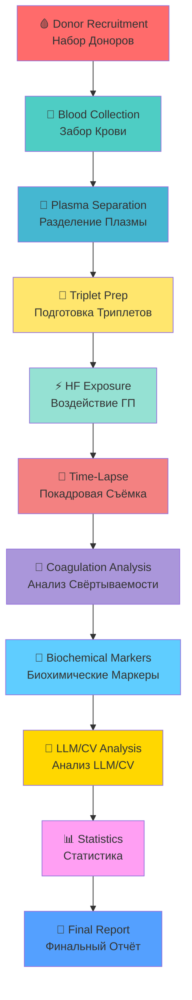

# 📋 BLOOD PLASMA PROTOCOL / ПРОТОКОЛ КРОВЯНОЙ ПЛАЗМЫ

**Status / Статус:** ✅ Complete / Завершено  
**Opened / Открыто:** Mar 18, 2026  
**Assignees / Исполнители:** ValeriaOvseannicova, liker0704

---

## 🎯 OVERVIEW / ОБЗОР

**This document provides complete bilingual protocol for blood plasma coagulation study under hyperbolic field exposure.**

**Этот документ предоставляет полный двуязычный протокол исследования свёртываемости кровяной плазмы под воздействием гиперболического поля.**

---

## 📊 EXPERIMENTAL PROTOCOL WORKFLOW / РАБОЧИЙ ПРОЦЕСС ЭКСПЕРИМЕНТА

---

## 📋 PROTOCOL STEPS / ШАГИ ПРОТОКОЛА

### ENGLISH

**Complete step-by-step protocol with bilingual documentation:**

1. **🩸 Donor Screening / Скрининг Доноров**
   - Inclusion/exclusion criteria / Критерии включения/исключения
   - Age 18-65 / Возраст 18-65
   - No antibiotics in last 14 days / Нет антибиотиков в последние 14 дней
   - Signed informed consent / Подписанное информированное согласие

2. **🧪 Blood Collection / Забор Крови**
   - 20ml per donor, EDTA tubes / 20мл на донора, пробирки ЭДТА
   - Standard venipuncture procedure / Стандартная процедура венепункции
   - 4 tubes per donor / 4 пробирки на донора

3. **🔄 Plasma Separation / Разделение Плазмы**
   - Centrifugation 3000rpm, 10min / Центрифугирование 3000об/мин, 10мин
   - Room temperature 17°C / Комнатная температура 17°C
   - Plasma layer carefully extracted / Слой плазмы аккуратно извлекается

4. **🧫 Triplet Preparation / Подготовка Триплетов**
   - Control (no irradiation) / Контроль (без облучения)
   - Experimental A (Channel 19) / Экспериментальный A (Канал 19)
   - Experimental B (Channel 21) / Экспериментальный B (Канал 21)
   - Volume: 1-1.5ml per sample / Объём: 1-1.5мл на образец

5. **⚡ Hyperbolic Field Exposure / Воздействие Гиперболического Поля**
   - Channel 19: 30 minutes (time acceleration) / Канал 19: 30 минут (ускорение времени)
   - Channel 21: 30 minutes (time deceleration) / Канал 21: 30 минут (замедление времени)
   - Control: 1.5m from emitters (no exposure) / Контроль: 1.5м от излучателей (без воздействия)

6. **📸 Time-Lapse Imaging / Покадровая Визуализация**
   - 24-48 hours per sample / 24-48 часа на образец
   - 1 frame per 5 minutes / 1 кадр в 5 минут
   - iPhone 16 Pro Max, 4K resolution / iPhone 16 Pro Max, 4K разрешение
   - LED backlight for consistency / LED подсветка для консистентности

7. **🔬 Coagulation Analysis / Анализ Свёртываемости**
   - Prothrombin Time (PT) / Протромбиновое Время (ПВ)
   - Activated Partial Thromboplastin Time (APTT) / Активированное Частичное Тромбопластиновое Время (АЧТВ)
   - Fibrinogen levels / Уровни фибриногена

8. **🧪 Biochemical Markers / Биохимические Маркеры**
   - D-dimer / Д-димер
   - Platelet count / Подсчёт тромбоцитов
   - Additional markers as needed / Дополнительные маркеры по мере необходимости

9. **🤖 LLM/CV Analysis / Анализ LLM/CV**
   - Blinded protocol (Sample A/B/C) / Слепой протокол (Образец A/B/C)
   - Triple-run validation / Тройная проверка
   - Multi-provider analysis (8 LLM + CV models) / Мультипровайдерный анализ (8 моделей LLM + CV)

10. **📊 Statistical Analysis / Статистический Анализ**
    - ANOVA for group comparisons / ANOVA для сравнения групп
    - T-tests for pairwise comparisons / T-тесты для попарных сравнений
    - P-values < 0.05 considered significant / P-значения < 0.05 считаются значимыми

11. **📄 Final Report / Финальный Отчёт**
    - Consolidated findings / Консолидированные выводы
    - Charts and visualizations / Графики и визуализации
    - Scientific publication preparation / Подготовка научной публикации

### РУССКИЙ

**Полный пошаговый протокол с двуязычной документацией:**

1. **🩸 Скрининг Доноров**
   - Критерии включения/исключения
   - Возраст 18-65
   - Нет антибиотиков в последние 14 дней
   - Подписанное информированное согласие

2. **🧪 Забор Крови**
   - 20мл на донора, пробирки ЭДТА
   - Стандартная процедура венепункции
   - 4 пробирки на донора

3. **🔄 Разделение Плазмы**
   - Центрифугирование 3000об/мин, 10мин
   - Комнатная температура 17°C
   - Слой плазмы аккуратно извлекается

4. **🧫 Подготовка Триплетов**
   - Контроль (без облучения)
   - Экспериментальный A (Канал 19)
   - Экспериментальный B (Канал 21)
   - Объём: 1-1.5мл на образец

5. **⚡ Воздействие Гиперболического Поля**
   - Канал 19: 30 минут (ускорение времени)
   - Канал 21: 30 минут (замедление времени)
   - Контроль: 1.5м от излучателей (без воздействия)

6. **📸 Покадровая Визуализация**
   - 24-48 часа на образец
   - 1 кадр в 5 минут
   - iPhone 16 Pro Max, 4K разрешение
   - LED подсветка для консистентности

7. **🔬 Анализ Свёртываемости**
   - Протромбиновое Время (ПВ)
   - Активированное Частичное Тромбопластиновое Время (АЧТВ)
   - Уровни фибриногена

8. **🧪 Биохимические Маркеры**
   - Д-димер
   - Подсчёт тромбоцитов
   - Дополнительные маркеры по мере необходимости

9. **🤖 Анализ LLM/CV**
   - Слепой протокол (Образец A/B/C)
   - Тройная проверка
   - Мультипровайдерный анализ (8 моделей LLM + CV)

10. **📊 Статистический Анализ**
    - ANOVA для сравнения групп
    - T-тесты для попарных сравнений
    - P-значения < 0.05 считаются значимыми

11. **📄 Финальный Отчёт**
    - Консолидированные выводы
    - Графики и визуализации
    - Подготовка научной публикации

---

## 📁 DATA & PHOTO NAVIGATION / НАВИГАЦИЯ ПО ДАННЫМ И ФОТО

### 📸 PHOTO GALLERY BY PATIENT / ГАЛЕРЕЯ ФОТО ПО ПАЦИЕНТАМ

| Patient / Пациент | Photos / Фото | Samples / Образцы | Direct Link / Прямая Ссылка |
|-------------------|---------------|-------------------|----------------------------|
| **Patient 01 / Пациент 01** | 13 | 0.1.1, 0.1.2, 19.1.1, 21.1.1 | [📂 View Photos](data/patient-01/photos/) |
| **Patient 02 / Пациент 02** | 25 | 0.2.1, 0.2.2, 19.2.1, 19.2.2, 21.2.1, 21.2.2 | [📂 View Photos](data/patient-02/photos/) |
| **Patient 03 / Пациент 03** | 16 | 0.3.1, 0.3.2, 19.3.1, 21.3.1 | [📂 View Photos](data/patient-03/photos/) |
| **Patient 04 / Пациент 04** | 4 | 0.4.1, 0.4.2, 19.4.1, 21.4.1 | [📂 View Photos](data/patient-04/photos/) |
| **Patient 05 / Пациент 05** | 10 | 0.5.1, 19.5.1, 21.5.1 | [📂 View Photos](data/patient-05/photos/) |
| **Patient 06 / Пациент 06** | 3 | 0.6.1, 0.6.2, 19.6.1, 21.6.1, 19.6.2, 21.6.2 | [📂 View Photos](data/patient-06/photos/) |
| **Patient 07 / Пациент 07** | 30 | 0.7.1, 0.7.2, 19.7.1, 21.7.1, 19.7.2, 21.7.2 | [📂 View Photos](data/patient-07/photos/) |

**TOTAL / ВСЕГО:** 101 photographs / 101 фотография

### 📄 PROTOCOL DOCUMENTS / ДОКУМЕНТЫ ПРОТОКОЛА

| Document / Документ | Language / Язык | Direct Link / Прямая Ссылка |
|---------------------|-----------------|----------------------------|
| **📋 Experiment Protocol / Протокол Эксперимента** | [🇬🇧 EN](reports/experiment_protocol_en.md) \| [🇷🇺 RU](reports/experiment_protocol_ru.md) | [View Protocol](reports/experiment_protocol_en.md) |
| **📊 Patient Summary / Сводка по Пациентам** | EN/RU | [View Summary](processed/en/all_patients.json) |
| **🧪 Analysis Results / Результаты Анализа** | EN/RU | [View Results](reports/2026-02-25_ai-analysis/) |

---

## 🔗 RELATED REPORTS / СВЯЗАННЫЕ ОТЧЁТЫ

### 📊 ALL ANALYSIS REPORTS / ВСЕ ОТЧЁТЫ ПО АНАЛИЗУ

| # | Report / Отчёт | Date / Дата | Status / Статус | Direct Link / Прямая Ссылка |
|---|----------------|-------------|-----------------|----------------------------|
| 1 | **📋 Experiment Protocol / Протокол Эксперимента** | 2026-02 | ✅ Complete | [🇬🇧 EN](reports/experiment_protocol_en.md) \| [🇷🇺 RU](reports/experiment_protocol_ru.md) |
| 2 | **🤖 Multi-AI Image Analysis / Мультипровайдерный AI-анализ** | 2026-02-25 | ✅ Complete | [🇬🇧 EN](reports/2026-02-25_ai-analysis/) \| [🇷🇺 RU](reports/2026-02-25_ai-analysis/) |
| 3 | **👁️ LLM Vision Clot Analysis / LLM Vision Анализ Сгустков** | 2026-02-26 | ✅ Complete | [🇬🇧 EN](reports/2026-02-26_llm-vision-analysis/) \| [🇷🇺 RU](reports/2026-02-26_llm-vision-analysis/) |
| 4 | **📊 Comparative LLM Analysis / Сравнительный Анализ LLM** | 2026-03-12 | ✅ Complete | [🇬🇧 EN](reports/2026-03-12_comparative/) \| [🇷🇺 RU](reports/2026-03-12_comparative/) |
| 5 | **👁️ CV/ML Analysis / Computer Vision + ML Анализ** | 2026-03-14 | ✅ Complete | [🇬🇧 EN](reports/2026-03-14_cv-ml-analysis/) \| [🇷🇺 RU](reports/2026-03-14_cv-ml-analysis/) |

---

## 👥 CONTACT INFORMATION / КОНТАКТНАЯ ИНФОРМАЦИЯ

| Contact / Контакт | Email / Электронная почта | Role / Роль |
|------------------|--------------------------|-------------|
| **👨‍💼 BANCHENKO DENIS YURIEVICH / БАНЧЕНКО ДЕНИС ЮРЬЕВИЧ** | [denisbanchenko@asrp.tech](mailto:denisbanchenko@asrp.tech) | CEO ASRP / Program Director / Директор Программы |
| **👩‍⚕️ OVSEANNIKOVA VALERIA ALEXANDROVNA / ОВСЯННИКОВА ВАЛЕРИЯ АЛЕКСАНДРОВНА** | [valeriaovseannicova@asrp.tech](mailto:valeriaovseannicova@asrp.tech) | CBE / Director of Biomedical Research / Руководитель Департамента Биомедицинских Исследований |
| **👨‍💻 KAPUSTIN MYKHAILO MYKHALOVICH / КАПУСТИН МИХАЙЛО МИХАЙЛОВИЧ** | [mykhailokapustin@asrp.tech](mailto:mykhailokapustin@asrp.tech) | CTO / Director of IT & AI / Директор Департамента ИТ и ИИ |
| **🔬 ZMIENKO KYRYL / ЗМИЕНКО КИРИЛЛ** | [kyrylzmiienko@asrp.tech](mailto:kyrylzmiienko@asrp.tech) | Chief AI Engineer / Главный ИИ Инженер |
| **⚡ OVSYANNIKOV ALEXANDR / ОВСЯННИКОВ АЛЕКСАНДР** | [alexandrovsyannikov@asrp.tech](mailto:alexandrovsyannikov@asrp.tech) | Chief Electrical Engineer / Главный Инженер по Электронике |

---

## 🔗 RELATED ISSUES / СВЯЗАННЫЕ ЗАДАЧИ

| Issue # | Title / Название | Status / Статус | Link / Ссылка |
|---------|------------------|-----------------|---------------|
| **#8** | 📑 PEER REVIEW PUBLICATION PREPARATION / ПОДГОТОВКА НАУЧНОЙ СТАТЬИ | 🟡 Open | [View Issue](https://github.com/AdvancedScientificResearchProjects/Hyperbolic_Field_BloodPlasma_Study/issues/8) |
| **#7** | 🙈 BLIND ANALYSIS PROTOCOL / ПРОТОКОЛ ОСЛЕПЛЕНИЯ | 🟡 Open | [View Issue](https://github.com/AdvancedScientificResearchProjects/Hyperbolic_Field_BloodPlasma_Study/issues/7) |
| **#6** | 📷 TIME-LAPSE PHOTOGRAPHY SYSTEM / СИСТЕМА ПОКАДРОВОЙ СЪЁМКИ | 🟡 Open | [View Issue](https://github.com/AdvancedScientificResearchProjects/Hyperbolic_Field_BloodPlasma_Study/issues/6) |
| **#5** | 🧪 BIOCHEMICAL ANALYSIS INTEGRATION / ИНТЕГРАЦИЯ БИОХИМИЧЕСКОГО АНАЛИЗА | 🟡 Open | [View Issue](https://github.com/AdvancedScientificResearchProjects/Hyperbolic_Field_BloodPlasma_Study/issues/5) |
| **#4** | 👥 EXPAND DONOR BASE TO 30 PARTICIPANTS / РАСШИРЕНИЕ БАЗЫ ДОНОРОВ | 🟡 Open | [View Issue](https://github.com/AdvancedScientificResearchProjects/Hyperbolic_Field_BloodPlasma_Study/issues/4) |

---

**Last Updated / Последнее обновление:** 26 March 2026  
**Status / Статус:** ✅ Complete / Завершено  
**Documentation Language / Язык Документации:** English \| Русский (Full Bilingual / Полный Двуязычный)

---

**🔬 ACTIVE RESEARCH / АКТИВНОЕ ИССЛЕДОВАНИЕ**  
**📊 DATA-DRIVEN SCIENCE / НАУКА НА ОСНОВЕ ДАННЫХ**  
**🌐 BILINGUAL DOCUMENTATION / ДВУЯЗЫЧНАЯ ДОКУМЕНТАЦИЯ**
