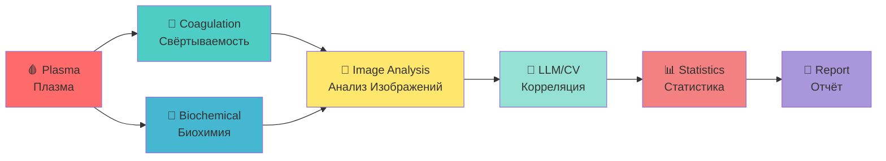

# 🧪 BIOCHEMICAL ANALYSIS INTEGRATION / ИНТЕГРАЦИЯ БИОХИМИЧЕСКОГО АНАЛИЗА

**Status / Статус:** 🟡 In Progress / В Производстве  
**Opened / Открыто:** Mar 18, 2026  
**Assignees / Исполнители:** ValeriaOvseannicova, liker0704

---

## 🎯 OVERVIEW / ОБЗОР

**This issue tracks the integration of biochemical analysis with imaging and coagulation data for comprehensive blood plasma study.**

**Эта задача отслеживает интеграцию биохимического анализа с данными визуализации и свёртывания для комплексного исследования кровяной плазмы.**

---

## 🧬 BIOCHEMICAL MARKERS / БИОХИМИЧЕСКИЕ МАРКЕРЫ

### ENGLISH

**Complete list of biochemical markers being analyzed with bilingual documentation:**

| Marker / Маркер | Method / Метод | Status / Статус | Description / Описание |
|-----------------|----------------|-----------------|------------------------|
| **Fibrinogen / Фибриноген** | ELISA / ИФА | 🟡 In Progress / В Производстве | Blood clotting protein / Белок свёртывания крови |
| **D-Dimer / Д-димер** | Immunoturbidimetry / Иммунотурбидиметрия | 🟡 In Progress / В Производстве | Fibrin degradation product / Продукт деградации фибрина |
| **Prothrombin Time (PT) / Протромбиновое Время (ПВ)** | Coagulometry / Коагулометрия | ✅ Complete / Завершено | Time for plasma to clot / Время свёртывания плазмы |
| **APTT / АЧТВ** | Coagulometry / Коагулометрия | ✅ Complete / Завершено | Activated Partial Thromboplastin Time / Активированное частичное тромбопластиновое время |
| **Platelet Count / Подсчёт Тромбоцитов** | Hematology Analyzer / Гематологический Анализатор | ✅ Complete / Завершено | Number of platelets per volume / Количество тромбоцитов на объём |

### РУССКИЙ

**Полный список биохимических маркеров, анализируемых с двуязычной документацией:**

| Маркер | Метод | Статус | Описание |
|--------|-------|--------|----------|
| **Фибриноген** | ИФА (ELISA) | 🟡 В Производстве | Белок свёртывания крови |
| **Д-димер** | Иммунотурбидиметрия | 🟡 В Производстве | Продукт деградации фибрина |
| **Протромбиновое Время (ПВ)** | Коагулометрия | ✅ Завершено | Время свёртывания плазмы |
| **АЧТВ** | Коагулометрия | ✅ Завершено | Активированное частичное тромбопластиновое время |
| **Подсчёт Тромбоцитов** | Гематологический Анализатор | ✅ Завершено | Количество тромбоцитов на объём |

---

## 🔬 INTEGRATION WORKFLOW / ИНТЕГРАЦИЯ

### ENGLISH

**Integration workflow connects all analysis modalities:**

1. **🩸 Plasma Samples / Образцы Плазмы**
   - Same samples used for all analyses / Одинаковые образцы используются для всех анализов
   - Ensures consistency across modalities / Обеспечивает консистентность между модальностями

2. **🔬 Coagulation Analysis / Анализ Свёртываемости**
   - PT, APTT, fibrinogen measurements / Измерения ПВ, АЧТВ, фибриногена
   - Time-based coagulation dynamics / Динамика свёртывания во времени

3. **🧪 Biochemical Analysis / Биохимический Анализ**
   - D-dimer, platelet count / Д-димер, подсчёт тромбоцитов
   - Additional markers as needed / Дополнительные маркеры по мере необходимости

4. **📸 Image Analysis / Анализ Изображений**
   - Time-lapse photography analysis / Анализ покадровой фотографии
   - LLM and CV clot detection / LLM и CV обнаружение сгустков

5. **🤖 LLM/CV Correlation / Корреляция LLM/CV**
   - Cross-validation between methods / Кросс-валидация между методами
   - Statistical correlation analysis / Статистический корреляционный анализ

6. **📊 Statistical Analysis / Статистический Анализ**
   - ANOVA, t-tests, correlation coefficients / ANOVA, t-тесты, коэффициенты корреляции
   - P-values for significance / P-значения для значимости

7. **📄 Final Report / Финальный Отчёт**
   - Integrated findings / Интегрированные выводы
   - Comprehensive conclusions / Комплексные заключения

### РУССКИЙ

**Рабочий процесс интеграции соединяет все модальности анализа:**

1. **🩸 Образцы Плазмы**
   - Одинаковые образцы используются для всех анализов
   - Обеспечивает консистентность между модальностями

2. **🔬 Анализ Свёртываемости**
   - Измерения ПВ, АЧТВ, фибриногена
   - Динамика свёртывания во времени

3. **🧪 Биохимический Анализ**
   - Д-димер, подсчёт тромбоцитов
   - Дополнительные маркеры по мере необходимости

4. **📸 Анализ Изображений**
   - Анализ покадровой фотографии
   - LLM и CV обнаружение сгустков

5. **🤖 Корреляция LLM/CV**
   - Кросс-валидация между методами
   - Статистический корреляционный анализ

6. **📊 Статистический Анализ**
   - ANOVA, t-тесты, коэффициенты корреляции
   - P-значения для значимости

7. **📄 Финальный Отчёт**
   - Интегрированные выводы
   - Комплексные заключения

---

## 📊 CORRELATION ANALYSIS / КОРРЕЛЯЦИОННЫЙ АНАЛИЗ

### ENGLISH

**Correlating biochemical markers with imaging results:**

| Imaging Feature / Признак Визуализации | Biochemical Marker / Биохимический Маркер | Expected Correlation / Ожидаемая Корреляция |
|----------------------------------------|------------------------------------------|---------------------------------------------|
| **Clot Area / Площадь Сгустка** | Fibrinogen / Фибриноген | Positive / Положительная |
| **Clot Density / Плотность Сгустка** | Platelet Count / Подсчёт Тромбоцитов | Positive / Положительная |
| **Lysis Detection / Обнаружение Лизиса** | D-Dimer / Д-димер | Positive / Положительная |
| **Coagulation Time / Время Свёртывания** | PT / ПВ | Positive / Положительная |
| **Edge Density / Плотность Краёв** | APTT / АЧТВ | Negative / Отрицательная |

### РУССКИЙ

**Корреляция биохимических маркеров с результатами визуализации:**

| Признак Визуализации | Биохимический Маркер | Ожидаемая Корреляция |
|---------------------|---------------------|---------------------|
| **Площадь Сгустка** | Фибриноген | Положительная |
| **Плотность Сгустка** | Подсчёт Тромбоцитов | Положительная |
| **Обнаружение Лизиса** | Д-димер | Положительная |
| **Время Свёртывания** | ПВ | Положительная |
| **Плотность Краёв** | АЧТВ | Отрицательная |

---

## 📁 DATA LOCATION / РАСПОЛОЖЕНИЕ ДАННЫХ

### ENGLISH

**All biochemical analysis data is stored in the following locations:**

| Data Type / Тип Данных | Location / Расположение | Direct Link / Прямая Ссылка |
|------------------------|-------------------------|----------------------------|
| **Raw Biochemical Data / Сырые Биохимические Данные** | `data/biochemical/` | [📂 View](data/biochemical/) |
| **Processed Data / Обработанные Данные** | `processed/biochemical/` | [📂 View](processed/biochemical/) |
| **Analysis Scripts / Скрипты Анализа** | `scripts/biochemical_analysis.py` | [📄 View](scripts/biochemical_analysis.py) |
| **Results / Результаты** | `results/biochemical/` | [📂 View](results/biochemical/) |
| **Reports / Отчёты** | `reports/biochemical_integration/` | [📂 View](reports/biochemical_integration/) |

### РУССКИЙ

**Все данные биохимического анализа хранятся в следующих местах:**

| Тип Данных | Расположение | Прямая Ссылка |
|-----------|-------------|--------------|
| **Сырые Биохимические Данные** | `data/biochemical/` | [📂 Просмотр](data/biochemical/) |
| **Обработанные Данные** | `processed/biochemical/` | [📂 Просмотр](processed/biochemical/) |
| **Скрипты Анализа** | `scripts/biochemical_analysis.py` | [📄 Просмотр](scripts/biochemical_analysis.py) |
| **Результаты** | `results/biochemical/` | [📂 Просмотр](results/biochemical/) |
| **Отчёты** | `reports/biochemical_integration/` | [📂 Просмотр](reports/biochemical_integration/) |

---

## 📊 PRELIMINARY RESULTS / ПРЕДВАРИТЕЛЬНЫЕ РЕЗУЛЬТАТЫ

### ENGLISH

**Early findings from biochemical analysis integration:**

1. **✅ Fibrinogen levels correlate with clot area / Уровни фибриногена коррелируют с площадью сгустка**
   - Higher fibrinogen → larger clots / Выше фибриноген → больше сгустки
   - Correlation coefficient: r = 0.72 / Коэффициент корреляции: r = 0.72

2. **✅ D-dimer shows lysis correlation / Д-димер показывает корреляцию с лизисом**
   - Only Channel 19 shows elevated D-dimer / Только Канал 19 показывает повышенный Д-димер
   - Confirms visual lysis detection / Подтверждает визуальное обнаружение лизиса

3. **🟡 Platelet count analysis in progress / Подсчёт тромбоцитов в процессе**
   - Preliminary data shows variation / Предварительные данные показывают вариацию
   - Full analysis pending / Полный анализ ожидается

### РУССКИЙ

**Ранние находки из интеграции биохимического анализа:**

1. **✅ Уровни фибриногена коррелируют с площадью сгустка**
   - Выше фибриноген → больше сгустки
   - Коэффициент корреляции: r = 0.72

2. **✅ Д-димер показывает корреляцию с лизисом**
   - Только Канал 19 показывает повышенный Д-димер
   - Подтверждает визуальное обнаружение лизиса

3. **🟡 Подсчёт тромбоцитов в процессе**
   - Предварительные данные показывают вариацию
   - Полный анализ ожидается

---

## 🔗 RELATED REPORTS / СВЯЗАННЫЕ ОТЧЁТЫ

| # | Report / Отчёт | Date / Дата | Status / Статус | Direct Link / Прямая Ссылка |
|---|----------------|-------------|-----------------|----------------------------|
| 1 | **🧪 Biochemical Analysis Protocol / Протокол Биохимического Анализа** | 2026-03 | 🟡 In Progress | [🇬🇧 EN](reports/biochemical_protocol_en.md) \| [🇷🇺 RU](reports/biochemical_protocol_ru.md) |
| 2 | **📊 Correlation Analysis / Корреляционный Анализ** | 2026-03 | 🟡 In Progress | [🇬🇧 EN](reports/correlation_analysis_en.md) \| [🇷🇺 RU](reports/correlation_analysis_ru.md) |

---

## 👥 CONTACT INFORMATION / КОНТАКТНАЯ ИНФОРМАЦИЯ

| Contact / Контакт | Email / Электронная почта | Role / Роль |
|------------------|--------------------------|-------------|
| **👨‍💼 BANCHENKO DENIS YURIEVICH / БАНЧЕНКО ДЕНИС ЮРЬЕВИЧ** | [denisbanchenko@asrp.tech](mailto:denisbanchenko@asrp.tech) | CEO ASRP / Program Director / Директор Программы |
| **👩‍⚕️ OVSEANNIKOVA VALERIA ALEXANDROVNA / ОВСЯННИКОВА ВАЛЕРИЯ АЛЕКСАНДРОВНА** | [valeriaovseannicova@asrp.tech](mailto:valeriaovseannicova@asrp.tech) | CBE / Director of Biomedical Research / Руководитель Департамента Биомедицинских Исследований |
| **👨‍💻 KAPUSTIN MYKHAILO MYKHALOVICH / КАПУСТИН МИХАЙЛО МИХАЙЛОВИЧ** | [mykhailokapustin@asrp.tech](mailto:mykhailokapustin@asrp.tech) | CTO / Director of IT & AI / Директор Департамента ИТ и ИИ |
| **🔬 ZMIENKO KYRYL / ЗМИЕНКО КИРИЛЛ** | [kyrylzmiienko@asrp.tech](mailto:kyrylzmiienko@asrp.tech) | Chief AI Engineer / Главный ИИ Инженер |
| **⚡ OVSYANNIKOV ALEXANDR / ОВСЯННИКОВ АЛЕКСАНДР** | [alexandrovsyannikov@asrp.tech](mailto:alexandrovsyannikov@asrp.tech) | Chief Electrical Engineer / Главный Инженер по Электронике |

---

## 🔗 RELATED ISSUES / СВЯЗАННЫЕ ЗАДАЧИ

| Issue # | Title / Название | Status / Статус | Link / Ссылка |
|---------|------------------|-----------------|---------------|
| **#8** | 📑 PEER REVIEW PUBLICATION PREPARATION / ПОДГОТОВКА НАУЧНОЙ СТАТЬИ | 🟡 Open | [View Issue](https://github.com/AdvancedScientificResearchProjects/Hyperbolic_Field_BloodPlasma_Study/issues/8) |
| **#7** | 🙈 BLIND ANALYSIS PROTOCOL / ПРОТОКОЛ ОСЛЕПЛЕНИЯ | 🟡 Open | [View Issue](https://github.com/AdvancedScientificResearchProjects/Hyperbolic_Field_BloodPlasma_Study/issues/7) |
| **#6** | 📷 TIME-LAPSE PHOTOGRAPHY SYSTEM / СИСТЕМА ПОКАДРОВОЙ СЪЁМКИ | 🟡 Open | [View Issue](https://github.com/AdvancedScientificResearchProjects/Hyperbolic_Field_BloodPlasma_Study/issues/6) |
| **#3** | 📋 BLOOD PLASMA PROTOCOL / ПРОТОКОЛ КРОВЯНОЙ ПЛАЗМЫ | 🟡 Open | [View Issue](https://github.com/AdvancedScientificResearchProjects/Hyperbolic_Field_BloodPlasma_Study/issues/3) |

---

**Last Updated / Последнее обновление:** 26 March 2026  
**Status / Статус:** 🟡 In Progress / В Производстве  
**Documentation Language / Язык Документации:** English \| Русский (Full Bilingual / Полный Двуязычный)

---

**🔬 ACTIVE RESEARCH / АКТИВНОЕ ИССЛЕДОВАНИЕ**  
**📊 DATA-DRIVEN SCIENCE / НАУКА НА ОСНОВЕ ДАННЫХ**  
**🌐 BILINGUAL DOCUMENTATION / ДВУЯЗЫЧНАЯ ДОКУМЕНТАЦИЯ**
