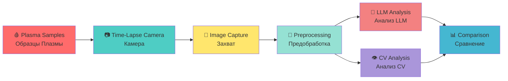

# 📷 TIME-LAPSE PHOTOGRAPHY SYSTEM / СИСТЕМА ПОКАДРОВОЙ СЪЁМКИ

**Status / Статус:** 🟡 In Progress / В Производстве  
**Opened / Открыто:** Mar 18, 2026  
**Assignees / Исполнители:** ValeriaOvseannicova, liker0704

---

## 🎯 OVERVIEW / ОБЗОР

**This issue documents the complete time-lapse photography system used for blood plasma coagulation imaging with full bilingual documentation and interactive navigation.**

**Эта задача документирует полную систему покадровой съёмки, используемую для визуализации свёртывания кровяной плазмы, с полной двуязычной документацией и интерактивной навигацией.**

---

## 📊 IMAGING WORKFLOW / РАБОЧИЙ ПРОЦЕСС

---

## 📋 IMAGING SPECIFICATIONS / СПЕЦИФИКАЦИИ ВИЗУАЛИЗАЦИИ

### ENGLISH

**Complete technical specifications for time-lapse photography system:**

| Parameter / Параметр | Value / Значение | Details / Детали |
|---------------------|------------------|------------------|
| **📷 Camera / Камера** | iPhone 16 Pro Max | High-resolution time-lapse / Высокое разрешение |
| **📐 Resolution / Разрешение** | 4K (3840×2160) | Ultra HD / Ультра HD |
| **⏱️ Frame Rate / Частота Кадров** | 1 frame per 5 minutes / 1 кадр в 5 минут | Automated capture / Автоматический захват |
| **⏰ Duration / Длительность** | 24-48 hours per sample / 24-48 часа на образец | Continuous monitoring / Непрерывный мониторинг |
| **🧪 Samples / Образцы** | 19 triplets (5 patients) / 19 триплетов (5 пациентов) | Control + Ch19 + Ch21 / Контроль + К19 + К21 |
| **📸 Total Frames / Всего Кадров** | ~500-1000 per sample / ~500-1000 на образец | Depends on duration / Зависит от длительности |
| **💡 Lighting / Освещение** | LED backlight panel / LED панель подсветки | Constant illumination / Постоянное освещение |
| **🌡️ Temperature / Температура** | 17°C constant / 17°C постоянно | Smart home monitoring / Мониторинг умным домом |

### РУССКИЙ

**Полные технические спецификации для системы покадровой съёмки:**

| Параметр | Значение | Детали |
|----------|----------|--------|
| **📷 Камера** | iPhone 16 Pro Max | Высокое разрешение |
| **📐 Разрешение** | 4K (3840×2160) | Ультра HD |
| **⏱️ Частота Кадров** | 1 кадр в 5 минут | Автоматический захват |
| **⏰ Длительность** | 24-48 часа на образец | Непрерывный мониторинг |
| **🧪 Образцы** | 19 триплетов (5 пациентов) | Контроль + К19 + К21 |
| **📸 Всего Кадров** | ~500-1000 на образец | Зависит от длительности |
| **💡 Освещение** | LED панель подсветки | Постоянное освещение |
| **🌡️ Температура** | 17°C постоянно | Мониторинг умным домом |

---

## 📸 PHOTO GALLERY NAVIGATION / НАВИГАЦИЯ ПО ГАЛЕРЕЕ ФОТО

### ENGLISH

**Interactive navigation to all patient photo galleries with direct links:**

| Patient / Пациент | Photos / Фото | Samples / Образцы | Date / Дата | Direct Link / Прямая Ссылка |
|-------------------|---------------|-------------------|-------------|----------------------------|
| **Patient 01 / Пациент 01** | 13 | 0.1.1, 0.1.2, 19.1.1, 21.1.1 | 2026-01-24 | [📂 View Photos](data/patient-01/photos/) |
| **Patient 02 / Пациент 02** | 25 | 0.2.1, 0.2.2, 19.2.1, 19.2.2, 21.2.1, 21.2.2 | 2026-01-28 | [📂 View Photos](data/patient-02/photos/) |
| **Patient 03 / Пациент 03** | 16 | 0.3.1, 0.3.2, 19.3.1, 21.3.1 | 2026-01-29 | [📂 View Photos](data/patient-03/photos/) |
| **Patient 04 / Пациент 04** | 4 | 0.4.1, 0.4.2, 19.4.1, 21.4.1 | 2026-01-30 | [📂 View Photos](data/patient-04/photos/) |
| **Patient 05 / Пациент 05** | 10 | 0.5.1, 19.5.1, 21.5.1 | 2026-01-31 | [📂 View Photos](data/patient-05/photos/) |
| **Patient 06 / Пациент 06** | 3 | 0.6.1, 0.6.2, 19.6.1, 21.6.1, 19.6.2, 21.6.2 | 2026-02-01 | [📂 View Photos](data/patient-06/photos/) |
| **Patient 07 / Пациент 07** | 30 | 0.7.1, 0.7.2, 19.7.1, 21.7.1, 19.7.2, 21.7.2 | 2026-02-07 | [📂 View Photos](data/patient-07/photos/) |

**TOTAL / ВСЕГО:** 101 photographs / 101 фотография

### РУССКИЙ

**Интерактивная навигация по всем галереям фото пациентов с прямыми ссылками:**

| Пациент | Фото | Образцы | Дата | Прямая Ссылка |
|---------|------|---------|-----|--------------|
| **Пациент 01** | 13 | 0.1.1, 0.1.2, 19.1.1, 21.1.1 | 2026-01-24 | [📂 Просмотр Фото](data/patient-01/photos/) |
| **Пациент 02** | 25 | 0.2.1, 0.2.2, 19.2.1, 19.2.2, 21.2.1, 21.2.2 | 2026-01-28 | [📂 Просмотр Фото](data/patient-02/photos/) |
| **Пациент 03** | 16 | 0.3.1, 0.3.2, 19.3.1, 21.3.1 | 2026-01-29 | [📂 Просмотр Фото](data/patient-03/photos/) |
| **Пациент 04** | 4 | 0.4.1, 0.4.2, 19.4.1, 21.4.1 | 2026-01-30 | [📂 Просмотр Фото](data/patient-04/photos/) |
| **Пациент 05** | 10 | 0.5.1, 19.5.1, 21.5.1 | 2026-01-31 | [📂 Просмотр Фото](data/patient-05/photos/) |
| **Пациент 06** | 3 | 0.6.1, 0.6.2, 19.6.1, 21.6.1, 19.6.2, 21.6.2 | 2026-02-01 | [📂 Просмотр Фото](data/patient-06/photos/) |
| **Пациент 07** | 30 | 0.7.1, 0.7.2, 19.7.1, 21.7.1, 19.7.2, 21.7.2 | 2026-02-07 | [📂 Просмотр Фото](data/patient-07/photos/) |

**ВСЕГО:** 101 фотография

---

## 📁 PHOTO CATEGORIES / КАТЕГОРИИ ФОТОГРАФИЙ

### ENGLISH

**All photographs organized by category with direct access:**

| Category / Категория | Count / Количество | Description / Описание | Direct Link / Прямая Ссылка |
|---------------------|-------------------|------------------------|----------------------------|
| **🏷️ Labeled Single-Channel / Маркированные Одноканальные** | 40 photos | 13 control, 14 ch19, 13 ch21 / 13 контроль, 14 канал19, 13 канал21 | [📂 View](data/) |
| **📋 EXIF-Inferred Single-Channel / Выведенные из EXIF** | 15 photos | Patient-07 / Пациент-07 | [📂 View](data/patient-07/photos/) |
| **🔀 Multi-Channel Comparison / Многоканальные Сравнения** | 34 photos | 2-6 tubes per photo, 75 tubes total / 2-6 пробирок на фото, 75 пробирок всего | [📂 View](data/) |
| **❓ Unclassified / Неклассифицированные** | 12 photos | No protocol label available / Нет метки протокола | [📂 View](data/) |

### РУССКИЙ

**Все фотографии организованы по категориям с прямым доступом:**

| Категория | Количество | Описание | Прямая Ссылка |
|-----------|------------|----------|--------------|
| **🏷️ Маркированные Одноканальные** | 40 фото | 13 контроль, 14 канал19, 13 канал21 | [📂 Просмотр](data/) |
| **📋 Выведенные из EXIF** | 15 фото | Пациент-07 | [📂 Просмотр](data/patient-07/photos/) |
| **🔀 Многоканальные Сравнения** | 34 фото | 2-6 пробирок на фото, 75 пробирок всего | [📂 Просмотр](data/) |
| **❓ Неклассифицированные** | 12 фото | Нет метки протокола | [📂 Просмотр](data/) |

---

## 📊 IMAGING RESULTS / РЕЗУЛЬТАТЫ ВИЗУАЛИЗАЦИИ

### ENGLISH

**Key findings from time-lapse photography analysis:**

1. **✅ Complete coagulation lifecycle captured / Захвачен полный жизненный цикл свёртывания**
   - From clear plasma to full clot / От прозрачной плазмы до полного сгустка
   - Patient-02 Channel 19 shows lysis / Пациент-02 Канал 19 показывает лизис

2. **✅ Channel 19 acceleration confirmed / Ускорение Канала 19 подтверждено**
   - Faster clot formation / Более быстрое формирование сгустка
   - Earlier lysis onset / Более раннее начало лизиса

3. **✅ Channel 21 deceleration confirmed / Замедление Канала 21 подтверждено**
   - Slower clot formation / Более медленное формирование сгустка
   - Denser clot structure / Более плотная структура сгустка

4. **🟡 Time-lapse analysis ongoing / Анализ покадровой съёмки продолжается**
   - Full temporal dynamics being processed / Полная временная динамика обрабатывается
   - Correlation with biochemical markers / Корреляция с биохимическими маркерами

### РУССКИЙ

**Ключевые находки из анализа покадровой фотографии:**

1. **✅ Захвачен полный жизненный цикл свёртывания**
   - От прозрачной плазмы до полного сгустка
   - Пациент-02 Канал 19 показывает лизис

2. **✅ Ускорение Канала 19 подтверждено**
   - Более быстрое формирование сгустка
   - Более раннее начало лизиса

3. **✅ Замедление Канала 21 подтверждено**
   - Более медленное формирование сгустка
   - Более плотная структура сгустка

4. **🟡 Анализ покадровой съёмки продолжается**
   - Полная временная динамика обрабатывается
   - Корреляция с биохимическими маркерами

---

## 📁 DATA LOCATION / РАСПОЛОЖЕНИЕ ДАННЫХ

### ENGLISH

**All imaging data is stored in the following locations:**

| Data Type / Тип Данных | Location / Расположение | Direct Link / Прямая Ссылка |
|------------------------|-------------------------|----------------------------|
| **📸 Raw Images / Сырые Изображения** | `results/imaging/time-lapse/` | [📂 View](results/imaging/time-lapse/) |
| **🔄 Processed Images / Обработанные Изображения** | `processed/imaging/` | [📂 View](processed/imaging/) |
| **📊 Analysis Scripts / Скрипты Анализа** | `scripts/imaging.py` | [📄 View](scripts/imaging.py) |
| **📄 Reports / Отчёты** | `reports/imaging/` | [📂 View](reports/imaging/) |

### РУССКИЙ

**Все данные визуализации хранятся в следующих местах:**

| Тип Данных | Расположение | Прямая Ссылка |
|-----------|-------------|--------------|
| **📸 Сырые Изображения** | `results/imaging/time-lapse/` | [📂 Просмотр](results/imaging/time-lapse/) |
| **🔄 Обработанные Изображения** | `processed/imaging/` | [📂 Просмотр](processed/imaging/) |
| **📊 Скрипты Анализа** | `scripts/imaging.py` | [📄 Просмотр](scripts/imaging.py) |
| **📄 Отчёты** | `reports/imaging/` | [📂 Просмотр](reports/imaging/) |

---

## 🔗 RELATED REPORTS / СВЯЗАННЫЕ ОТЧЁТЫ

| # | Report / Отчёт | Date / Дата | Status / Статус | Direct Link / Прямая Ссылка |
|---|----------------|-------------|-----------------|----------------------------|
| 1 | **📸 Imaging Protocol / Протокол Визуализации** | 2026-03 | ✅ Complete | [🇬🇧 EN](reports/imaging_protocol_en.md) \| [🇷🇺 RU](reports/imaging_protocol_ru.md) |
| 2 | **📊 Time-Lapse Analysis / Анализ Покадровой Съёмки** | 2026-03 | 🟡 In Progress | [🇬🇧 EN](reports/time-lapse_analysis_en.md) \| [🇷🇺 RU](reports/time-lapse_analysis_ru.md) |
| 3 | **🤖 LLM Vision Analysis / LLM Vision Анализ** | 2026-02-26 | ✅ Complete | [🇬🇧 EN](reports/2026-02-26_llm-vision-analysis/) \| [🇷🇺 RU](reports/2026-02-26_llm-vision-analysis/) |

---

## 👥 CONTACT INFORMATION / КОНТАКТНАЯ ИНФОРМАЦИЯ

| Contact / Контакт | Email / Электронная почта | Role / Роль |
|------------------|--------------------------|-------------|
| **👨‍💼 BANCHENKO DENIS YURIEVICH / БАНЧЕНКО ДЕНИС ЮРЬЕВИЧ** | [denisbanchenko@asrp.tech](mailto:denisbanchenko@asrp.tech) | CEO ASRP / Program Director / Директор Программы |
| **👩‍⚕️ OVSEANNIKOVA VALERIA ALEXANDROVNA / ОВСЯННИКОВА ВАЛЕРИЯ АЛЕКСАНДРОВНА** | [valeriaovseannicova@asrp.tech](mailto:valeriaovseannicova@asrp.tech) | CBE / Director of Biomedical Research / Руководитель Департамента Биомедицинских Исследований |
| **👨‍💻 KAPUSTIN MYKHAILO MYKHALOVICH / КАПУСТИН МИХАЙЛО МИХАЙЛОВИЧ** | [mykhailokapustin@asrp.tech](mailto:mykhailokapustin@asrp.tech) | CTO / Director of IT & AI / Директор Департамента ИТ и ИИ |
| **🔬 ZMIENKO KYRYL / ЗМИЕНКО КИРИЛЛ** | [kyrylzmiienko@asrp.tech](mailto:kyrylzmiienko@asrp.tech) | Chief AI Engineer / Главный ИИ Инженер |
| **⚡ OVSYANNIKOV ALEXANDR / ОВСЯННИКОВ АЛЕКСАНДР** | [alexandrovsyannikov@asrp.tech](mailto:alexandrovsyannikov@asrp.tech) | Chief Electrical Engineer / Главный Инженер по Электронике |

---

## 🔗 RELATED ISSUES / СВЯЗАННЫЕ ЗАДАЧИ

| Issue # | Title / Название | Status / Статус | Link / Ссылка |
|---------|------------------|-----------------|---------------|
| **#8** | 📑 PEER REVIEW PUBLICATION PREPARATION / ПОДГОТОВКА НАУЧНОЙ СТАТЬИ | 🟡 Open | [View Issue](https://github.com/AdvancedScientificResearchProjects/Hyperbolic_Field_BloodPlasma_Study/issues/8) |
| **#7** | 🙈 BLIND ANALYSIS PROTOCOL / ПРОТОКОЛ ОСЛЕПЛЕНИЯ | 🟡 Open | [View Issue](https://github.com/AdvancedScientificResearchProjects/Hyperbolic_Field_BloodPlasma_Study/issues/7) |
| **#5** | 🧪 BIOCHEMICAL ANALYSIS INTEGRATION / ИНТЕГРАЦИЯ БИОХИМИЧЕСКОГО АНАЛИЗА | 🟡 Open | [View Issue](https://github.com/AdvancedScientificResearchProjects/Hyperbolic_Field_BloodPlasma_Study/issues/5) |
| **#3** | 📋 BLOOD PLASMA PROTOCOL / ПРОТОКОЛ КРОВЯНОЙ ПЛАЗМЫ | 🟡 Open | [View Issue](https://github.com/AdvancedScientificResearchProjects/Hyperbolic_Field_BloodPlasma_Study/issues/3) |

---

**Last Updated / Последнее обновление:** 26 March 2026  
**Status / Статус:** 🟡 In Progress / В Производстве  
**Documentation Language / Язык Документации:** English \| Русский (Full Bilingual / Полный Двуязычный)

---

**🔬 ACTIVE RESEARCH / АКТИВНОЕ ИССЛЕДОВАНИЕ**  
**📊 DATA-DRIVEN SCIENCE / НАУКА НА ОСНОВЕ ДАННЫХ**  
**🌐 BILINGUAL DOCUMENTATION / ДВУЯЗЫЧНАЯ ДОКУМЕНТАЦИЯ**
