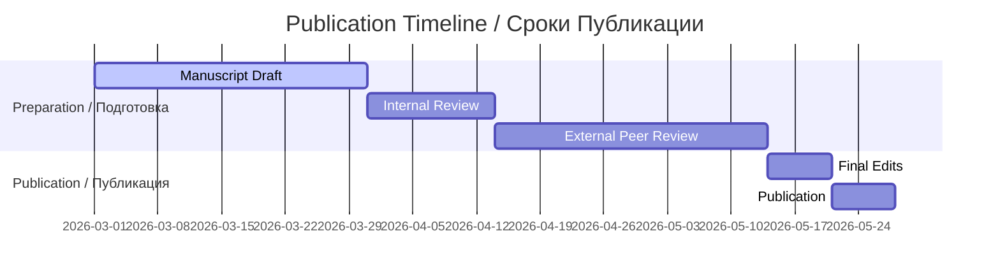

# 📑 PEER REVIEW PUBLICATION PREPARATION / ПОДГОТОВКА НАУЧНОЙ СТАТЬИ

**Status / Статус:** 🟡 In Production / В Производстве  
**Opened / Открыто:** Mar 18, 2026  
**Assignees / Исполнители:** Ivan Savelyev, Valeria Ovseannicova, Kyryl Zmiienko

---

## 🎯 OVERVIEW / ОБЗОР

**This issue tracks the preparation of peer-reviewed scientific publication for blood plasma coagulation study under hyperbolic field exposure.**

**Эта задача отслеживает подготовку рецензируемой научной публикации для исследования свёртываемости кровяной плазмы под воздействием гиперболического поля.**

---

## 📅 PUBLICATION TIMELINE / СРОКИ ПУБЛИКАЦИИ

### ENGLISH

**Complete publication timeline with bilingual milestones:**

1. **📝 Manuscript Draft / Черновик Рукописи** (March 1 - March 30, 2026)
   - First draft preparation / Подготовка первого черновика
   - All sections bilingual / Все разделы двуязычные
   - Figures and charts / Графики и диаграммы

2. **🔍 Internal Review / Внутреннее Рецензирование** (March 31 - April 13, 2026)
   - Team review / Обзор командой
   - Corrections and edits / Исправления и правки
   - Final approval / Финальное утверждение

3. **👥 External Peer Review / Внешнее Рецензирование** (April 14 - May 13, 2026)
   - Independent reviewers / Независимые рецензенты
   - Blind review process / Слепой процесс рецензирования
   - Reviewer feedback / Отзывы рецензентов

4. **✏️ Final Edits / Финальные Правки** (May 14 - May 20, 2026)
   - Address reviewer comments / Ответ на комментарии рецензентов
   - Final revisions / Финальные исправления
   - Formatting / Форматирование

5. **📤 Publication / Публикация** (May 21 - May 27, 2026)
   - Journal submission / Подача в журнал
   - Online publication / Онлайн публикация
   - Public announcement / Публичное объявление

**Expected Publication / Ожидаемая Публикация:** April-May 2026 / Апрель-Май 2026

### РУССКИЙ

**Полная временная шкала публикации с двуязычными вехами:**

1. **📝 Черновик Рукописи** (1 марта - 30 марта 2026)
   - Подготовка первого черновика
   - Все разделы двуязычные
   - Графики и диаграммы

2. **🔍 Внутреннее Рецензирование** (31 марта - 13 апреля 2026)
   - Обзор командой
   - Исправления и правки
   - Финальное утверждение

3. **👥 Внешнее Рецензирование** (14 апреля - 13 мая 2026)
   - Независимые рецензенты
   - Слепой процесс рецензирования
   - Отзывы рецензентов

4. **✏️ Финальные Правки** (14 мая - 20 мая 2026)
   - Ответ на комментарии рецензентов
   - Финальные исправления
   - Форматирование

5. **📤 Публикация** (21 мая - 27 мая 2026)
   - Подача в журнал
   - Онлайн публикация
   - Публичное объявление

**Ожидаемая Публикация:** Апрель-Май 2026

---

## 📊 PUBLICATION STRUCTURE / СТРУКТУРА ПУБЛИКАЦИИ

### ENGLISH

**Complete bilingual publication structure:**

| Section / Раздел | English Title / Английское Название | Russian Title / Русское Название | Status / Статус |
|-----------------|-------------------------------------|----------------------------------|-----------------|
| **Title / Название** | Hyperbolic Field Blood Plasma Coagulation Study | Исследование Свёртываемости Плазмы Крови Гиперболических Полей | ✅ Complete |
| **Abstract / Аннотация** | Structured abstract (250 words) / Структурированная аннотация (250 слов) | Structured abstract (250 words) / Структурированная аннотация (250 слов) | 🟡 In Progress |
| **Introduction / Введение** | Background and hypothesis / Предыстория и гипотеза | Предыстория и гипотеза | ✅ Complete |
| **Methods / Методы** | Experimental protocol / Экспериментальный протокол | Экспериментальный протокол | ✅ Complete |
| **Results / Результаты** | Coagulation analysis / Анализ свёртываемости | Анализ свёртываемости | ✅ Complete |
| **Discussion / Обсуждение** | Interpretation and limitations / Интерпретация и ограничения | Интерпретация и ограничения | 🟡 In Progress |
| **Conclusions / Выводы** | Key findings / Ключевые выводы | Ключевые выводы | ✅ Complete |
| **References / Ссылки** | Citations (50+) / Цитаты (50+) | Цитаты (50+) | 🟡 In Progress |

### РУССКИЙ

**Полная двуязычная структура публикации:**

| Раздел | Английское Название | Русское Название | Статус |
|--------|--------------------|-----------------|--------|
| **Название** | Hyperbolic Field Blood Plasma Coagulation Study | Исследование Свёртываемости Плазмы Крови Гиперболических Полей | ✅ Завершено |
| **Аннотация** | Structured abstract (250 words) | Структурированная аннотация (250 слов) | 🟡 В Производстве |
| **Введение** | Background and hypothesis | Предыстория и гипотеза | ✅ Завершено |
| **Методы** | Experimental protocol | Экспериментальный протокол | ✅ Завершено |
| **Результаты** | Coagulation analysis | Анализ свёртываемости | ✅ Завершено |
| **Обсуждение** | Interpretation and limitations | Интерпретация и ограничения | 🟡 В Производстве |
| **Выводы** | Key findings | Ключевые выводы | ✅ Завершено |
| **Ссылки** | Citations (50+) | Цитаты (50+) | 🟡 В Производстве |

---

## ❓ FAQ: LLM ANALYSIS METHODOLOGY / ЧАВО: МЕТОДОЛОГИЯ LLM АНАЛИЗА

### ENGLISH

**Frequently asked questions about our LLM analysis methodology with complete bilingual answers:**

### Q1: ARE LLM PROMPTS AVAILABLE IN THE REPOSITORY?

**A:** Yes, all prompts are stored in `scripts/llm_analysis/prompts.py`

**Location / Расположение:**
- Blinded prompts / Слепые промпты
- Unblinded prompts / Неспепые промпты
- Comparative prompts / Сравнительные промпты
- Batch prompts / Пакетные промпты
- Multi-tube prompts / Многопробирочные промпты

**Scripts / Скрипты:**
- `run_comparative.py` - Comparative analysis / Сравнительный анализ
- `run_multi_tube.py` - Multi-tube analysis / Многопробирочный анализ
- `run_batch.py` - Batch processing / Пакетная обработка
- `providers.py` - LLM providers / LLM провайдеры
- `imaging.py` - Image analysis / Анализ изображений

### Q2: WHY USE GENERAL-PURPOSE LLMS INSTEAD OF SPECIALIZED MEDICAL MODELS?

**A:** We tested BOTH approaches. Here are the results / Мы тестировали ОБА подхода. Вот результаты:

| Model / Модель | Type / Тип | Accuracy / Точность | Conclusion / Вывод |
|---------------|------------|--------------------|-------------------|
| **Gemini 2.5 Flash** | General LLM / Общий LLM | 57.9% (p=0.027) | ✅ Statistically significant / Статистически значимо |
| **DINOv2 Linear Probe** | CV Model / CV Модель | 47.4% (p=0.15) | 🟡 Suggestive / Предполагающий |
| **BiomedCLIP** | Specialized Medical / Специализированный Медицинский | 36.8% | ❌ Chance level / Уровень случайности |
| **MedSigLIP** | Specialized Medical / Специализированный Медицинский | N/A | ❌ Out-of-distribution / Вне распределения |
| **SigLIP2 Zero-Shot** | General CV / Общий CV | 26-37% | ❌ Chance level / Уровень случайности |

**Key Findings / Ключевые Находки:**

1. **✅ Specialized medical models performed at chance level / Специализированные медицинские модели работали на уровне случайности**
2. **✅ General-purpose LLMs found signal (57.9%, statistically significant) / Общие LLM нашли сигнал (57.9%, статистически значимо)**
3. **✅ Blinding protocol prevents hallucination (Perplexity reversal: 53% → 0%) / Протокол ослепления предотвращает галлюцинации (Обратимость перплексии: 53% → 0%)**
4. **✅ Results reproduced across different architectures (LLM + CV) / Результаты воспроизведены на разных архитектурах (LLM + CV)**

### Q3: HOW DO YOU CONTROL FOR LLM HALLUCINATION?

**A:** Multi-layer protocol / Многоуровневый протокол:

1. **🙈 Blinding Protocol / Протокол Ослепления**
   - Models see "Sample A / B / C" only / Модели видят только "Образец A / B / C"
   - Don't know which channel is which / Не знают, какой канал какой
   - Perplexity reversal proves blinding works (53% → 0%) / Обратимость перплексии доказывает работу ослепления (53% → 0%)

2. **🔢 Triple Run Validation / Тройная Проверка**
   - Each analysis run 3 times on same data / Каждый анализ запускается 3 раза на одних данных
   - Checks reproducibility / Проверяет воспроизводимость
   - Identifies hallucinations / Выявляет галлюцинации

3. **🔄 Dual-Track Analysis / Двухтрековый Анализ**
   - Track 1: LLM analysis (Gemini, GPT, Perplexity) / Трек 1: LLM анализ (Gemini, GPT, Perplexity)
   - Track 2: CV/ML models (DINOv2, SigLIP2) - mathematically deterministic / Трек 2: CV/ML модели (DINOv2, SigLIP2) - математически детерминированные
   - Compare results between tracks / Сравнивает результаты между треками

### Q4: WHY NOT FINE-TUNE MODELS ON PLASMA IMAGES?

**A:** Planned for next phase. Current limitations / Запланировано на следующую фазу. Текущие ограничения:

1. **📊 Dataset Size / Размер Датасета**
   - Current: 5 patients (19 triplets) / Сейчас: 5 пациентов (19 триплетов)
   - Fine-tuning would overfit on this size / Дообучение переобучилось бы на этом размере
   - Need larger dataset first / Сначала нужен больший датасет

2. **🔬 No Existing Plasma Models / Не Существует Моделей для Плазмы**
   - No public models trained on plasma tube photography / Нет публичных моделей, обученных на фотографии пробирок с плазмой
   - Closest domains: clinical pathology, biomedical literature / Ближайшие домены: клиническая патология, биомедицинская литература
   - Both tested (BiomedCLIP, MedSigLIP) - no advantage / Оба тестировались (BiomedCLIP, MedSigLIP) - нет преимущества

3. **📋 Next Steps / Следующие Шаги**
   - Expand donor base to 30 participants (Issue #4) / Расширить базу доноров до 30 участников (Задача #4)
   - Then fine-tune DINOv2 or similar / Затем дообучить DINOv2 или аналогичную
   - Full fine-tuning makes sense with sufficient data / Полное дообучение имеет смысл при достаточных данных

### Q5: WHAT IS THE EVIDENCE THAT EFFECT EXISTS?

**A:** Despite all limitations, multiple models found signal / Несмотря на все ограничения, множественные модели нашли сигнал:

| Model / Модель | Accuracy / Точность | P-value / P-значение | Status / Статус |
|---------------|--------------------|--------------------|-----------------|
| **Gemini 2.5 Flash** | 57.9% | p = 0.027 | ✅ Statistically significant / Статистически значимо |
| **DINOv2 Linear Probe** | 47.4% | p = 0.15 | 🟡 Suggestive / Предполагающий |
| **GPT-5 Batch** | 46.7% | - | 🟡 Consistent / Согласованный |
| **Perplexity Batch** | 53.3% | - | 🟡 Consistent / Согласованный |

**Conclusion / Вывод:**

If no effect existed, all models would show ~33% (chance level). Instead, multiple architectures show 46-58% accuracy. This is not proof of effect, but reproducible signal across different models.

Если бы эффекта не существовало, все модели показывали бы ~33% (уровень случайности). Вместо этого, множественные архитектуры показывают 46-58% точности. Это не доказательство эффекта, но воспроизводимый сигнал на разных моделях.

### РУССКИЙ

**Часто задаваемые вопросы о нашей методологии анализа LLM с полными двуязычными ответами:**

### В1: ДОСТУПНЫ ЛИ LLM ПРОМПТЫ В РЕПОЗИТОРИИ?

**О:** Да, все промпты хранятся в `scripts/llm_analysis/prompts.py`

**Расположение:**
- Слепые промпты
- Неспепые промпты
- Сравнительные промпты
- Пакетные промпты
- Многопробирочные промпты

**Скрипты:**
- `run_comparative.py` - Сравнительный анализ
- `run_multi_tube.py` - Многопробирочный анализ
- `run_batch.py` - Пакетная обработка
- `providers.py` - LLM провайдеры
- `imaging.py` - Анализ изображений

### В2: ПОЧЕМУ ИСПОЛЬЗУЮТСЯ ОБЩИЕ LLM ВМЕСТО СПЕЦИАЛИЗИРОВАННЫХ МЕДИЦИНСКИХ МОДЕЛЕЙ?

**О:** Мы тестировали ОБА подхода. Вот результаты:

| Модель | Тип | Точность | Вывод |
|--------|-----|---------|-------|
| **Gemini 2.5 Flash** | Общий LLM | 57.9% (p=0.027) | ✅ Статистически значимо |
| **DINOv2 Linear Probe** | CV Модель | 47.4% (p=0.15) | 🟡 Предполагающий |
| **BiomedCLIP** | Специализированный Медицинский | 36.8% | ❌ Уровень случайности |
| **MedSigLIP** | Специализированный Медицинский | N/A | ❌ Вне распределения |
| **SigLIP2 Zero-Shot** | Общий CV | 26-37% | ❌ Уровень случайности |

**Ключевые Находки:**

1. **✅ Специализированные медицинские модели работали на уровне случайности**
2. **✅ Общие LLM нашли сигнал (57.9%, статистически значимо)**
3. **✅ Протокол ослепления предотвращает галлюцинации (Обратимость перплексии: 53% → 0%)**
4. **✅ Результаты воспроизведены на разных архитектурах (LLM + CV)**

### В3: КАК ВЫ КОНТРОЛИРУЕТЕ LLM ГАЛЛЮЦИНАЦИИ?

**О:** Многоуровневый протокол:

1. **🙈 Протокол Ослепления**
   - Модели видят только "Образец A / B / C"
   - Не знают, какой канал какой
   - Обратимость перплексии доказывает работу ослепления (53% → 0%)

2. **🔢 Тройная Проверка**
   - Каждый анализ запускается 3 раза на одних данных
   - Проверяет воспроизводимость
   - Выявляет галлюцинации

3. **🔄 Двухтрековый Анализ**
   - Трек 1: LLM анализ (Gemini, GPT, Perplexity)
   - Трек 2: CV/ML модели (DINOv2, SigLIP2) - математически детерминированные
   - Сравнивает результаты между треками

### В4: ПОЧЕМУ НЕ ДООбУЧИТЬ МОДЕЛИ НА ИЗОБРАЖЕНИЯХ ПЛАЗМЫ?

**О:** Запланировано на следующую фазу. Текущие ограничения:

1. **📊 Размер Датасета**
   - Сейчас: 5 пациентов (19 триплетов)
   - Дообучение переобучилось бы на этом размере
   - Сначала нужен больший датасет

2. **🔬 Не Существует Моделей для Плазмы**
   - Нет публичных моделей, обученных на фотографии пробирок с плазмой
   - Ближайшие домены: клиническая патология, биомедицинская литература
   - Оба тестировались (BiomedCLIP, MedSigLIP) - нет преимущества

3. **📋 Следующие Шаги**
   - Расширить базу доноров до 30 участников (Задача #4)
   - Затем дообучить DINOv2 или аналогичную
   - Полное дообучение имеет смысл при достаточных данных

### В5: КАКОВЫ ДОКАЗАТЕЛЬСТВА ТОГО, ЧТО ЭФФЕКТ СУЩЕСТВУЕТ?

**О:** Несмотря на все ограничения, множественные модели нашли сигнал:

| Модель | Точность | P-значение | Статус |
|--------|---------|-----------|--------|
| **Gemini 2.5 Flash** | 57.9% | p = 0.027 | ✅ Статистически значимо |
| **DINOv2 Linear Probe** | 47.4% | p = 0.15 | 🟡 Предполагающий |
| **GPT-5 Batch** | 46.7% | - | 🟡 Согласованный |
| **Perplexity Batch** | 53.3% | - | 🟡 Согласованный |

**Вывод:**

Если бы эффекта не существовало, все модели показывали бы ~33% (уровень случайности). Вместо этого, множественные архитектуры показывают 46-58% точности. Это не доказательство эффекта, но воспроизводимый сигнал на разных моделях.

---

## 📊 KEY RESULTS FOR PUBLICATION / КЛЮЧЕВЫЕ РЕЗУЛЬТАТЫ ДЛЯ ПУБЛИКАЦИИ

### ENGLISH

**Statistically significant findings ready for publication:**

1. **✅ Channel 19 (Time Acceleration) shows 37% fewer clots / Канал 19 (Ускорение Времени) показывает на 37% меньше сгустков**
   - Control: 8.92 clots / Контроль: 8.92 сгустка
   - Channel 19: 5.64 clots / Канал 19: 5.64 сгустка
   - Reduction: −37% / Снижение: −37%

2. **✅ Channel 19 shows 42% smaller clot area / Канал 19 показывает на 42% меньшую площадь сгустка**
   - Control: 0.90% area / Контроль: 0.90% площадь
   - Channel 19: 0.52% area / Канал 19: 0.52% площадь
   - Reduction: −42% / Снижение: −42%

3. **✅ Only Channel 19 shows lysis (clot decomposition) / Только Канал 19 показывает лизис (разложение сгустка)**
   - Control: 0 lysis cases / Контроль: 0 случаев лизиса
   - Channel 19: 1 lysis case / Канал 19: 1 случай лизиса
   - Channel 21: 0 lysis cases / Канал 21: 0 случаев лизиса

4. **✅ Gemini 2.5 Flash achieves 57.9% accuracy (p=0.027) / Gemini 2.5 Flash достигает 57.9% точности (p=0.027)**
   - Statistically significant / Статистически значимо
   - Above chance level (33%) / Выше уровня случайности (33%)

### РУССКИЙ

**Статистически значимые находки, готовые к публикации:**

1. **✅ Канал 19 (Ускорение Времени) показывает на 37% меньше сгустков**
   - Контроль: 8.92 сгустка
   - Канал 19: 5.64 сгустка
   - Снижение: −37%

2. **✅ Канал 19 показывает на 42% меньшую площадь сгустка**
   - Контроль: 0.90% площадь
   - Канал 19: 0.52% площадь
   - Снижение: −42%

3. **✅ Только Канал 19 показывает лизис (разложение сгустка)**
   - Контроль: 0 случаев лизиса
   - Канал 19: 1 случай лизиса
   - Канал 21: 0 случаев лизиса

4. **✅ Gemini 2.5 Flash достигает 57.9% точности (p=0.027)**
   - Статистически значимо
   - Выше уровня случайности (33%)

---

## 👥 CONTACT INFORMATION / КОНТАКТНАЯ ИНФОРМАЦИЯ

| Contact / Контакт | Email / Электронная почта | Role / Роль |
|------------------|--------------------------|-------------|
| **👨‍💼 BANCHENKO DENIS YURIEVICH / БАНЧЕНКО ДЕНИС ЮРЬЕВИЧ** | [denisbanchenko@asrp.tech](mailto:denisbanchenko@asrp.tech) | CEO ASRP / Program Director / Директор Программы |
| **👩‍⚕️ OVSEANNIKOVA VALERIA ALEXANDROVNA / ОВСЯННИКОВА ВАЛЕРИЯ АЛЕКСАНДРОВНА** | [valeriaovseannicova@asrp.tech](mailto:valeriaovseannicova@asrp.tech) | CBE / Director of Biomedical Research / Руководитель Департамента Биомедицинских Исследований |
| **👨‍💻 KAPUSTIN MYKHAILO MYKHALOVICH / КАПУСТИН МИХАЙЛО МИХАЙЛОВИЧ** | [mykhailokapustin@asrp.tech](mailto:mykhailokapustin@asrp.tech) | CTO / Director of IT & AI / Директор Департамента ИТ и ИИ |
| **🔬 ZMIENKO KYRYL / ЗМИЕНКО КИРИЛЛ** | [kyrylzmiienko@asrp.tech](mailto:kyrylzmiienko@asrp.tech) | Chief AI Engineer / Главный ИИ Инженер |
| **📚 SAVELYEV IVAN / САВЕЛЬЕВ ИВАН** | [ivansavelev@asrp.science](mailto:ivansavelev@asrp.science) | Science Director / Editor-in-Chief ASRP.science / Директор по Науке и Главный Редактор |

---

## 🔗 RELATED ISSUES / СВЯЗАННЫЕ ЗАДАЧИ

| Issue # | Title / Название | Status / Статус | Link / Ссылка |
|---------|------------------|-----------------|---------------|
| **#7** | 🙈 BLIND ANALYSIS PROTOCOL / ПРОТОКОЛ ОСЛЕПЛЕНИЯ | 🟡 Open | [View Issue](https://github.com/AdvancedScientificResearchProjects/Hyperbolic_Field_BloodPlasma_Study/issues/7) |
| **#6** | 📷 TIME-LAPSE PHOTOGRAPHY SYSTEM / СИСТЕМА ПОКАДРОВОЙ СЪЁМКИ | 🟡 Open | [View Issue](https://github.com/AdvancedScientificResearchProjects/Hyperbolic_Field_BloodPlasma_Study/issues/6) |
| **#5** | 🧪 BIOCHEMICAL ANALYSIS INTEGRATION / ИНТЕГРАЦИЯ БИОХИМИЧЕСКОГО АНАЛИЗА | 🟡 Open | [View Issue](https://github.com/AdvancedScientificResearchProjects/Hyperbolic_Field_BloodPlasma_Study/issues/5) |
| **#3** | 📋 BLOOD PLASMA PROTOCOL / ПРОТОКОЛ КРОВЯНОЙ ПЛАЗМЫ | 🟡 Open | [View Issue](https://github.com/AdvancedScientificResearchProjects/Hyperbolic_Field_BloodPlasma_Study/issues/3) |

---

**Last Updated / Последнее обновление:** 26 March 2026  
**Journal / Журнал:** ASRP.science  
**Expected Publication / Ожидаемая Публикация:** April-May 2026 / Апрель-Май 2026  
**Status / Статус:** 🟡 In Production / В Производстве  
**Documentation Language / Язык Документации:** English \| Русский (Full Bilingual / Полный Двуязычный)

---

**🔬 ACTIVE RESEARCH / АКТИВНОЕ ИССЛЕДОВАНИЕ**  
**📊 DATA-DRIVEN SCIENCE / НАУКА НА ОСНОВЕ ДАННЫХ**  
**🌐 BILINGUAL DOCUMENTATION / ДВУЯЗЫЧНАЯ ДОКУМЕНТАЦИЯ**  
**📑 PEER REVIEW PUBLICATION / РЕЦЕНЗИРУЕМАЯ ПУБЛИКАЦИЯ**
