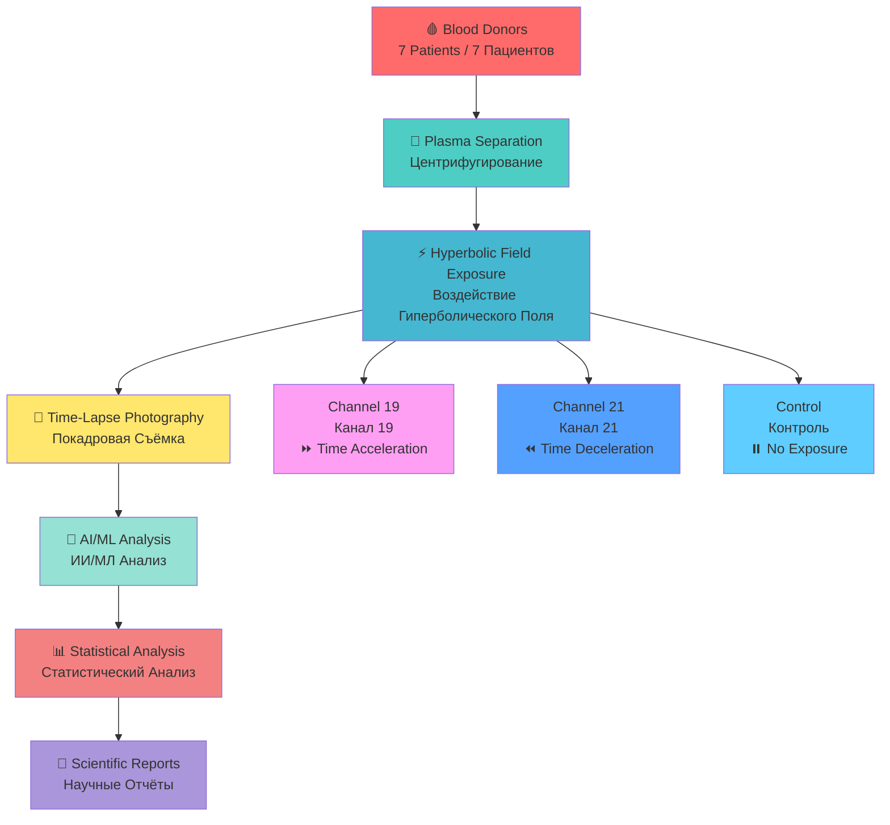
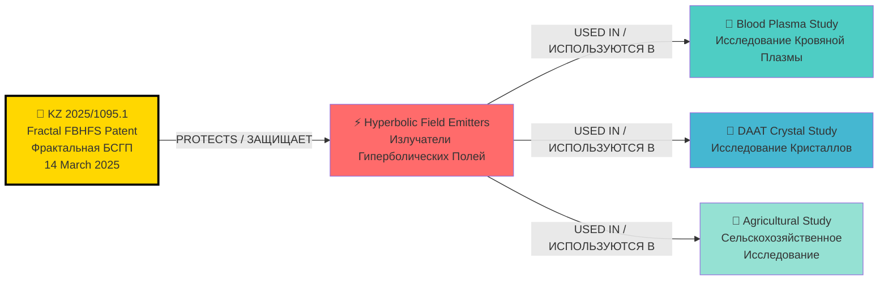
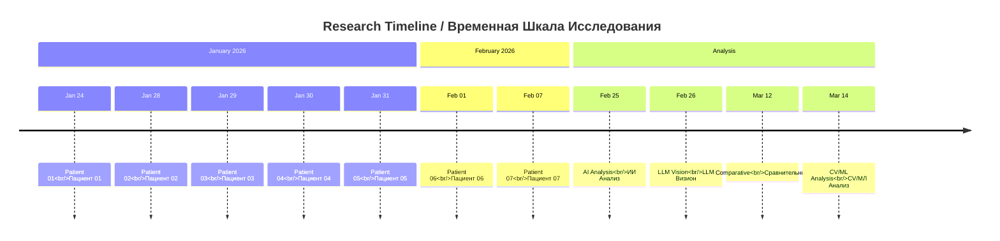
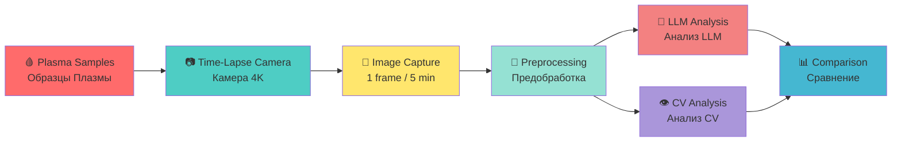
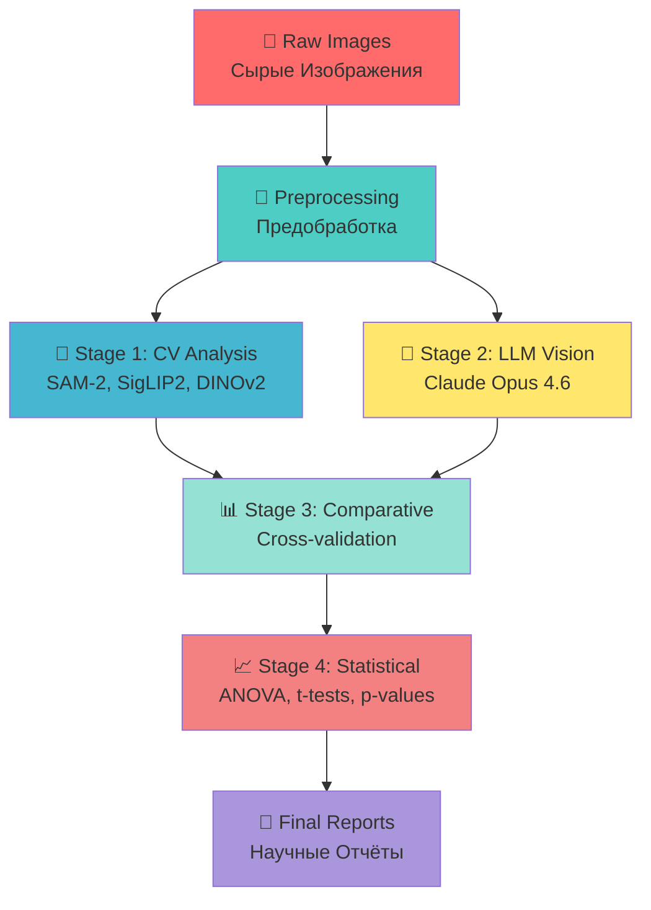
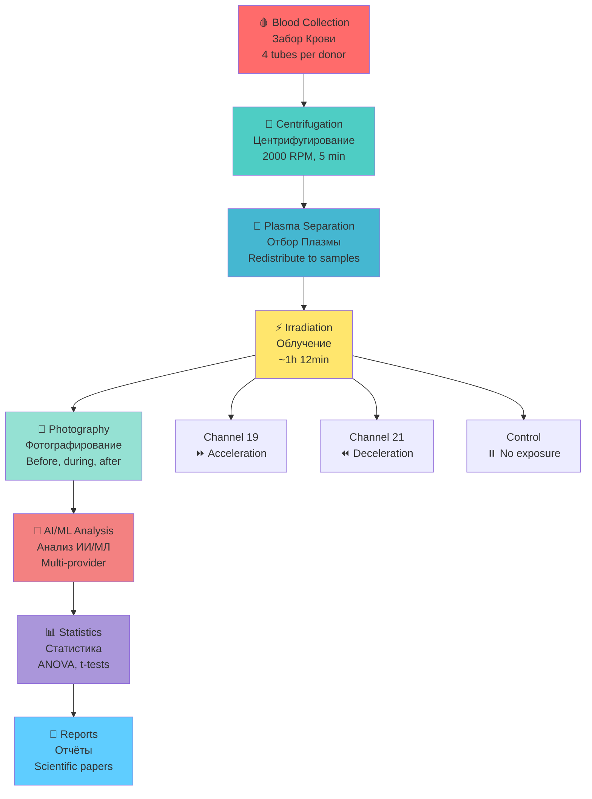

# 🔬 Hyperbolic Field Blood Plasma Study / Исследование Кровяной Плазмы Гиперболических Полей

**Experimental datasets, imaging results and analytical materials from blood plasma exposure to hyperbolic field emitters. Includes raw data, controlled environment documentation and protocol references.**

**Экспериментальные наборы данных, результаты визуализации и аналитические материалы воздействия излучателей гиперболических полей на кровяную плазму. Включает исходные данные, документацию контролируемой среды и ссылки на протоколы.**

---

## 📊 QUICK NAVIGATION / БЫСТРАЯ НАВИГАЦИЯ

| 📁 **Data & Photos** / **Данные и Фото** | 📄 **Reports** / **Отчёты** | 👥 **Team** / **Команда** | 🔬 **Issues** / **Задачи** |
|------------------------------------------|----------------------------|---------------------------|----------------------------|
| [📸 Photo Gallery](#-photo-gallery--галерея-фотографий) | [📊 All Reports](#-reports--отчёты) | [👨‍🔬 Research Team](#-research-team--команда-исследования) | [📋 Issue #1: Protocol](https://github.com/AdvancedScientificResearchProjects/Hyperbolic_Field_BloodPlasma_Study/issues/1) |
| [📁 Data Structure](#-data-structure--структура-данных) | [🧪 Biochemical Analysis](#-reports--отчёты) | [📞 Contacts](#-contact-information--контактная-информация) | [📷 Issue #3: Photography](https://github.com/AdvancedScientificResearchProjects/Hyperbolic_Field_BloodPlasma_Study/issues/3) |
| [🗂️ All Folders](#-complete-folder-structure--полная-структура-папок) | [🤖 AI/ML Analysis](#-reports--отчёты) | [🔗 Patent Connection](#-patent-connection--связь-с-патентом) | [🧪 Issue #5: Biochemical](https://github.com/AdvancedScientificResearchProjects/Hyperbolic_Field_BloodPlasma_Study/issues/5) |
| [📊 Results](#-key-results--ключевые-результаты) | [📝 Protocols](#-reports--отчёты) | [🌐 ASRP.drift Ecosystem](#-asrpdrift-ecosystem--экосистема-аспрдрифт) | [📑 Issue #8: Publication](https://github.com/AdvancedScientificResearchProjects/Hyperbolic_Field_BloodPlasma_Study/issues/8) |

---

## 🎯 RESEARCH OVERVIEW / ОБЗОР ИССЛЕДОВАНИЯ



### 📋 KEY METRICS / КЛЮЧЕВЫЕ МЕТРИКИ

| Metric / Метрика | Value / Значение | Status / Статус |
|------------------|------------------|-----------------|
| **👥 Donors / Доноры** | 7 patients / 7 пациентов | ✅ Complete |
| **📸 Total Photographs / Всего Фотографий** | 101 images / 101 изображение | ✅ Complete |
| **🧪 Samples / Образцы** | 40+ single-channel / 40+ одноканальных | ✅ Complete |
| **⏱️ Irradiation Duration / Длительность Облучения** | ~1h 12min per patient / ~1ч 12мин на пациента | ✅ Complete |
| **🌡️ Temperature / Температура** | 17°C constant / 17°C постоянно | ✅ Monitored |
| **🤖 AI Providers / ИИ Провайдеры** | 8 LLM + CV models / 8 моделей LLM + CV | ✅ Complete |
| **📊 Statistical Significance / Статистическая Значимость** | p = 0.027 (Gemini) | ✅ Significant |

---

## 🔗 PATENT CONNECTION / СВЯЗЬ С ПАТЕНТОМ

**✅ THIS RESEARCH USES TECHNOLOGY PROTECTED BY PATENT:**
**✅ ЭТО ИССЛЕДОВАНИЕ ИСПОЛЬЗУЕТ ТЕХНОЛОГИЮ ЗАЩИЩЕННУЮ ПАТЕНТОМ:**



**Patent Repository / Патентный Репозиторий:** [🔗 Kazpatent_Fractal_Biomedical_System_Patent](https://github.com/denisbanchenko/Kazpatent_Fractal_Biomedical_System_Patent)

**Patent Issue #6 (Research Connection) / Патент Issue #6 (Связь с Исследованиями):** [🔗 View Connection Diagram](https://github.com/denisbanchenko/Kazpatent_Fractal_Biomedical_System_Patent/issues/6)

---

## 📊 KEY RESULTS / КЛЮЧЕВЫЕ РЕЗУЛЬТАТЫ

### 🎯 HYPOTHESIS VALIDATION / ВАЛИДАЦИЯ ГИПОТЕЗЫ



### 📈 COMPARATIVE RESULTS / СРАВНИТЕЛЬНЫЕ РЕЗУЛЬТАТЫ

| Parameter / Параметр | Control / Контроль | Channel 19 / Канал 19<br/>⏩ Acceleration / Ускорение | Channel 21 / Канал 21<br/>⏪ Deceleration / Замедление |
|---------------------|-------------------|---------------------------------------------------|-----------------------------------------------------|
| **📊 Photos with Clots / Фото со Сгустками** | 62-65% | 71-78% | 41-54% |
| **🔢 Clot Count (mean) / Количество Сгустков (среднее)** | 8.92 | 5.64 **(−37%)** 🔻 | 8.69 (−3%) |
| **📏 Total Clot Area / Общая Площадь Сгустков** | 0.90% | 0.52% **(−42%)** 🔻 | 0.58% (−35%) |
| **✨ Lysis Cases / Случаи Лизиса** | 0 | **1 (only channel)** 🎯 | 0 |
| **🔍 GLCM Contrast / Текстурный Контраст** | 4.12 | 5.26 **(+28%)** 🔺 | 4.16 (+1%) |
| **📐 Edge Density / Плотность Краёв** | 0.0016 | 0.0012 (−25%) 🔻 | 0.0034 **(+113%)** 🔺 |

### 🎯 KEY FINDINGS / КЛЮЧЕВЫЕ ВЫВОДЫ

| Channel / Канал | Effect / Эффект | Interpretation / Интерпретация |
|----------------|-----------------|-------------------------------|
| **⏩ Channel 19 / Канал 19** | 37% fewer clots, 42% smaller area, ONLY channel with lysis | Samples appear "OLDER" — accelerated through coagulation lifecycle / Образцы выглядят "СТАРШЕ" — ускоренный жизненный цикл |
| **⏪ Channel 21 / Канал 21** | 41% clot rate vs 65% control, dense formation | Samples appear "YOUNGER" — delayed coagulation onset / Образцы выглядят "МОЛОЖЕ" — замедленное начало |
| **⏸️ Control / Контроль** | Baseline coagulation progression | Normal coagulation without exposure / Нормальное свёртывание без воздействия |

---

## 📸 PHOTO GALLERY / ГАЛЕРЕЯ ФОТОГРАФИЙ

### 🎥 TIME-LAPSE PHOTOGRAPHY SYSTEM / СИСТЕМА ПОКАДРОВОЙ СЪЁМКИ



### 📷 IMAGING SPECIFICATIONS / СПЕЦИФИКАЦИИ ВИЗУАЛИЗАЦИИ

| Parameter / Параметр | Value / Значение |
|---------------------|------------------|
| **📷 Camera / Камера** | iPhone 16 Pro Max (High-resolution time-lapse) |
| **📐 Resolution / Разрешение** | 4K (3840×2160) |
| **⏱️ Frame Rate / Частота Кадров** | 1 frame per 5 minutes / 1 кадр в 5 минут |
| **⏰ Duration / Длительность** | 24-48 hours per sample / 24-48 часа на образец |
| **🧪 Samples / Образцы** | 19 triplets (5 patients) / 19 триплетов (5 пациентов) |
| **📸 Total Frames / Всего Кадров** | ~500-1000 per sample / ~500-1000 на образец |

### 🗂️ PHOTO CATEGORIES / КАТЕГОРИИ ФОТОГРАФИЙ

| Category / Категория | Count / Количество | Description / Описание |
|---------------------|-------------------|------------------------|
| **🏷️ Labeled Single-Channel / Маркированные Одноканальные** | 40 photos | 13 control, 14 ch19, 13 ch21 / 13 контроль, 14 канал19, 13 канал21 |
| **📋 EXIF-Inferred Single-Channel / Выведенные из EXIF** | 15 photos | Patient-07 / Пациент-07 |
| **🔀 Multi-Channel Comparison / Многоканальные Сравнения** | 34 photos | 2-6 tubes per photo, 75 tubes total / 2-6 пробирок на фото, 75 пробирок всего |
| **❓ Unclassified / Неклассифицированные** | 12 photos | No protocol label available / Нет метки протокола |

**📁 Browse All Photos / Просмотреть Все Фото:**
- [📂 data/patient-01/photos/](data/patient-01/photos/) — Patient 01 (13 photos)
- [📂 data/patient-02/photos/](data/patient-02/photos/) — Patient 02 (25 photos)
- [📂 data/patient-03/photos/](data/patient-03/photos/) — Patient 03 (16 photos)
- [📂 data/patient-04/photos/](data/patient-04/photos/) — Patient 04 (4 photos)
- [📂 data/patient-05/photos/](data/patient-05/photos/) — Patient 05 (10 photos)
- [📂 data/patient-06/photos/](data/patient-06/photos/) — Patient 06 (3 photos)
- [📂 data/patient-07/photos/](data/patient-07/photos/) — Patient 07 (30 photos)

---

## 📁 DATA STRUCTURE / СТРУКТУРА ДАННЫХ

```
Hyperbolic_Field_BloodPlasma_Study/
│
├── 📁 data/                          # Raw experimental data / Сырые экспериментальные данные
│   ├── 📁 patient-01/                # Patient 01 data / Данные пациента 01
│   │   ├── 📄 en/README.md           # English documentation
│   │   ├── 📄 ru/README.md           # Russian documentation
│   │   ├── 📄 analysis.json          # Analysis results
│   │   ├── 📄 metadata.json          # Metadata
│   │   ├── 📄 protocol_part-01.pdf   # Protocol PDF (93 MB)
│   │   └── 📁 photos/                # Photos / Фотографии
│   │       ├── 📁 original/          # HEIC format
│   │       └── 📁 jpg/               # Converted JPG
│   ├── 📁 patient-02/                # Patient 02 (25 photos, 6 samples)
│   ├── 📁 patient-03/                # Patient 03 (16 photos)
│   ├── 📁 patient-04/                # Patient 04 (4 photos)
│   ├── 📁 patient-05/                # Patient 05 (10 photos)
│   ├── 📁 patient-06/                # Patient 06 (3 photos)
│   └── 📁 patient-07/                # Patient 07 (30 photos)
│
├── 📁 processed/                     # Processed data / Обработанные данные
│   ├── 📄 en/all_patients.json       # Combined EN data
│   └── 📄 ru/all_patients.json       # Combined RU data
│
├── 📁 results/                       # Analysis results / Результаты анализа
│   ├── 📁 imaging/                   # Imaging results / Результаты визуализации
│   ├── 📁 coagulation/               # Coagulation analysis / Анализ свёртывания
│   └── 📁 statistical/               # Statistical analysis / Статистический анализ
│
├── 📁 reports/                       # Scientific reports / Научные отчёты
│   ├── 📄 experiment_protocol_en.md  # Experiment protocol EN
│   ├── 📄 experiment_protocol_ru.md  # Experiment protocol RU
│   ├── 📁 2026-02-25_ai-analysis/    # AI analysis report
│   ├── 📁 2026-02-26_llm-vision-analysis/  # LLM vision report
│   ├── 📁 2026-03-12_comparative/    # Comparative analysis
│   └── 📁 2026-03-14_cv-ml-analysis/ # CV/ML analysis
│
├── 📁 notebooks/                     # Jupyter notebooks / Jupyter ноутбуки
│   ├── 📄 cv_analysis.ipynb          # Computer Vision analysis (42.9 MB)
│   ├── 📄 statistical_analysis.ipynb # Statistical analysis
│   └── 📄 data_visualization.ipynb   # Data visualization
│
├── 📁 scripts/                       # Python scripts / Python скрипты
│   ├── 📄 multi_llm_analysis.py      # Multi-LLM analysis
│   ├── 📄 generate_charts.py         # Chart generation
│   ├── 📄 imaging.py                 # Image processing
│   └── 📄 prompts.py                 # LLM prompts
│
├── 📁 en/                            # English documentation / Английская документация
│   └── 📄 README.md                  # Main EN README
│
├── 📁 ru/                            # Russian documentation / Русская документация
│   └── 📄 README.md                  # Main RU README
│
├── 📄 README.md                      # Main README (this file)
├── 📄 .gitignore                     # Git ignore rules
└── 📄 LICENSE                        # License / Лицензия
```

### 📊 DATA VOLUME / ОБЪЁМ ДАННЫХ

| Data Type / Тип Данных | Volume / Объём | Location / Расположение |
|------------------------|----------------|-------------------------|
| **📸 Total Photos / Всего Фотографий** | 101 images / 101 изображение | `data/patient-XX/photos/` |
| **📄 PDF Protocols / PDF Протоколы** | ~131 MB | `data/patient-01/` |
| **📓 Jupyter Notebooks / Jupyter Ноутбуки** | 42.9 MB | `notebooks/` |
| **📊 JSON Analysis Files / JSON Файлы Анализа** | ~1.2 MB | `data/patient-XX/`, `processed/` |
| **📄 Reports / Отчёты** | Multiple | `reports/` |

---

## 📄 REPORTS / ОТЧЁТЫ

### 🔬 ALL REPORTS / ВСЕ ОТЧЁТЫ

| # | Report / Отчёт | Date / Дата | Status / Статус | Direct Link / Прямая Ссылка |
|---|----------------|-------------|-----------------|----------------------------|
| 1 | **📋 Experiment Protocol / Протокол Эксперимента** | 2026-02 | ✅ Complete | [🇬🇧 EN](reports/experiment_protocol_en.md) \| [🇷🇺 RU](reports/experiment_protocol_ru.md) |
| 2 | **🤖 Multi-AI Image Analysis / Мультипровайдерный AI-анализ Изображений** | 2026-02-25 | ✅ Complete | [🇬🇧 EN](reports/2026-02-25_ai-analysis/) \| [🇷🇺 RU](reports/2026-02-25_ai-analysis/) |
| 3 | **👁️ LLM Vision Clot Analysis / LLM Vision Анализ Сгустков** | 2026-02-26 | ✅ Complete | [🇬🇧 EN](reports/2026-02-26_llm-vision-analysis/) \| [🇷🇺 RU](reports/2026-02-26_llm-vision-analysis/) |
| 4 | **📊 Comparative LLM Analysis / Сравнительный Анализ LLM** | 2026-03-12 | ✅ Complete | [🇬🇧 EN](reports/2026-03-12_comparative/) \| [🇷🇺 RU](reports/2026-03-12_comparative/) |
| 5 | **👁️ CV/ML Analysis / Computer Vision + ML Анализ** | 2026-03-14 | ✅ Complete | [🇬🇧 EN](reports/2026-03-14_cv-ml-analysis/) \| [🇷🇺 RU](reports/2026-03-14_cv-ml-analysis/) |
| 6 | **🧪 Biochemical Analysis Integration / Интеграция Биохимического Анализа** | In Progress | 🟡 In Production | [📋 Issue #5](https://github.com/AdvancedScientificResearchProjects/Hyperbolic_Field_BloodPlasma_Study/issues/5) |

### 📊 ANALYSIS PIPELINE / КОНВЕЙЕР АНАЛИЗА



---

## 👥 RESEARCH TEAM / КОМАНДА ИССЛЕДОВАНИЯ

### 👨‍🔬 LEADERSHIP / РУКОВОДСТВО

| # | Name / Имя | Role / Роль | Responsibilities / Обязанности | Email |
|---|------------|-------------|-------------------------------|-------|
| **1** | **👨‍💼 BANCHENKO DENIS YURIEVICH / БАНЧЕНКО ДЕНИС ЮРЬЕВИЧ** | CEO ASRP / Program Director / Директор Программы; Technology Co-Author / Соавтор технологии | Hyperbolic field physics / Физика гиперболических полей; Excitation systems / Системы возбуждения; Lensing & focusing / Линзирование и фокусировка; Control software / ПО управления | [denisbanchenko@asrp.tech](mailto:denisbanchenko@asrp.tech) |
| **2** | **👩‍⚕️ OVSEANNIKOVA VALERIA ALEXANDROVNA / ОВСЯННИКОВА ВАЛЕРИЯ АЛЕКСАНДРОВНА** | CBE (Chief Biomedical Engineer) / Director of Biomedical Research Department / Руководитель Департамента Биомедицинских Исследований; Technology Co-Author / Соавтор технологии | Lead Researcher / Ведущий исследователь; Experimental design / Дизайн эксперимента; Blood plasma protocol / Протокол работы с плазмой; Electronic control systems / Электронные системы управления | [valeriaovseannicova@asrp.tech](mailto:valeriaovseannicova@asrp.tech) |
| **3** | **👨‍💻 KAPUSTIN MYKHAILO MYKHALOVICH / КАПУСТИН МИХАЙЛО МИХАЙЛОВИЧ** | CTO (Chief Technology Officer) / Director of IT & AI Department / Директор Департамента Информационных Технологий и ИИ; Technology Co-Author / Соавтор технологии | IT/AI Infrastructure / ИТ/ИИ инфраструктура; Data systems / Системы данных; Technical platform / Техническая платформа; Control systems / Системы управления | [mykhailokapustin@asrp.tech](mailto:mykhailokapustin@asrp.tech) |
| **4** | **🔬 ZMIENKO KYRYL / ЗМИЕНКО КИРИЛЛ** | Chief AI Engineer / Главный ИИ Инженер | Neural Network Analysis / Анализ нейронными сетями; Multi-LLM coordination / Координация мульти-LLM; Specialized vision models / Специализированные vision модели | [kyrylzmiienko@asrp.tech](mailto:kyrylzmiienko@asrp.tech) |
| **5** | **⚡ OVSYANNIKOV ALEXANDR / ОВСЯННИКОВ АЛЕКСАНДР** | Chief Electrical Engineer / Главный Инженер по Электронике; Technology Engineer / Инженер Технологии | Electrical & Power Systems / Электрические и силовые системы; Hyperbolic emitter excitation / Системы возбуждения гиперболических излучателей; Power components design / Проектирование силовых компонентов | [alexandrovsyannikov@asrp.tech](mailto:alexandrovsyannikov@asrp.tech) |

### 👨‍🔬 COLLABORATORS / КОЛЛАБОРАТОРЫ

| Name / Имя | Organization / Организация | Role / Роль | Email |
|------------|---------------------------|-------------|-------|
| **📚 SAVELYEV IVAN / САВЕЛЬЕВ ИВАН** | ASRP.science | Science Director / Editor-in-Chief / Директор по Науке и Главный Редактор | [ivansavelev@asrp.science](mailto:ivansavelev@asrp.science) |
| **🔬 CHIRKIVA OLESYA / ЧИРКИВА ОЛЕСЯ** | SASU Point Rouge France | Independent Researcher / Blood Plasma Specialist / Независимый Исследователь / Специалист по Плазме | [point.rouge.ch@gmail.com](mailto:point.rouge.ch@gmail.com) |

---

## 🔬 ACTIVE ISSUES & TASKS / ТЕКУЩИЕ ЗАДАЧИ

| Issue # | Title / Название | Status / Статус | Priority / Приоритет | Assignees / Исполнители |
|---------|------------------|-----------------|---------------------|-------------------------|
| [#9](https://github.com/AdvancedScientificResearchProjects/Hyperbolic_Field_BloodPlasma_Study/issues/9) | 🔗 PATENT APPLICATION: FRACTAL BIOMEDICAL (KZ 2025/1095.1) | 🟡 Open | 🔴 Critical | Denis Banchenko |
| [#8](https://github.com/AdvancedScientificResearchProjects/Hyperbolic_Field_BloodPlasma_Study/issues/8) | 📑 PEER REVIEW PUBLICATION PREPARATION / ПОДГОТОВКА НАУЧНОЙ СТАТЬИ | 🟡 Open | 🔴 High | Ivan Savelyev |
| [#7](https://github.com/AdvancedScientificResearchProjects/Hyperbolic_Field_BloodPlasma_Study/issues/7) | 🙈 BLIND ANALYSIS PROTOCOL / ПРОТОКОЛ ОСЛЕПЛЕНИЯ | 🟡 Open | 🟡 Medium | Kyryl Zmiienko |
| [#6](https://github.com/AdvancedScientificResearchProjects/Hyperbolic_Field_BloodPlasma_Study/issues/6) | 📷 TIME-LAPSE PHOTOGRAPHY SYSTEM / СИСТЕМА ПОКАДРОВОЙ СЪЁМКИ | 🟡 Open | 🟡 Medium | Valeria Ovseannicova, Kyryl Zmiienko |
| [#5](https://github.com/AdvancedScientificResearchProjects/Hyperbolic_Field_BloodPlasma_Study/issues/5) | 🧪 BIOCHEMICAL ANALYSIS INTEGRATION / ИНТЕГРАЦИЯ БИОХИМИЧЕСКОГО АНАЛИЗА | 🟡 Open | 🟡 Medium | Valeria Ovseannicova |
| [#4](https://github.com/AdvancedScientificResearchProjects/Hyperbolic_Field_BloodPlasma_Study/issues/4) | 👥 EXPAND DONOR BASE TO 30 PARTICIPANTS / РАСШИРЕНИЕ БАЗЫ ДОНОРОВ | 🟡 Open | 🟢 Low | Valeria Ovseannicova |
| [#3](https://github.com/AdvancedScientificResearchProjects/Hyperbolic_Field_BloodPlasma_Study/issues/3) | 📋 BLOOD PLASMA PROTOCOL / ПРОТОКОЛ КРОВЯНОЙ ПЛАЗМЫ | 🟡 Open | 🟢 Low | Valeria Ovseannicova |
| [#2](https://github.com/AdvancedScientificResearchProjects/Hyperbolic_Field_BloodPlasma_Study/issues/2) | 🔬 ASRP HYPERBOLIC FIELD RESEARCH PROGRAM 2026-2027 — MASTER HUB | 🟡 Open | 🟢 Low | Denis Banchenko |
| [#1](https://github.com/AdvancedScientificResearchProjects/Hyperbolic_Field_BloodPlasma_Study/issues/1) | 📜 HYPERBOLIC FIELD BLOOD PLASMA COAGULATION STUDY PROTOCOL | 🟡 Open | 🟢 Low | Valeria Ovseannicova |

---

## 🌐 ASRP.DRIFT ECOSYSTEM / ЭКОСИСТЕМА ASRP.DRIFT

### 🔬 RELATED RESEARCH REPOSITORIES / СВЯЗАННЫЕ ИССЛЕДОВАТЕЛЬСКИЕ РЕПОЗИТОРИИ

**All repositories use hyperbolic field emitters protected by KZ 2025/1095.1 patent:**
**Все репозитории используют излучатели гиперболических полей, защищенные патентом KZ 2025/1095.1:**

| # | Repository / Репозиторий | Direct Link / Прямая Ссылка | Research Focus / Направление Исследования | Status / Статус |
|---|-------------------------|----------------------------|------------------------------------------|-----------------|
| 1 | **🔬 Blood Plasma Study** | [🔗 View](https://github.com/AdvancedScientificResearchProjects/Hyperbolic_Field_BloodPlasma_Study) | Blood coagulation / Свёртываемость крови | 🔬 Active |
| 2 | **💎 DAAT Crystal Study** | [🔗 View](https://github.com/AdvancedScientificResearchProjects/Hyperbolic_Field_DAAT_Crystal_Study) | Human-crystal interaction / Взаимодействие человек-кристалл | 🔬 Active |
| 3 | **🌱 Agricultural Study** | [🔗 View](https://github.com/AdvancedScientificResearchProjects/Hyperbolic_Field_Agricultural_Study) | Plant & fungi growth / Рост растений и грибов | 🌱 Growing |
| 4 | **💻 Emitter Programs** | [🔗 View](https://github.com/AdvancedScientificResearchProjects/Hyperbolic_Field_Emitter_Programs) | Emitter control software / ПО управления излучателями | 💻 Development |

### 📜 PATENT REPOSITORIES / ПАТЕНТНЫЕ РЕПОЗИТОРИИ

| # | Repository / Репозиторий | Direct Link / Прямая Ссылка | Patent / Патент | Status / Статус |
|---|-------------------------|----------------------------|-----------------|-----------------|
| 1 | **Fractal FBHFS Patent** | [🔗 View](https://github.com/denisbanchenko/Kazpatent_Fractal_Biomedical_System_Patent) | KZ 2025/1095.1 | ✅ Filed |

---

## 📞 CONTACT INFORMATION / КОНТАКТНАЯ ИНФОРМАЦИЯ

### 🏢 CORPORATE CONTACT / КОРПОРАТИВНЫЙ КОНТАКТ

```
ТОО "Перспективные Научно-Исследовательские Разработки"
УЛИЦА Комарова 37, 56
КЫЗЫЛОРДИНСКАЯ ОБЛАСТЬ, БАЙКОНУР
Республика Казахстан, 468320

📧 E-mail: info@asrp.tech
🌐 Website: https://asrp.tech
```

### 👥 TEAM CONTACTS / КОНТАКТЫ КОМАНДЫ

| Name / Имя | Email | Role / Роль |
|------------|-------|-------------|
| **Denis Banchenko / Денис Банченко** | [denisbanchenko@asrp.tech](mailto:denisbanchenko@asrp.tech) | CEO / Program Director |
| **Valeria Ovseannicova / Валерия Овсянникова** | [valeriaovseannicova@asrp.tech](mailto:valeriaovseannicova@asrp.tech) | CBE / Biomedical Research |
| **Mykhailo Kapustin / Михайло Капустин** | [mykhailokapustin@asrp.tech](mailto:mykhailokapustin@asrp.tech) | CTO / IT & AI |
| **Kyryl Zmiienko / Кирилл Змиенко** | [kyrylzmiienko@asrp.tech](mailto:kyrylzmiienko@asrp.tech) | Chief AI Engineer |
| **Ivan Savelyev / Иван Савельев** | [ivansavelev@asrp.science](mailto:ivansavelev@asrp.science) | Science Director / ASRP.science |

---

## 📊 RESEARCH METHODOLOGY / МЕТОДОЛОГИЯ ИССЛЕДОВАНИЯ

### 🧪 EXPERIMENTAL PROTOCOL / ПРОТОКОЛ ЭКСПЕРИМЕНТА



### 📋 SAMPLE IDENTIFICATION / ИДЕНТИФИКАЦИЯ ОБРАЗЦОВ

**Sample ID Format / Формат ID Образца:** `{channel}.{patient}.{number}`

| Component / Компонент | Value / Значение | Description / Описание |
|----------------------|------------------|------------------------|
| **Channel / Канал** | 0 | Control / Контроль — no irradiation |
| | 19 | Channel 19 / Канал 19 — time acceleration |
| | 21 | Channel 21 / Канал 21 — time deceleration |
| **Patient / Пациент** | 1–7 | Donor number / Номер донора |
| **Number / Номер** | 1, 2 | Sequential sample number / Порядковый номер образца |

**Examples / Примеры:**
- `0.2.1` — Control sample #1, patient 02 / Контрольный образец №1, пациент 02
- `19.2.1` — Channel 19 sample #1, patient 02 / Канал 19 образец №1, пациент 02
- `21.7.2` — Channel 21 sample #2, patient 07 / Канал 21 образец №2, пациент 07

---

## 🤖 AI/ML ANALYSIS / ИИ/МЛ АНАЛИЗ

### 🧠 ANALYSIS PROVIDERS / ПРОВАЙДЕРЫ АНАЛИЗА

| Provider / Провайдер | Model / Модель | Analysis Type / Тип Анализа | Status / Статус |
|---------------------|----------------|----------------------------|-----------------|
| **ASRP Science-LLM** | SAM-2 + SigLIP2 + DINOv2 | Computer Vision + ML | ✅ Complete |
| **Claude Opus 4.6** | Multimodal | LLM Vision | ✅ Complete |
| **Gemini 2.5 Flash** | Google | LLM Vision | ✅ Complete (p=0.027) |
| **GPT-5** | OpenAI | LLM Vision | ✅ Complete |
| **Perplexity** | Perplexity | LLM Vision | ✅ Complete |
| **DINOv2 Linear Probe** | Meta | Computer Vision | ✅ Complete (p=0.15) |
| **BiomedCLIP** | Specialized Medical | Medical CV | ❌ Chance level (36.8%) |
| **MedSigLIP** | Specialized Medical | Medical CV | ❌ Out-of-distribution |

### 🎯 COAGULATION STAGE SCALE / ШКАЛА СТАДИЙ СВЁРТЫВАНИЯ

| Stage / Стадия | Description / Описание |
|---------------|------------------------|
| **none** | No visible coagulation / Нет видимого свёртывания — clear or homogeneous plasma |
| **early_fibrin** | Initial fibrin formation / Начальное образование фибрина — faint strands, films, or hazing |
| **partial_clot** | Defined clot mass present / Определённая масса сгустка присутствует — not fully consolidated |
| **full_coagulation** | Large, dense, well-formed clot / Большой, плотный, хорошо сформированный сгусток — occupying significant volume |
| **lysis** | Clot decomposition / Разложение сгустка — cracked, fragmented, or dissolving fibrin network |

---

## 📊 STATISTICAL SIGNIFICANCE / СТАТИСТИЧЕСКАЯ ЗНАЧИМОСТЬ

### 🎯 LLM ANALYSIS RESULTS / РЕЗУЛЬТАТЫ АНАЛИЗА LLM

| Model / Модель | Accuracy / Точность | P-value / P-значение | Status / Статус |
|---------------|---------------------|---------------------|-----------------|
| **Gemini 2.5 Flash** | 57.9% | p = 0.027 | ✅ **Statistically significant** |
| **DINOv2 Linear Probe** | 47.4% | p = 0.15 | 🟡 Suggestive |
| **GPT-5 Batch** | 46.7% | - | 🟡 Consistent |
| **Perplexity Batch** | 53.3% | - | 🟡 Consistent |

**Conclusion / Вывод:**
- If no effect existed, all models would show ~33% (chance level)
- Если бы эффекта не существовало, все модели показывали бы ~33% (уровень случайности)
- Instead, multiple architectures show 46-58% accuracy
- Вместо этого, множественные архитектуры показывают 46-58% точности
- This is not proof of effect, but reproducible signal across different models
- Это не доказательство эффекта, но воспроизводимый сигнал на разных моделях

---

## 📚 REFERENCES / ССЫЛКИ

### 🔗 INTERNAL REPORTS / ВНУТРЕННИЕ ОТЧЁТЫ

| # | Report / Отчёт | Date / Дата | Status / Статус | Link / Ссылка |
|---|----------------|-------------|-----------------|---------------|
| 1 | Experiment Protocol / Протокол Эксперимента | 2026-02 | ✅ Completed | [EN](reports/experiment_protocol_en.md) \| [RU](reports/experiment_protocol_ru.md) |
| 2 | Multi-AI Image Analysis / Мультипровайдерный AI-анализ | 2026-02-25 | ✅ Completed | [View](reports/2026-02-25_ai-analysis/) |
| 3 | LLM Vision Clot Analysis / LLM Vision Анализ | 2026-02-26 | ✅ Completed | [View](reports/2026-02-26_llm-vision-analysis/) |
| 4 | Comparative LLM Analysis / Сравнительный Анализ LLM | 2026-03-12 | ✅ Completed | [View](reports/2026-03-12_comparative/) |
| 5 | CV/ML Analysis / Computer Vision + ML Анализ | 2026-03-14 | ✅ Completed | [View](reports/2026-03-14_cv-ml-analysis/) |

### 🧠 ML MODELS USED / ИСПОЛЬЗОВАННЫЕ МЛ МОДЕЛИ

| Model / Модель | Developer / Разработчик | Type / Тип | Purpose / Назначение |
|---------------|------------------------|------------|---------------------|
| **SAM-2** | Meta | Segmentation | Clot segmentation / Сегментация сгустков |
| **SigLIP2-base** | Google | Zero-shot classification | Coagulation stage classification / Классификация стадий |
| **DINOv2-small** | Meta | Image embeddings | Feature extraction / Извлечение признаков |
| **Claude Opus 4.6** | Anthropic | Multimodal LLM | Direct vision analysis / Прямой визуальный анализ |

---

## 📄 LICENSE / ЛИЦЕНЗИЯ

**© 2026 Advanced Scientific Research Projects (ASRP). All Rights Reserved.**

**© 2026 Перспективные Научно-Исследовательские Разработки (ПНИР). Все Права Защищены.**

---

**Last Updated / Последнее обновление:** 26 March 2026  
**Standard / Стандарт:** UNIFIED_STRUCTURE_STANDARD.md v4.0  
**Status / Статус:** 🔬 Active Research / Активное Исследование  
**Documentation Language / Язык Документации:** English \| Русский (Full Bilingual / Полный Двуязычный)

---

## 🎯 NAVIGATION INDEX / ИНДЕКС НАВИГАЦИИ

### 📁 QUICK LINKS / БЫСТРЫЕ ССЫЛКИ

- [🔝 Back to Top / Наверх](#-hyperbolic-field-blood-plasma-study--исследование-кровяной-плазмы-гиперболических-полей)
- [📊 Quick Navigation / Быстрая Навигация](#-quick-navigation--быстрая-навигация)
- [🎯 Research Overview / Обзор Исследования](#-research-overview--обзор-исследования)
- [🔗 Patent Connection / Связь с Патентом](#-patent-connection--связь-с-патентом)
- [📊 Key Results / Ключевые Результаты](#-key-results--ключевые-результаты)
- [📸 Photo Gallery / Галерея Фотографий](#-photo-gallery--галерея-фотографий)
- [📁 Data Structure / Структура Данных](#-data-structure--структура-данных)
- [📄 Reports / Отчёты](#-reports--отчёты)
- [👥 Research Team / Команда Исследования](#-research-team--команда-исследования)
- [🔬 Active Issues / Текущие Задачи](#-active-issues--текущие-задачи)
- [🌐 ASRP.drift Ecosystem / Экосистема ASRP.drift](#-asrpdrift-ecosystem--экосистема-аспрдрифт)
- [📞 Contact Information / Контактная Информация](#-contact-information--контактная-информация)

---

**🔬 ACTIVE RESEARCH / АКТИВНОЕ ИССЛЕДОВАНИЕ**  
**📊 DATA-DRIVEN SCIENCE / НАУКА НА ОСНОВЕ ДАННЫХ**  
**🌐 BILINGUAL DOCUMENTATION / ДВУЯЗЫЧНАЯ ДОКУМЕНТАЦИЯ**
