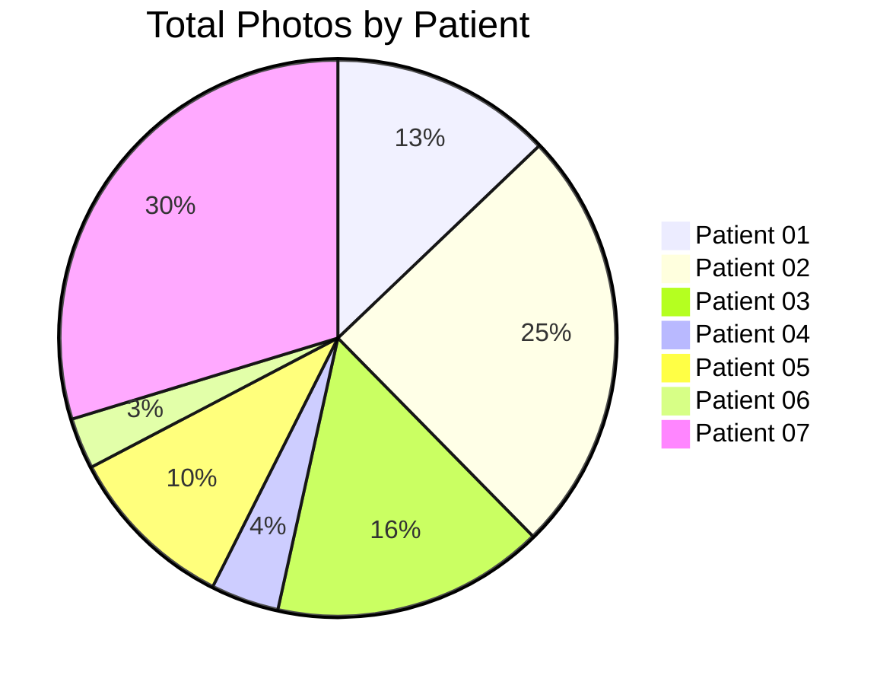
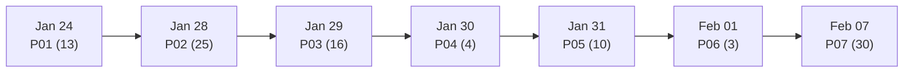

#  Patient Data Hub

**Hyperbolic Field Blood Plasma Study — Complete Patient Dataset**

---

##  QUICK NAVIGATION

|  **Patients** |  **Statistics** |  **Protocols** |
|-----------------|-------------------|------------------|
| [All Patients](#patient-datasets) | [Dataset Stats](#dataset-statistics) | [Protocol](../../../../original_research/reports/experiment_protocol_en.md) |

---

##  DATASET OVERVIEW

| Metric | Value |
|--------|-------|
| ** Total Patients** | 7 |
| ** Total Photographs** | 101 images |
| ** Total Samples** | 33 samples |
| ** Experiment Period** | Jan 24 — Feb 7, 2026 |

---

##  PATIENT DATASETS

| # | Patient | Photos | Date | Blood Group | Documentation |
|---|---------|--------|------|-------------|---------------|
| 1 | [**Patient 01**](patient-01/photos/) |  13 | 2026-01-24 | II+ | [ README](patient-01/photos/README.md) |
| 2 | [**Patient 02**](patient-02/photos/) |  25 | 2026-01-28 | III+ | [ README](patient-02/photos/README.md) |
| 3 | [**Patient 03**](patient-03/photos/) |  16 | 2026-01-29 | IV- | [ README](patient-03/photos/README.md) |
| 4 | [**Patient 04**](patient-04/photos/) |  4 | 2026-01-30 | IV+ | [ README](patient-04/photos/README.md) |
| 5 | [**Patient 05**](patient-05/photos/) |  10 | 2026-01-31 | no data | [ README](patient-05/photos/README.md) |
| 6 | [**Patient 06**](patient-06/photos/) |  3 | 2026-02-01 | I+ | [ README](patient-06/photos/README.md) |
| 7 | [**Patient 07**](patient-07/photos/) |  30 | 2026-02-07 | no data | [ README](patient-07/photos/README.md) |

---

##  EXPERIMENT TIMELINE

---

##  NAVIGATION

| Resource | Link |
|----------|------|
| ** Main README** | [View](../../../../README.md) |
| ** Original Research** | [View](../../../../original_research/) |
| ** Reports** | [View](../../../../original_research/reports/) |

---

**Last Updated: 2026-03-26 | Data Hub Version: 1.0**
