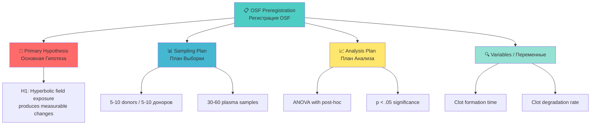

## 📋 OSF PREREGISTRATION / ПРЕДВАРИТЕЛЬНАЯ РЕГИСТРАЦИЯ ИССЛЕДОВАНИЯ

**✅ THIS STUDY WAS PREREGISTERED BEFORE DATA COLLECTION:**
**✅ ЭТО ИССЛЕДОВАНИЕ БЫЛО ЗАРЕГИСТРИРОВАНО ДО СБОРА ДАННЫХ:**

### OSF Registration Details / Детали Регистрации OSF

| Parameter / Параметр | Value / Значение |
|----------------------|------------------|
| **🏛️ Platform / Платформа** | [Open Science Framework (OSF)](https://osf.io/) |
| **📋 Registration Type / Тип Регистрации** | OSF Preregistration |
| **🔗 OSF Project ID** | [osf.io/8q42f](https://osf.io/8q42f) |
| **📄 Registration DOI** | [10.17605/OSF.IO/GWA9E](https://doi.org/10.17605/OSF.IO/GWA9E) |
| **📅 Date Registered / Дата Регистрации** | January 25, 2026 / 25 января 2026 |
| **📜 Title / Название** | Chrono-Regulatory and Biochronal Therapeutics: A Framework for Temporal Regulation in Human Physiology |
| **👥 Contributors / Авторы** | Denis Banchenko, Valeria Ovseannicova, Mykhailo Kapustin, Olesia Chirkova, Ivan Savelyev, Galina Ovseannicova, Alexandr Ovseannicov |
| **📊 Study Type / Тип Исследования** | Experiment (Mixed Design) |
| **🔬 Blinding / Ослепление** | Data analysts blinded / Аналитики ослеплены |
| **📝 License / Лицензия** | CC-BY Attribution-NonCommercial-NoDerivatives 4.0 International |
| **🗄️ Archive / Архив** | [Internet Archive](https://archive.org/details/osf-registrations-gwa9e-v1) |

### Key Preregistered Elements / Ключевые Элементы Регистрации

### Study Design Summary / Краткое Описание Дизайна Исследования

| Element / Элемент | Description / Описание |
|-------------------|------------------------|
| **🎯 Primary Hypothesis / Основная Гипотеза** | Biological samples exposed to ASRP hyperbolic field modulation will exhibit statistically significant changes in metabolic and biochemical process rates compared to non-exposed control samples / Биологические образцы, подвергшиеся воздействию гиперболического поля ASRP, продемонстрируют статистически значимые изменения скоростей метаболических и биохимических процессов по сравнению с необлученными контрольными образцами |
| **📊 Design / Дизайн** | Mixed experimental design (between-subjects + within-subjects) / Смешанный экспериментальный дизайн (между субъектами + внутри субъектов) |
| **🔬 Blinding / Ослепление** | Personnel who analyze the data are blinded / Персонал, анализирующий данные, ослеплен |
| **🧪 Samples / Образцы** | 5-10 donors → 30-60 plasma aliquots / 5-10 доноров → 30-60 образцов плазмы |
| **📈 Primary Outcomes / Основные Исходы** | Fibrin clot formation time, Fibrin clot degradation rate / Время образования фибринового сгустка, Скорость деградации сгустка |
| **📊 Statistical Criteria / Статистические Критерии** | ANOVA, p < .05 (two-tailed), Tukey-Kramer post-hoc / ANOVA, p < .05 (двусторонний), пост-хок Тьюки-Крамера |

### Quick Links / Быстрые Ссылки

| Resource / Ресурс | Link / Ссылка |
|-------------------|---------------|
| **📋 OSF Registry / Реестр OSF** | [View Registry Details](https://osf.io/8q42f) |
| **📄 Registration DOI / DOI Регистрации** | [10.17605/OSF.IO/GWA9E](https://doi.org/10.17605/OSF.IO/GWA9E) |
| **🗄️ Internet Archive / Архив Интернета** | [View Archive](https://archive.org/details/osf-registrations-gwa9e-v1) |
| **📊 OSF Components / Компоненты OSF** | Data, Analytic Code, Materials, Papers, Supplements |

---
