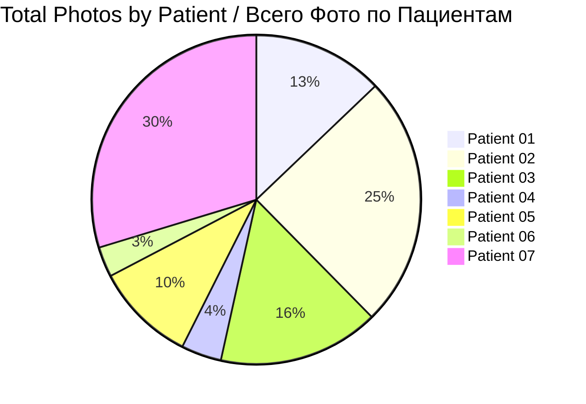
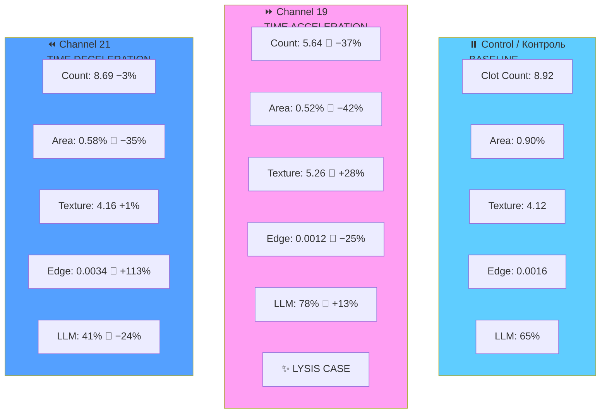
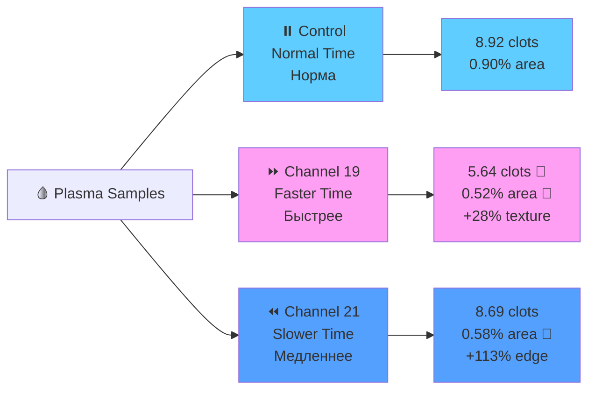

# 📊 Patient Data Hub / Хаб Данных Пациентов

**Hyperbolic Field Blood Plasma Study / Исследование Кровяной Плазмы Гиперболических Полей**

---

## 🎯 QUICK NAVIGATION / БЫСТРАЯ НАВИГАЦИЯ

| 📁 **Patients / Пациенты** | 📊 **Statistics / Статистика** | 📋 **Protocols / Протоколы** |
|----------------------------|--------------------------------|------------------------------|
| [All Patients](#patient-datasets--наборы-данных-пациентов) | [Dataset Stats](#dataset-statistics--статистика-наборов-данных) | [Protocol EN/RU](../reports/experiment_protocol_en.md) |

---

## 📊 DATASET OVERVIEW / ОБЗОР НАБОРОВ ДАННЫХ



| Metric / Метрика | Value / Значение |
|------------------|------------------|
| **👥 Total Patients** | 7 |
| **📸 Total Photographs** | 101 images |
| **🧪 Total Samples** | 33 samples |
| **⏰ Experiment Period** | Jan 24 — Feb 7, 2026 |
| **🌡️ Temperature** | 17°C constant |

---

## 📈 COMPREHENSIVE CHANNEL METRICS / ВСЕСТОРОННИЕ МЕТРИКИ КАНАЛОВ

### Clot Count Comparison / Сравнение Количества Сгустков

```mermaid
barChart
    title Mean Clot Count by Channel / Среднее Количество Сгустков
    x-axis "Channel"
    y-axis "Count"
    bar "⏸️ Control\n8.92" : 8.92
    bar "⏩ Ch19\n5.64\n(−37%)" : 5.64
    bar "⏪ Ch21\n8.69\n(−3%)" : 8.69
```

### Clot Area Percentage / Процент Площади Сгустков

```mermaid
barChart
    title Total Clot Area (% of sample) / Общая Площадь Сгустков (%)
    x-axis "Channel"
    y-axis "Area %"
    bar "⏸️ Control\n0.90%" : 0.90
    bar "⏩ Ch19\n0.52%\n(−42%)" : 0.52
    bar "⏪ Ch21\n0.58%\n(−35%)" : 0.58
```

### Texture Analysis (GLCM Contrast) / Текстурный Анализ

```mermaid
barChart
    title GLCM Texture Contrast / Текстурный Контраст
    x-axis "Channel"
    y-axis "Contrast"
    bar "⏸️ Control\n4.12" : 4.12
    bar "⏩ Ch19\n5.26\n(+28%)" : 5.26
    bar "⏪ Ch21\n4.16\n(+1%)" : 4.16
```

### Edge Density Comparison / Плотность Краёв

```mermaid
barChart
    title Edge Density (Canny) / Плотность Краёв
    x-axis "Channel"
    y-axis "Density"
    bar "⏸️ Control\n0.0016" : 0.0016
    bar "⏩ Ch19\n0.0012\n(−25%)" : 0.0012
    bar "⏪ Ch21\n0.0034\n(+113%)" : 0.0034
```

### LLM Clot Detection Rate / Частота Обнаружения (LLM)

```mermaid
barChart
    title Clot Detection Rate (LLM Vision) / Обнаружение Сгустков (LLM)
    x-axis "Channel"
    y-axis "Detection %"
    bar "⏸️ Control\n65%" : 65
    bar "⏩ Ch19\n78%\n(+13%)" : 78
    bar "⏪ Ch21\n41%\n(−24%)" : 41
```

---

## ⏰ TIME DISTORTION EFFECTS / ЭФФЕКТЫ ИСКАЖЕНИЯ ВРЕМЕНИ

### Complete Effect Summary / Полная Сводка Эффектов



### Time Effect Visualization / Визуализация Временных Эффектов



---

## 📁 PATIENT DATASETS / НАБОРЫ ДАННЫХ ПАЦИЕНТОВ

| # | Patient | Photos | Date | Blood | Key Feature | Link |
|---|---------|--------|------|-------|-------------|------|
| 1 | **Patient 01** | 📸 13 | Jan 24 | II+ | First experiment | [View](patient-01/photos/) |
| 2 | **Patient 02** | 📸 25 | Jan 28 | III+ | Petri dish + LYSIS | [View](patient-02/photos/) |
| 3 | **Patient 03** | 📸 16 | Jan 29 | IV- | Rapid coagulation | [View](patient-03/photos/) |
| 4 | **Patient 04** | 📸 4 | Jan 30 | IV+ | No clots in Ch21 | [View](patient-04/photos/) |
| 5 | **Patient 05** | 📸 10 | Jan 31 | — | Night session | [View](patient-05/photos/) |
| 6 | **Patient 06** | 📸 3 | Feb 01 | I+ | Smallest dataset | [View](patient-06/photos/) |
| 7 | **Patient 07** | 📸 30 | Feb 07 | — | Largest dataset | [View](patient-07/photos/) |

---

## ⏰ EXPERIMENT TIMELINE / ВРЕМЕННАЯ ШКАЛА


---

## 🔬 KEY FINDINGS SUMMARY / СВОДКА НАХОДОК

| Metric | Control | Ch19 | Ch21 |
|--------|---------|------|------|
| **Clot Count** | 8.92 | 5.64 (−37%) 🔻 | 8.69 (−3%) |
| **Clot Area** | 0.90% | 0.52% (−42%) 🔻 | 0.58% (−35%) 🔻 |
| **Texture** | 4.12 | 5.26 (+28%) 🔺 | 4.16 (+1%) |
| **Edge Density** | 0.0016 | 0.0012 (−25%) 🔻 | 0.0034 (+113%) 🔺 |
| **LLM Detection** | 65% | 78% (+13%) 🔺 | 41% (−24%) 🔻 |
| **Lysis Cases** | 0 | 1 🎯 | 0 |

### Statistical Significance

| Analysis | Result | P-value | Status |
|----------|--------|---------|--------|
| Gemini LLM | 57.9% ch19 | p = 0.027 | ✅ Significant |
| DINOv2 Probe | 47.4% ch19 | p = 0.146 | 🟡 Suggestive |

---

## 🔗 NAVIGATION LINKS / ССЫЛКИ

| Resource | Link |
|----------|------|
| **🏠 Main README** | [View](../../README.md) |
| **📊 Original Research** | [View](../) |
| **📄 Reports** | [View](../reports/) |
| **🔬 Issues** | [View](https://github.com/AdvancedScientificResearchProjects/Hyperbolic_Field_BloodPlasma_Study/issues) |

---

## 📞 CONTACT / КОНТАКТЫ

| Role | Name | Email |
|------|------|-------|
| Lead Researcher | Ovseannikova Valeria | valeriaovseannicova@asrp.tech |
| Program Director | Banchenko Denis | denisbanchenko@asrp.tech |

---

**Last Updated:** 2026-03-26 | **Version:** 4.0

**© 2026 ASRP / Перспективные Научно-Исследовательские Разработки**
