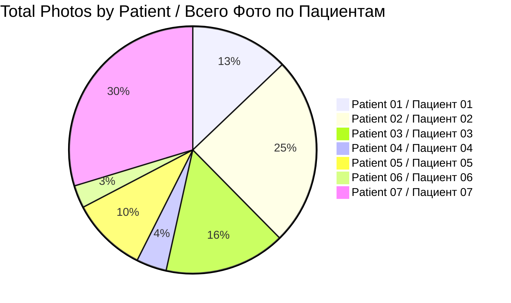
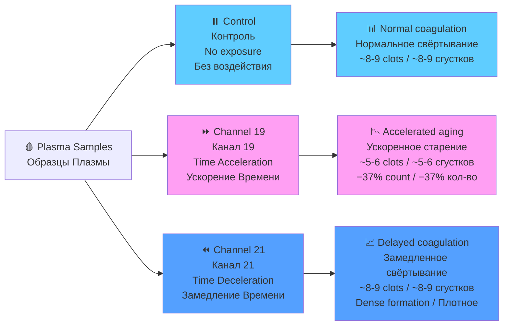
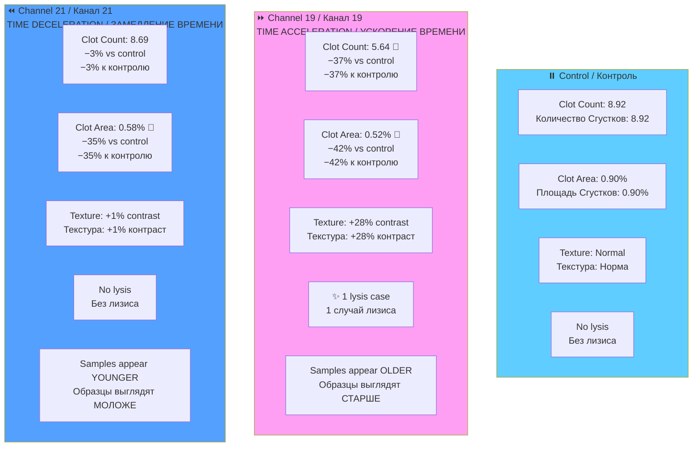
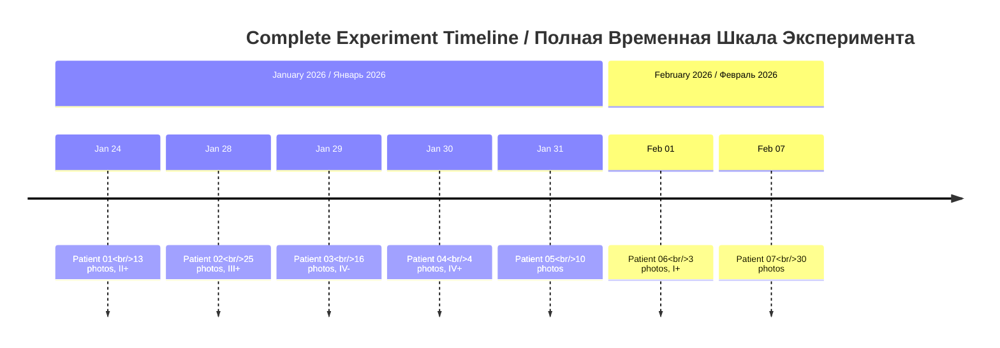
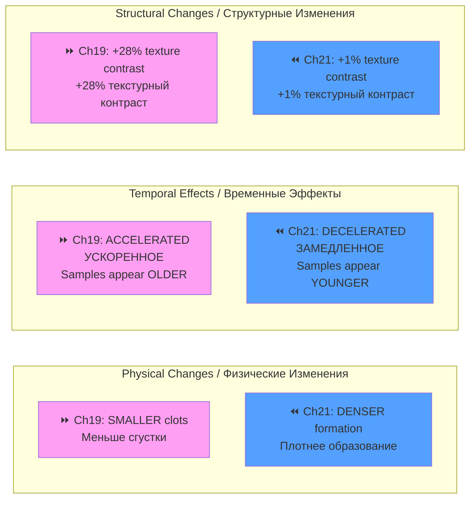

# 📊 Patient Data Hub / Хаб Данных Пациентов

**Hyperbolic Field Blood Plasma Study / Исследование Кровяной Плазмы Гиперболических Полей**

---

## 🎯 QUICK NAVIGATION / БЫСТРАЯ НАВИГАЦИЯ

| 📁 **Patients / Пациенты** | 📊 **Statistics / Статистика** | 📋 **Protocols / Протоколы** |
|----------------------------|--------------------------------|------------------------------|
| [All Patients](#patient-datasets--наборы-данных-пациентов) | [Dataset Stats](#dataset-statistics--статистика-наборов-данных) | [Protocol EN/RU](../reports/experiment_protocol_en.md) |

---

## 📊 DATASET OVERVIEW / ОБЗОР НАБОРОВ ДАННЫХ



| Metric / Метрика | Value / Значение |
|------------------|------------------|
| **👥 Total Patients / Всего Пациентов** | 7 |
| **📸 Total Photographs / Всего Фотографий** | 101 images / 101 изображение |
| **🧪 Total Samples / Всего Образцов** | 33 samples / 33 образца |
| **⏰ Experiment Period / Период Эксперимента** | Jan 24 — Feb 7, 2026 / 24 янв — 7 фев 2026 |
| **🌡️ Temperature / Температура** | 17°C constant / постоянно |

---

## ⏰ CHANNEL EXPLANATION / ОБЪЯСНЕНИЕ КАНАЛОВ

### Basic Channel Effects / Базовые Эффекты Каналов



### Detailed Channel Effects / Детальные Эффекты Каналов



---

## 📈 COMPARATIVE ANALYSIS / СРАВНИТЕЛЬНЫЙ АНАЛИЗ

### Clot Metrics Comparison / Сравнение Метрик Сгустков

```mermaid
xyChart-beta
    title "Clot Analysis: Channel Effects / Анализ Сгустков: Эффекты Каналов"
    x-axis ["Control<br/>Контроль", "Channel 19<br/>Канал 19<br/>⏩ Acceleration", "Channel 21<br/>Канал 21<br/>⏪ Deceleration"]
    y-axis "Relative Value / Относительное Значение" 0 --> 10
    bar [8.92, 5.64, 8.69]
    line [8.92, 5.64, 8.69]
```

### Effect Magnitude / Величина Эффекта

```mermaid
barChart-beta
    title "Effect Magnitude by Channel / Величина Эффекта по Каналам"
    x-axis "Parameter / Параметр"
    y-axis "Change vs Control / Изменение к Контролю %"
    bar "Ch19 Count<br/>−37%" : -37
    bar "Ch19 Area<br/>−42%" : -42
    bar "Ch21 Count<br/>−3%" : -3
    bar "Ch21 Area<br/>−35%" : -35
    bar "Ch19 Texture<br/>+28%" : 28
    bar "Ch21 Texture<br/>+1%" : 1
```

---

## 📁 PATIENT DATASETS / НАБОРЫ ДАННЫХ ПАЦИЕНТОВ

### Complete Patient Directory / Полный Каталог Пациентов

| # | Patient / Пациент | Photos / Фото | Date / Дата | Blood Group / Группа Крови | Key Feature / Ключевая Особенность | Link / Ссылка |
|---|-------------------|---------------|-------------|---------------------------|-----------------------------------|---------------|
| 1 | **Patient 01 / Пациент 01** | 📸 13 | 2026-01-24 | II+ | First experiment / Первый эксперимент | [📂 View](patient-01/photos/) |
| 2 | **Patient 02 / Пациент 02** | 📸 25 | 2026-01-28 | III+ | Petri dish time-lapse / Чашка Петри | [📂 View](patient-02/photos/) |
| 3 | **Patient 03 / Пациент 03** | 📸 16 | 2026-01-29 | IV- | Rapid coagulation / Быстрое свёртывание | [📂 View](patient-03/photos/) |
| 4 | **Patient 04 / Пациент 04** | 📸 4 | 2026-01-30 | IV+ | No clots in Ch21 / Без сгустков в Ch21 | [📂 View](patient-04/photos/) |
| 5 | **Patient 05 / Пациент 05** | 📸 10 | 2026-01-31 | no data | Night session / Ночная сессия | [📂 View](patient-05/photos/) |
| 6 | **Patient 06 / Пациент 06** | 📸 3 | 2026-02-01 | I+ | Smallest dataset / Самый маленький | [📂 View](patient-06/photos/) |
| 7 | **Patient 07 / Пациент 07** | 📸 30 | 2026-02-07 | no data | Largest dataset / Самый большой | [📂 View](patient-07/photos/) |

---

## ⏰ EXPERIMENT TIMELINE / ВРЕМЕННАЯ ШКАЛА ЭКСПЕРИМЕНТА



---

## 🔬 KEY FINDINGS / КЛЮЧЕВЫЕ НАХОДКИ

### Statistical Summary / Статистическая Сводка

| Finding / Находка | Channel / Канал | Value / Значение | Significance / Значимость |
|-------------------|-----------------|------------------|---------------------------|
| **Clot Count Reduction / Уменьшение Количества Сгустков** | ⏩ Ch19 | −37% (8.92 → 5.64) | 🔴 High / Высокая |
| **Clot Area Reduction / Уменьшение Площади Сгустков** | ⏩ Ch19 | −42% (0.90% → 0.52%) | 🔴 High / Высокая |
| **Lysis Case / Случай Лизиса** | ⏩ Ch19 | 1 case / 1 случай | 🎯 Unique / Уникальный |
| **Delayed Coagulation / Замедленное Свёртывание** | ⏪ Ch21 | −3% count / −3% кол-во | 🟡 Moderate / Умеренная |
| **Statistical Significance / Статистическая Значимость** | All / Все | p = 0.027 (Gemini) | ✅ Significant / Значимо |

### Configuration Changes / Изменения Конфигурации



---

## 🔗 NAVIGATION LINKS / ССЫЛКИ НАВИГАЦИИ

| Resource / Ресурс | Link / Ссылка |
|-------------------|---------------|
| **🏠 Main README / Главный README** | [View / Просмотр](../../README.md) |
| **📊 Original Research / Оригинальное Исследование** | [View / Просмотр](../) |
| **📄 Reports / Отчёты** | [View / Просмотр](../reports/) |
| **🔬 Issues / Задачи** | [View / Просмотр](https://github.com/AdvancedScientificResearchProjects/Hyperbolic_Field_BloodPlasma_Study/issues) |

---

## 📞 CONTACT / КОНТАКТЫ

| Role / Роль | Name / Имя | Email |
|-------------|------------|-------|
| **Lead Researcher / Ведущий Исследователь** | Ovseannikova Valeria / Овсянникова Валерия | valeriaovseannicova@asrp.tech |
| **Program Director / Директор Программы** | Banchenko Denis / Банченко Денис | denisbanchenko@asrp.tech |

---

**Last Updated / Последнее Обновление:** 2026-03-26 | **Data Hub Version / Версия Хаба Данных:** 2.0

**© 2026 Advanced Scientific Research Projects (ASRP) / Перспективные Научно-Исследовательские Разработки**
