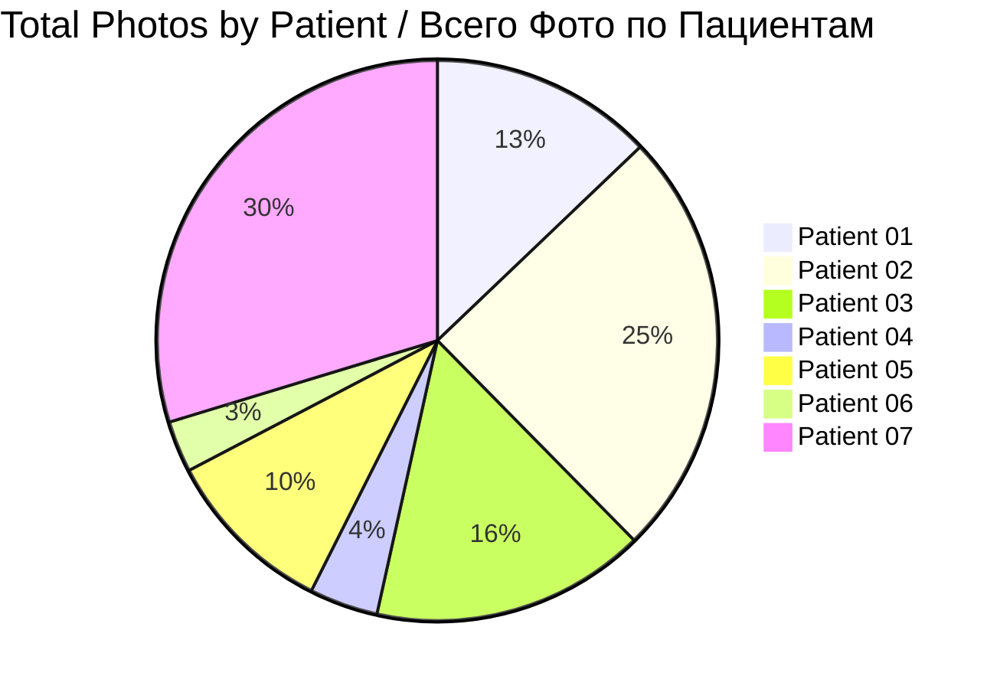
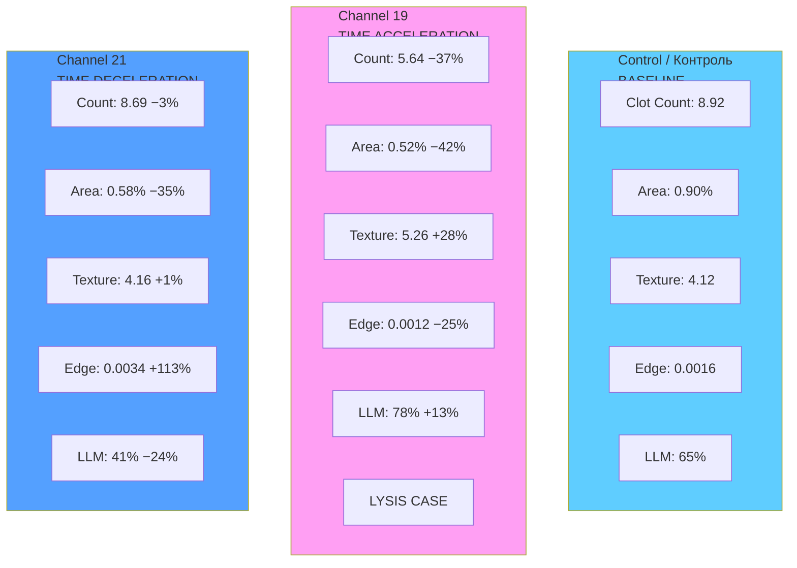
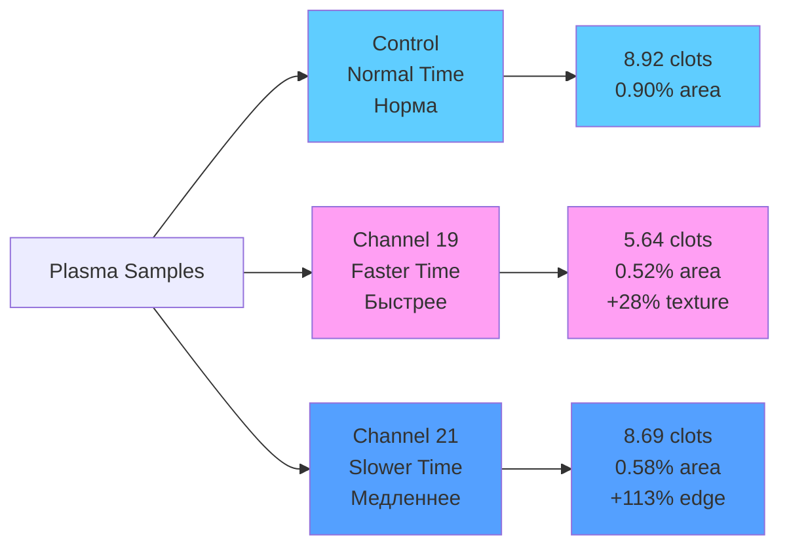
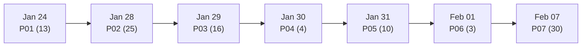

#  Patient Data Hub / Хаб Данных Пациентов

**Hyperbolic Field Blood Plasma Study / Исследование Кровяной Плазмы Гиперболических Полей**

---

##  QUICK NAVIGATION / БЫСТРАЯ НАВИГАЦИЯ

|  **Patients / Пациенты** |  **Statistics / Статистика** |  **Protocols / Протоколы** |
|----------------------------|--------------------------------|------------------------------|
| [All Patients](#patient-datasets--наборы-данных-пациентов) | [Dataset Stats](#dataset-statistics--статистика-наборов-данных) | [Protocol EN/RU](../reports/experiment_protocol_en.md) |

---

##  DATASET OVERVIEW / ОБЗОР НАБОРОВ ДАННЫХ

```mermaid
pie title Total Photos by Patient / Всего Фото по Пациентам
    "Patient 01" : 13
    "Patient 02" : 25
    "Patient 03" : 16
    "Patient 04" : 4
    "Patient 05" : 10
    "Patient 06" : 3
    "Patient 07" : 30
```

| Metric / Метрика | Value / Значение |
|------------------|------------------|
| ** Total Patients** | 7 |
| ** Total Photographs** | 101 images |
| ** Total Samples** | 33 samples |
| ** Experiment Period** | Jan 24 — Feb 7, 2026 |
| ** Temperature** | 17°C constant |

---

##  COMPREHENSIVE CHANNEL METRICS / ВСЕСТОРОННИЕ МЕТРИКИ КАНАЛОВ

### Clot Count Comparison / Сравнение Количества Сгустков

**Mean Clot Count by Channel / Среднее Количество Сгустков**

| Metric / Метрика | Value / Значение |
|---|---|
| Control / Контроль | 8.92 |
| Ch19 (−37%) | 5.64 |
| Ch21 (−3%) | 8.69 |

### Clot Area Percentage / Процент Площади Сгустков

**Total Clot Area (% of sample) / Общая Площадь Сгустков (%)**

| Metric / Метрика | Value / Значение |
|---|---|
| Control / Контроль | 0.90 |
| Ch19 (−42%) | 0.52 |
| Ch21 (−35%) | 0.58 |

### Texture Analysis (GLCM Contrast) / Текстурный Анализ

**GLCM Texture Contrast / Текстурный Контраст**

| Metric / Метрика | Value / Значение |
|---|---|
| Control / Контроль | 4.12 |
| Ch19 (+28%) | 5.26 |
| Ch21 (+1%) | 4.16 |

### Edge Density Comparison / Плотность Краёв

**Edge Density (Canny) / Плотность Краёв**

| Metric / Метрика | Value / Значение |
|---|---|
| Control / Контроль | 0.0016 |
| Ch19 (−25%) | 0.0012 |
| Ch21 (+113%) | 0.0034 |

### LLM Clot Detection Rate / Частота Обнаружения (LLM)

**Clot Detection Rate (LLM Vision) / Обнаружение Сгустков (LLM)**

| Metric / Метрика | Value / Значение |
|---|---|
| Control / Контроль | 65 |
| Ch19 (+13%) | 78 |
| Ch21 (−24%) | 41 |

---

##  TIME DISTORTION EFFECTS / ЭФФЕКТЫ ИСКАЖЕНИЯ ВРЕМЕНИ

### Complete Effect Summary / Полная Сводка Эффектов

```mermaid
flowchart TB
    subgraph Control[" Control / Контроль<br/>BASELINE"]
        C1["Clot Count: 8.92"]
        C2["Area: 0.90%"]
        C3["Texture: 4.12"]
        C4["Edge: 0.0016"]
        C5["LLM: 65%"]
    end
    
    subgraph Ch19[" Channel 19<br/>TIME ACCELERATION"]
        A1["Count: 5.64  −37%"]
        A2["Area: 0.52%  −42%"]
        A3["Texture: 5.26  +28%"]
        A4["Edge: 0.0012  −25%"]
        A5["LLM: 78%  +13%"]
        A6[" LYSIS CASE"]
    end
    
    subgraph Ch21[" Channel 21<br/>TIME DECELERATION"]
        D1["Count: 8.69 −3%"]
        D2["Area: 0.58%  −35%"]
        D3["Texture: 4.16 +1%"]
        D4["Edge: 0.0034  +113%"]
        D5["LLM: 41%  −24%"]
    end
    
    style Control fill:#5fcdff
    style Ch19 fill:#ff9ff3
    style Ch21 fill:#54a0ff
```

### Time Effect Visualization / Визуализация Временных Эффектов

```mermaid
flowchart LR
    A[ Plasma Samples] --> B[ Control<br/>Normal Time<br/>Норма]
    A --> C[ Channel 19<br/>Faster Time<br/>Быстрее]
    A --> D[ Channel 21<br/>Slower Time<br/>Медленнее]
    
    B --> E[8.92 clots<br/>0.90% area]
    C --> F[5.64 clots <br/>0.52% area <br/>+28% texture]
    D --> G[8.69 clots<br/>0.58% area <br/>+113% edge]
    
    style B fill:#5fcdff
    style C fill:#ff9ff3
    style D fill:#54a0ff
    style E fill:#5fcdff
    style F fill:#ff9ff3
    style G fill:#54a0ff
```

---

##  PATIENT DATASETS / НАБОРЫ ДАННЫХ ПАЦИЕНТОВ

| # | Patient / Пациент | Photos / Фото | Date / Дата | Blood / Кровь | Key Feature / Особенность | Link / Ссылка |
|---|---------|--------|------|-------|-------------|------|
| 1 | **Patient 01** |  13 | Jan 24 | II+ | First experiment | [View](patient-01/photos/) |
| 2 | **Patient 02** |  25 | Jan 28 | III+ | Petri dish + LYSIS | [View](patient-02/photos/) |
| 3 | **Patient 03** |  16 | Jan 29 | IV- | Rapid coagulation | [View](patient-03/photos/) |
| 4 | **Patient 04** |  4 | Jan 30 | IV+ | No clots in Ch21 | [View](patient-04/photos/) |
| 5 | **Patient 05** |  10 | Jan 31 | — | Night session | [View](patient-05/photos/) |
| 6 | **Patient 06** |  3 | Feb 01 | I+ | Smallest dataset | [View](patient-06/photos/) |
| 7 | **Patient 07** |  30 | Feb 07 | — | Largest dataset | [View](patient-07/photos/) |

---

##  EXPERIMENT TIMELINE / ВРЕМЕННАЯ ШКАЛА

```mermaid
flowchart LR
    A["Jan 24<br/>P01 (13)"] --> B["Jan 28<br/>P02 (25)"]
    B --> C["Jan 29<br/>P03 (16)"]
    C --> D["Jan 30<br/>P04 (4)"]
    D --> E["Jan 31<br/>P05 (10)"]
    E --> F["Feb 01<br/>P06 (3)"]
    F --> G["Feb 07<br/>P07 (30)"]
```

---

##  KEY FINDINGS SUMMARY / СВОДКА НАХОДОК

| Metric / Метрика | Control / Контроль | Ch19 / Канал 19 | Ch21 / Канал 21 |
|--------|---------|------|------|
| **Clot Count** | 8.92 | 5.64 (−37%)  | 8.69 (−3%) |
| **Clot Area** | 0.90% | 0.52% (−42%)  | 0.58% (−35%)  |
| **Texture** | 4.12 | 5.26 (+28%)  | 4.16 (+1%) |
| **Edge Density** | 0.0016 | 0.0012 (−25%)  | 0.0034 (+113%)  |
| **LLM Detection** | 65% | 78% (+13%)  | 41% (−24%)  |
| **Lysis Cases** | 0 | 1  | 0 |

### Statistical Significance

| Analysis / Анализ | Result / Результат | P-value / P-значение | Status / Статус |
|----------|--------|---------|--------|
| Gemini LLM | 57.9% ch19 | p = 0.027 |  Significant |
| DINOv2 Probe | 47.4% ch19 | p = 0.146 |  Suggestive |

---

##  NAVIGATION LINKS / ССЫЛКИ

| Resource / Ресурс | Link / Ссылка |
|----------|------|
| ** Main README** | [View](../../README.md) |
| ** Original Research** | [View](../) |
| ** Reports** | [View](../reports/) |
| ** Issues** | [View](https://github.com/AdvancedScientificResearchProjects/Hyperbolic_Field_BloodPlasma_Study/issues) |

---

##  CONTACT / КОНТАКТЫ

| Role / Роль | Name / Имя | Email / Почта |
|------|------|-------|
| Lead Researcher / Ведущий Исследователь | Ovseannicova Valeria / Овсянникова Валерия | valeriaovseannicova@asrp.tech |
| Program Director / Директор Программы | Banchenko Denis / Банченко Денис | denisbanchenko@asrp.tech |
| Head Hardware Engineer / Главный Инженер | Ovsyannikov Alexandr / Овсянников Александр | alexandrovsyannikov@asrp.tech |

---

**Last Updated:** 2026-03-26 | **Version:** 4.0

**© 2026 ASRP / Перспективные Научно-Исследовательские Разработки**
