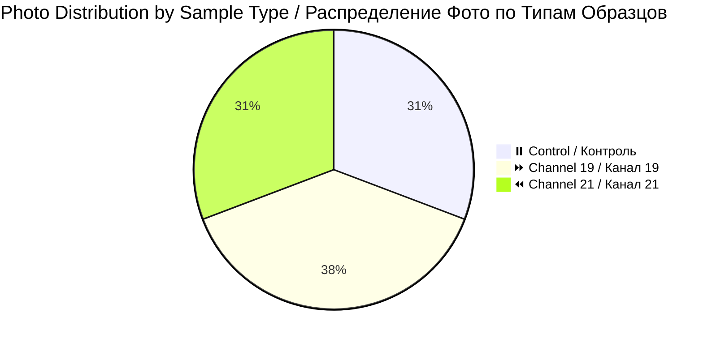

# 📸 Patient 01 Photo Dataset / Фото Dataset Пациента 01

**Experiment Date / Дата Эксперимента:** 2026-01-24 | **Blood Group / Группа Крови:** II+ | **Total Photos / Всего Фото:** 13

---

## 🎯 NAVIGATION / НАВИГАЦИЯ

[Dataset Info / Инфо](#dataset-overview--описание-набора-данных) | [Photos / Фото](#photo-inventory--инвентаризация-фотографий) | [Protocol / Протокол](../protocol_part-01.pdf) | [All Patients / Все Пациенты](../../README.md)

---

## 📊 DATASET OVERVIEW / ОПИСАНИЕ НАБОРА ДАННЫХ



| Metric / Метрика | Value / Значение |
|------------------|------------------|
| **📸 Total Photos / Всего Фото** | 13 images / 13 изображений |
| **🩸 Blood Group / Группа Крови** | II+ (Rh positive / Rh положительный) |
| **🧪 Total Samples / Всего Образцов** | 4 (2 control / контроля, 1 ch19, 1 ch21) |
| **⏰ Irradiation Duration / Длительность Облучения** | ~1h 12min / ~1ч 12мин |
| **📷 Camera / Камера** | iPhone 16 Pro Max |
| **🌡️ Temperature / Температура** | 17°C constant / постоянно |

---

## ⏰ EXPERIMENT TIMELINE / ВРЕМЕННАЯ ШКАЛА ЭКСПЕРИМЕНТА

```mermaid
timeline
    title Patient 01 Timeline / Временная Шкала Пациента 01
    section Blood Collection / Забор Крови
        18:56:10 — 18:59:59 : 🩸 4 test tubes / 4 пробирки
    section Centrifugation / Центрифугирование
        19:00:30 — 19:06:10 : 🔄 2000 rpm, 5 min
    section Sample Prep / Подготовка Образцов
        19:12:30 — 19:14:20 : 🧪 4 samples / 4 образца
    section Irradiation / Облучение
        19:18:29 — 20:30:00 : ⚡ Ch19 + Ch21
    section Photography / Фотографирование
        19:00:33 — 20:30:00 : 📸 13 photos / 13 фото
```

### 📋 CHRONOLOGY TABLE / ТАБЛИЦА ХРОНОЛОГИИ

| Time / Время | Event / Событие | Samples / Образцы |
|--------------|-----------------|-------------------|
| **18:56:10** | Blood collection started / Забор крови начат | — |
| **18:59:59** | Blood collection completed / Забор крови завершен | — |
| **19:00:30** | Centrifugation started / Центрифугирование начато | All / Все |
| **19:06:10** | Centrifugation completed / Центрифугирование завершено | — |
| **19:12:30** | Sample 0.1.1 prepared / Образец подготовлен | 0.1.1 (Control) |
| **19:13:25** | Sample 19.1.1 prepared / Образец подготовлен | 19.1.1 (Channel 19) |
| **19:13:40** | Sample 21.1.1 prepared / Образец подготовлен | 21.1.1 (Channel 21) |
| **19:14:20** | Sample 0.1.2 prepared / Образец подготовлен | 0.1.2 (Control) |
| **19:18:29** | **Irradiation started / Облучение начато** | 19.1.1, 21.1.1 |
| **20:30:00** | **Irradiation completed / Облучение завершено** | — |

---

## 🧪 SAMPLES / ОБРАЗЦЫ

### Sample Designations / Обозначения Образцов

| Sample ID | Type / Тип | Collection Time / Время Забора | Description / Описание |
|-----------|------------|-------------------------------|------------------------|
| `0.1.1` | ⏸️ Control / Контроль | 19:12:30 | No exposure / Без воздействия |
| `0.1.2` | ⏸️ Control / Контроль | 19:14:20 | No exposure / Без воздействия |
| `19.1.1` | ⏩ Channel 19 / Канал 19 | 19:13:25 | Time acceleration / Ускорение времени |
| `21.1.1` | ⏪ Channel 21 / Канал 21 | 19:13:40 | Time deceleration / Замедление времени |

---

## 📁 PHOTO INVENTORY / ИНВЕНТАРИЗАЦИЯ ФОТОГРАФИЙ

### Complete Photo List / Полный Список Фотографий

| # | File / Файл | Time / Время | Samples / Образцы | PDF Page / Стр. | Preview / Превью |
|---|-------------|--------------|-------------------|-----------------|------------------|
| 1 | `IMG_3250.HEIC` | 19:00:33 | 19.1.1, 21.1.1 | Part 1, p.3 | [🖼️](jpg/IMG_3250.jpg) |
| 2 | `IMG_3251.HEIC` | 19:02:24 | 21.1.1 | Part 1, p.4 | [🖼️](jpg/IMG_3251.jpg) |
| 3 | `IMG_3252.HEIC` | 19:02:07 | 19.1.1 | Part 1, p.5 | [🖼️](jpg/IMG_3252.jpg) |
| 4 | `IMG_3253.HEIC` | 17:32:09 | 19.1.1, 21.1.1, 0.1.1 | Part 1, p.6 | [🖼️](jpg/IMG_3253.jpg) |
| 5 | `IMG_3254.HEIC` | 20:46:15 | 0.1.2, 21.1.1, 19.1.1, 0.1.1 | Part 1, p.7 | [🖼️](jpg/IMG_3254.jpg) |
| 6 | `IMG_3255.HEIC` | 20:44:22 | 21.1.1, 19.1.1, 0.1.1 | Part 1, p.8 | [🖼️](jpg/IMG_3255.jpg) |
| 7 | `IMG_3256.HEIC` | 16:53:57 | 21.1.1, 19.1.1, 0.1.1 | Part 1, p.9 | [🖼️](jpg/IMG_3256.jpg) |
| 8 | `IMG_3257.HEIC` | 16:53:09 | 0.1.1, 19.1.1, 21.1.1 | Part 1, p.10 | [🖼️](jpg/IMG_3257.jpg) |
| 9 | `IMG_3258.HEIC` | 19:11:17 | 21.1.1, 0.1.1, 19.1.1 | Part 1, p.11 | [🖼️](jpg/IMG_3258.jpg) |
| 10 | `IMG_3259.HEIC` | 20:46:28 | 19.1.1, 21.1.1, 0.1.1, 0.1.2 | Part 2, p.1 | [🖼️](jpg/IMG_3259.jpg) |
| 11 | `IMG_3260.HEIC` | 20:38:53 | 21.1.1, 0.1.1, 19.1.1 | Part 2, p.2 | [🖼️](jpg/IMG_3260.jpg) |
| 12 | `IMG_3261.HEIC` | 17:32:54 | 0.1.1, 21.1.1, 19.1.1 | Part 2, p.3 | [🖼️](jpg/IMG_3261.jpg) |
| 13 | `IMG_3262.HEIC` | 19:11:05 | 21.1.1, 0.1.1, 19.1.1 | Part 2, p.4 | [🖼️](jpg/IMG_3262.jpg) |

### Photo Timeline Visualization / Визуализация Временной Шкалы Фото

```mermaid
gantt
    title Photo Capture Timeline / Временная Шкала Съёмки
    dateFormat HH:mm:ss
    axisFormat %H:%M
    
    section Early Photos / Ранние Фото
    IMG_3250 : 19:00:33, 2m
    IMG_3252 : 19:02:07, 2m
    IMG_3251 : 19:02:24, 2m
    
    section Mid Photos / Средние Фото
    IMG_3258 : 19:11:17, 2m
    IMG_3262 : 19:11:05, 2m
    
    section Late Photos / Поздние Фото
    IMG_3260 : 20:38:53, 2m
    IMG_3254 : 20:46:15, 2m
    IMG_3259 : 20:46:28, 2m
```



---

## 📄 EXPERIMENT PROTOCOL / ПРОТОКОЛ ЭКСПЕРИМЕНТА

### Protocol Details / Детали Протокола

| Parameter / Параметр | Value / Значение |
|---------------------|------------------|
| **Blood Group / Группа Крови** | II+ (Rh positive / Rh положительный) |
| **Blood Collection / Забор Крови** | 18:56:10 — 18:59:59 (4 test tubes / 4 пробирки) |
| **Centrifugation / Центрифугирование** | 19:00:30 — 19:06:10 (2000 rpm, 5 min) |
| **Irradiation / Облучение** | 19:18:29 — 20:30:00 (~1h 12min / ~1ч 12мин) |
| **Temperature / Температура** | 17°C constant / постоянно |

### Protocol PDF Links / Ссылки на PDF Протоколы

| Document / Документ | Format / Формат | Size / Размер | Link / Ссылка |
|---------------------|-----------------|---------------|---------------|
| Protocol Part 1 / Протокол Часть 1 | PDF | ~93 MB | [📄 protocol_part-01.pdf](../protocol_part-01.pdf) |
| Protocol Part 2 / Протокол Часть 2 | PDF | ~38 MB | [📄 protocol_part-02.pdf](../protocol_part-02.pdf) |

---

## 🔬 KEY OBSERVATIONS / КЛЮЧЕВЫЕ НАБЛЮДЕНИЯ

### Plasma Visual Characteristics / Визуальные Характеристики Плазмы

| Sample / Образец | Type / Тип | Color / Цвет | Clots / Сгустки |
|------------------|------------|--------------|-----------------|
| **0.1.1** | ⏸️ Control | Yellow-greenish / Желто-зеленоватый | Present / Есть |
| **0.1.2** | ⏸️ Control | Light yellow / Светло-желтый | Present / Есть |
| **19.1.1** | ⏩ Channel 19 | Yellow-olive / Желто-оливковый | Present / Есть |
| **21.1.1** | ⏪ Channel 21 | Yellow-greenish / Желто-зеленоватый | Present / Есть |

---

## 🔗 RELATED DATASETS / СВЯЗАННЫЕ НАБОРЫ ДАННЫХ

### Other Patients / Другие Пациенты

| Patient / Пациент | Photos / Фото | Date / Дата | Blood Group / Группа Крови | Link / Ссылка |
|-------------------|---------------|-------------|---------------------------|---------------|
| **Patient 02 / Пациент 02** | 25 | 2026-01-28 | III+ | [View / Просмотр](../../patient-02/photos/) |
| **Patient 03 / Пациент 03** | 16 | 2026-01-29 | IV- | [View / Просмотр](../../patient-03/photos/) |
| **Patient 04 / Пациент 04** | 4 | 2026-01-30 | IV+ | [View / Просмотр](../../patient-04/photos/) |
| **Patient 05 / Пациент 05** | 10 | 2026-01-31 | no data | [View / Просмотр](../../patient-05/photos/) |
| **Patient 06 / Пациент 06** | 3 | 2026-02-01 | I+ | [View / Просмотр](../../patient-06/photos/) |
| **Patient 07 / Пациент 07** | 30 | 2026-02-07 | no data | [View / Просмотр](../../patient-07/photos/) |

---

## 📞 CONTACT / КОНТАКТЫ

| Role / Роль | Name / Имя | Email |
|-------------|------------|-------|
| **Lead Researcher / Ведущий Исследователь** | Ovseannikova Valeria / Овсянникова Валерия | valeriaovseannicova@asrp.tech |
| **Program Director / Директор Программы** | Banchenko Denis / Банченко Денис | denisbanchenko@asrp.tech |

---

**Last Updated / Последнее Обновление:** 2026-03-26 | **Dataset Version / Версия Набора Данных:** 1.0

**© 2026 Advanced Scientific Research Projects (ASRP) / Перспективные Научно-Исследовательские Разработки**
