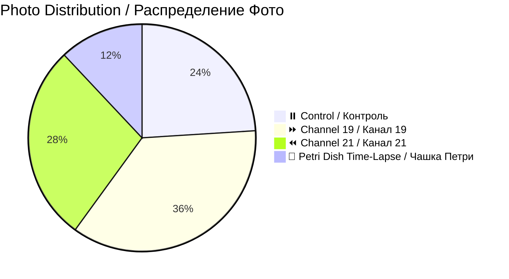

# 📸 Patient 02 Photo Dataset / Фото Dataset Пациента 02

**Experiment Date / Дата Эксперимента:** 2026-01-28 | **Blood Group / Группа Крови:** III+ | **Total Photos / Всего Фото:** 25

---

## 🎯 NAVIGATION / НАВИГАЦИЯ

[Info / Инфо](#dataset-overview--описание-набора-данных) | [Photos / Фото](#photo-inventory--инвентаризация-фотографий) | [Protocol / Протокол](../protocol_part-01.pdf) | [All Patients / Все Пациенты](../../README.md)

---

## 📊 DATASET OVERVIEW / ОПИСАНИЕ НАБОРА ДАННЫХ



| Metric / Метрика | Value / Значение |
|------------------|------------------|
| **📸 Total Photos / Всего Фото** | 25 images / 25 изображений |
| **🩸 Blood Group / Группа Крови** | III+ (Rh positive / Rh положительный) |
| **🧪 Total Samples / Всего Образцов** | 6 (2 control, 2 ch19, 2 ch21) |
| **⏰ Irradiation Duration / Длительность Облучения** | ~1h 14min / ~1ч 14мин |
| **📷 Camera / Камера** | iPhone 16 Pro Max |

---

## ⏰ TIMELINE / ВРЕМЕННАЯ ШКАЛА

```mermaid
timeline
    title Patient 02 Timeline / Временная Шкала Пациента 02
    section Blood Collection / Забор Крови
        19:50:50 — 19:54:16 : 🩸 4 tubes / 4 пробирки
    section Centrifugation / Центрифугирование
        19:54:10 — 20:00:10 : 🔄 2000 rpm
    section Irradiation / Облучение
        20:09:50 — 21:24:10 : ⚡ Ch19 + Ch21
    section Photography / Фотографирование
        21:29:19 — Next Day : 📸 25 photos / 25 фото
```

---

## 📁 PHOTOS / ФОТО (25)

| # | File / Файл | Time / Время | Samples / Образцы | Preview / Превью |
|---|-------------|--------------|-------------------|------------------|
| 1 | `IMG_3264.JPG` | 21:29:19 | Checklist / Чеклист | [🖼️](jpg/IMG_3264.JPG) |
| 2-9 | `IMG_3265-3272` | 21:30-21:39 | Individual / Индивид. | [🖼️](jpg/) |
| 10-16 | `IMG_3273-3279` | 21:40-21:51 | Comparisons / Сравнения | [🖼️](jpg/) |
| 17-20 | `IMG_3280-3283` | Various / Разное | Petri dish / Чашка Петри | [🖼️](jpg/) |
| 21-25 | `IMG_3284-3288` | Next day / След. день | +16-21h analysis | [🖼️](jpg/) |

**🔬 Key Feature / Ключевая Особенность:** Only patient with Petri dish time-lapse photography (+6h, +16h, +21h) / Единственный пациент с покадровой съёмкой чашки Петри

---

## 📄 PROTOCOL / ПРОТОКОЛ

| Parameter / Параметр | Value / Значение |
|---------------------|------------------|
| **Blood Group / Группа Крови** | III+ |
| **Blood Collection / Забор Крови** | 19:50:50 — 19:54:16 |
| **Centrifugation / Центрифугирование** | 19:54:10 — 20:00:10 |
| **Irradiation / Облучение** | 20:09:50 — 21:24:10 |

### PDFs / PDF Файлы
- [protocol_part-01.pdf](../protocol_part-01.pdf)
- [protocol_part-02.pdf](../protocol_part-02.pdf)
- [protocol_part-03.pdf](../protocol_part-03.pdf)

---

## 🔗 OTHER PATIENTS / ДРУГИЕ ПАЦИЕНТЫ

[P01](../../patient-01/) | [P03](../../patient-03/) | [P04](../../patient-04/) | [P05](../../patient-05/) | [P06](../../patient-06/) | [P07](../../patient-07/)

---

**Last Updated / Последнее Обновление:** 2026-03-26 | **Version / Версия:** 1.0
