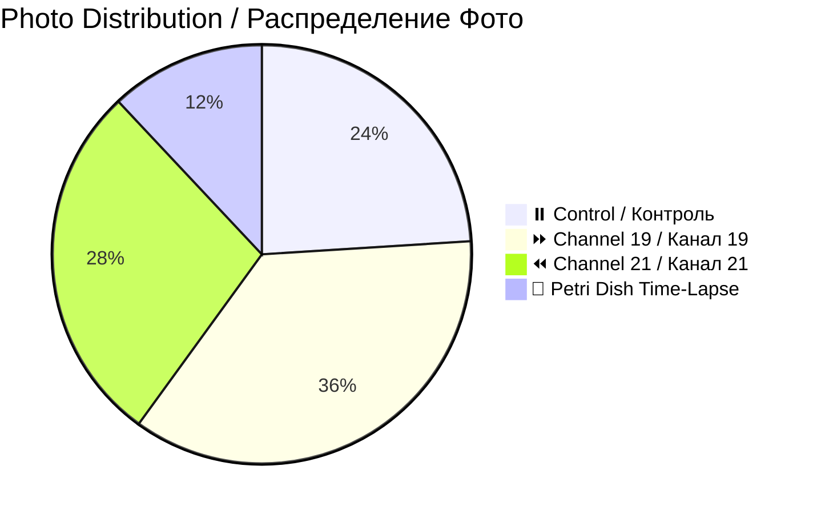
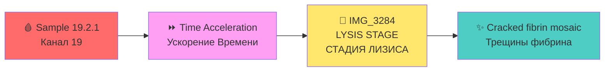

# 📸 Patient 02 Photo Dataset / Фото Dataset Пациента 02

**Experiment Date / Дата Эксперимента:** 2026-01-28 | **Blood Group / Группа Крови:** III+ | **Total Photos / Всего Фото:** 25

---

## 🎯 NAVIGATION / НАВИГАЦИЯ

[Info / Инфо](#dataset-overview) | [Photos / Фото](#photo-inventory) | [Protocol / Протокол](../protocol_part-01.pdf) | [All Patients / Все Пациенты](../../README.md) | [Data Hub / Хаб Данных](../../README.md)

---

## 📊 DATASET OVERVIEW / ОПИСАНИЕ НАБОРА ДАННЫХ



| Metric / Метрика | Value / Значение |
|------------------|------------------|
| **📸 Total Photos / Всего Фото** | 25 images / 25 изображений |
| **🩸 Blood Group / Группа Крови** | III+ (Rh positive) |
| **🧪 Total Samples / Всего Образцов** | 6 (2 control, 2 ch19, 2 ch21) |
| **⏰ Irradiation Duration / Длительность** | ~1h 14min / ~1ч 14мин |

---

## 📈 CHANNEL METRICS / МЕТРИКИ ПО КАНАЛАМ

### Photo Distribution by Channel / Распределение Фото по Каналам

```mermaid
barChart
    title Patient 02: Photos per Channel / Пациент 02: Фото на Канал
    x-axis "Channel / Канал"
    y-axis "Photos / Фото"
    bar "⏸️ Control" : 6
    bar "⏩ Ch19" : 9
    bar "⏪ Ch21" : 7
```

### Temporal Coverage / Временное Покрытие

```mermaid
timeline
    title Patient 02: Photo Timeline / Пациент 02: Временная Шкала
    section Immediate
        21:29 : First photo / Первое фото
    section +6 Hours
        Next day : Petri dish / Чашка Петри
    section +16-21 Hours
        Next day : Macro analysis / Макро анализ
```

### Key Finding: LYSIS CASE / Ключевая Находка: ЛИЗИС



**🎯 UNIQUE:** Only lysis case in entire study (101 photos) / Единственный случай лизиса во всём исследовании (101 фото)

---

## 📁 PHOTOS / ФОТО (25)

### Individual Photos / Индивидуальные Фото (2-9)

| # | File / Файл | Time / Время | Samples / Образцы | Preview / Превью |
|---|-------------|--------------|-------------------|------------------|
| 2 | `IMG_3265` | 21:30:20 | 19.2.1 | [🖼️](jpg/IMG_3265.jpg) |
| 3 | `IMG_3266` | 21:31:38 | 19.2.1 | [🖼️](jpg/IMG_3266.jpg) |
| 4 | `IMG_3267` | 21:32:23 | 19.2.2 | [🖼️](jpg/IMG_3267.jpg) |
| 5 | `IMG_3268` | 21:33:17 | 0.2.1 | [🖼️](jpg/IMG_3268.jpg) |
| 6 | `IMG_3269` | 21:34:06 | 0.2.2 | [🖼️](jpg/IMG_3269.jpg) |
| 7 | `IMG_3270` | 21:34:20 | 21.2.1 | [🖼️](jpg/IMG_3270.jpg) |
| 8 | `IMG_3271` | 21:35:43 | 21.2.1 | [🖼️](jpg/IMG_3271.jpg) |
| 9 | `IMG_3272` | 21:39:50 | 21.2.2 | [🖼️](jpg/IMG_3272.jpg) |

### Comparison Photos / Сравнительные Фото (10-16)

| # | File / Файл | Time / Время | Samples / Образцы | Preview / Превью |
|---|-------------|--------------|-------------------|------------------|
| 10 | `IMG_3273` | 21:40:18 | — | [🖼️](jpg/IMG_3273.jpg) |
| 11 | `IMG_3274` | 21:41:52 | 19.2.1, 0.2.1, 21.2.1 | [🖼️](jpg/IMG_3274.jpg) |
| 12 | `IMG_3275` | 21:41:58 | — | [🖼️](jpg/IMG_3275.jpg) |
| 13 | `IMG_3276` | 21:48:44 | 19.2.2, 0.2.2, 21.2.2 | [🖼️](jpg/IMG_3276.jpg) |
| 14 | `IMG_3277` | 21:49:17 | 19.2.2 | [🖼️](jpg/IMG_3277.jpg) |
| 15 | `IMG_3278` | 21:50:39 | 0.2.2 | [🖼️](jpg/IMG_3278.jpg) |
| 16 | `IMG_3279` | 21:51:21 | 21.2.2 | [🖼️](jpg/IMG_3279.jpg) |

### Petri Dish Time-Lapse / Чашка Петри (17-20)

| # | File / Файл | Time / Время | Description / Описание | Preview / Превью |
|---|-------------|--------------|------------------------|------------------|
| 17 | `IMG_3280` | no data | Fresh application / Свежее нанесение | [🖼️](jpg/IMG_3280.JPG) |
| 18 | `IMG_3281` | no data | +6 hours / +6 часов | [🖼️](jpg/IMG_3281.JPG) |
| 19 | `IMG_3282` | Next 17:15 | +16 hours / +16 часов | [🖼️](jpg/IMG_3282.jpg) |
| 20 | `IMG_3283` | Next 17:17 | +21 hours macro / +21 часа макро | [🖼️](jpg/IMG_3283.jpg) |

### Late Analysis / Поздний Анализ (21-25)

| # | File / Файл | Time / Время | Samples / Образцы | Preview / Превью |
|---|-------------|--------------|-------------------|------------------|
| 21 | `IMG_3284` | Next 17:17 | 19.2.1 | [🖼️](jpg/IMG_3284.jpg) |
| 22 | `IMG_3285` | Next 17:17 | 21.2.1 | [🖼️](jpg/IMG_3285.jpg) |
| 23 | `IMG_3286` | Next 17:28 | 0.2.1 | [🖼️](jpg/IMG_3286.jpg) |
| 24 | `IMG_3287` | Next 17:28 | 0.2.1 | [🖼️](jpg/IMG_3287.jpg) |
| 25 | `IMG_3288` | Next 17:28 | 19.2.1 | [🖼️](jpg/IMG_3288.jpg) |

---

## 🔗 OTHERS / ДРУГИЕ

[P01](../../patient-01/) | [P03](../../patient-03/) | [P04](../../patient-04/) | [P05](../../patient-05/) | [P06](../../patient-06/) | [P07](../../patient-07/)

---

**Last Updated / Последнее Обновление:** 2026-03-26 | **Version / Версия:** 3.0
