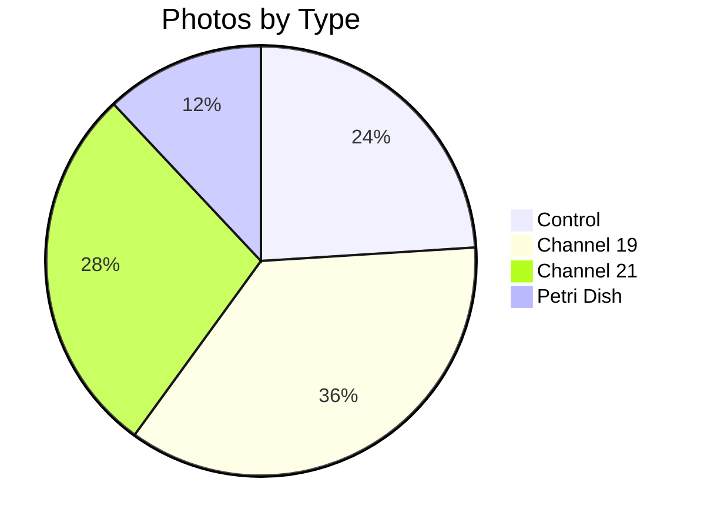

# 📸 Patient 02 Photo Dataset

**Experiment Date: 2026-01-28 | Blood Group: III+ | Total Photos: 25**

---

## 🎯 NAVIGATION

[Info](#dataset-overview) | [Photos](#photo-inventory) | [Protocol](../protocol_part-01.pdf) | [All Patients](../../README.md)

---

## 📊 OVERVIEW



| Metric | Value |
|--------|-------|
| **📸 Photos** | 25 |
| **🩸 Blood** | III+ |
| **🧪 Samples** | 6 |

---

## ⏰ TIMELINE

```mermaid
timeline
    title Patient 02
    section Collection
        19:50:50 — 19:54:16 : Blood
    : Centrifuge
        19:54:10 — 20:00:10
    : Irradiation
        20:09:50 — 21:24:10
    : Photos
        21:29:19 — Next Day
```

---

## 📁 PHOTOS (25)

| # | File | Time | Samples |
|---|------|------|---------|
| 1-9 | `IMG_3264-3272` | 21:29-21:39 | Individual samples |
| 10-16 | `IMG_3273-3279` | 21:40-21:51 | Comparisons |
| 17-20 | `IMG_3280-3283` | Various | Petri dish time-lapse |
| 21-25 | `IMG_3284-3288` | Next day | +16-21h analysis |

---

## 🔗 OTHERS

[P01](../../patient-01/) | [P03](../../patient-03/) | [P04](../../patient-04/) | [P05](../../patient-05/) | [P06](../../patient-06/) | [P07](../../patient-07/)

**Last Updated: 2026-03-26**
