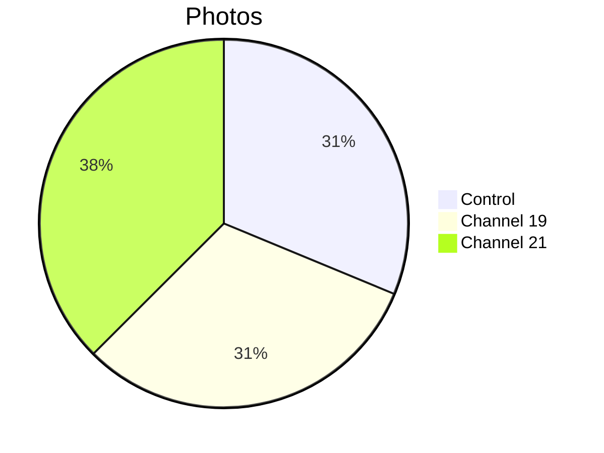

# 📸 Patient 03 Photo Dataset

**Experiment Date: 2026-01-29 | Blood Group: IV- | Total Photos: 16**

---

## 🎯 NAVIGATION

[Info](#overview) | [Photos](#photo-inventory) | [Protocol](../protocol_part-01.pdf) | [All Patients](../../README.md)

---

## 📊 OVERVIEW



| Metric | Value |
|--------|-------|
| **📸 Photos** | 16 |
| **🩸 Blood** | IV- |
| **🧪 Samples** | 4 |

**Note:** Rapid coagulation observed.

---

## ⏰ TIMELINE

```mermaid
timeline
    title Patient 03
    section Evening
        21:17 : Blood
        21:22 : Centrifuge
        21:35 : Irradiation
        20:41 : Photos (16)
```

---

## 📁 PHOTOS (16)

| Files | Count | Description |
|-------|-------|-------------|
| `IMG_3290-3305` | 16 | Individual and comparison shots |

---

## 🔗 OTHERS

[P01](../../patient-01/) | [P02](../../patient-02/) | [P04](../../patient-04/) | [P05](../../patient-05/) | [P06](../../patient-06/) | [P07](../../patient-07/)

**Last Updated: 2026-03-26**
