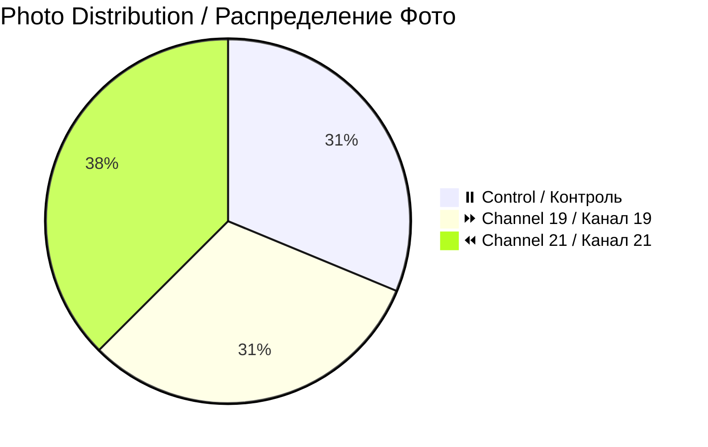

# 📸 Patient 03 Photo Dataset / Фото Dataset Пациента 03

**Experiment Date / Дата Эксперимента:** 2026-01-29 | **Blood Group / Группа Крови:** IV- | **Total Photos / Всего Фото:** 16

---

## 🎯 NAVIGATION / НАВИГАЦИЯ

[Info / Инфо](#overview) | [Photos / Фото](#photo-inventory) | [Protocol / Протокол](../protocol_part-01.pdf) | [All Patients / Все Пациенты](../../README.md)

---

## 📊 OVERVIEW / ОБЗОР



| Metric / Метрика | Value / Значение |
|------------------|------------------|
| **📸 Photos / Фото** | 16 images / 16 изображений |
| **🩸 Blood / Кровь** | IV- (Rh negative / Rh отрицательный) |
| **🧪 Samples / Образцы** | 4 (2 control, 1 ch19, 1 ch21) |
| **⏰ Duration / Длительность** | ~1h 8min / ~1ч 8мин |

**⚠️ Note / Примечание:** Rapid coagulation observed / Наблюдалось быстрое свёртывание

---

## ⏰ TIMELINE / ВРЕМЕННАЯ ШКАЛА

```mermaid
timeline
    title Patient 03 / Пациент 03
    section Evening Session / Вечерняя Сессия
        21:17 : Blood / Кровь
        21:22 : Centrifuge / Центрифуга
        21:35 : Irradiation / Облучение
        20:41 : Photos (16) / Фото
```

---

## 📁 PHOTOS / ФОТО (16)

| Files / Файлы | Count / Кол-во | Description / Описание | Preview / Превью |
|---------------|----------------|------------------------|------------------|
| `IMG_3290-3305` | 16 | Individual & comparison / Индивид. и сравнения | [🖼️](jpg/) |

---

## 🔗 OTHERS / ДРУГИЕ

[P01](../../patient-01/) | [P02](../../patient-02/) | [P04](../../patient-04/) | [P05](../../patient-05/) | [P06](../../patient-06/) | [P07](../../patient-07/)

---

**Last Updated / Последнее Обновление:** 2026-03-26
