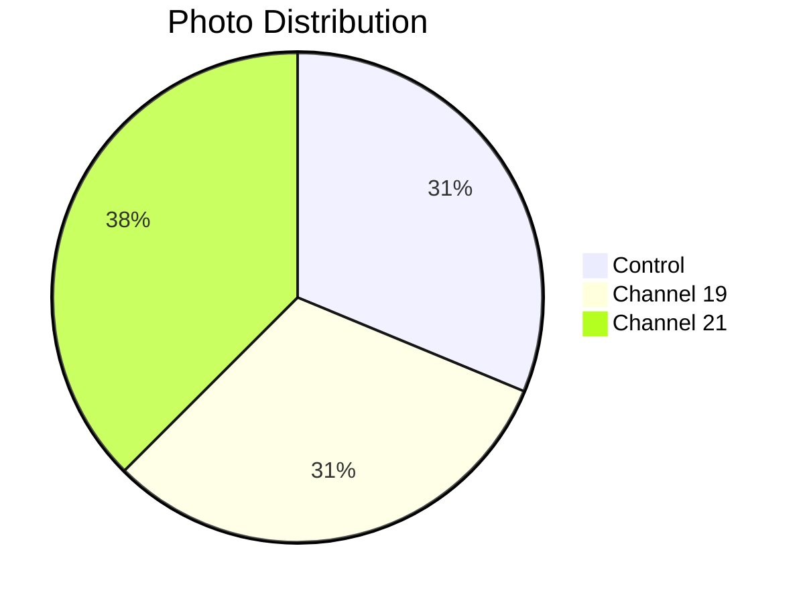
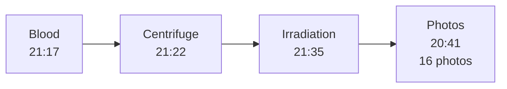

#  Patient 03 Photo Dataset / Фото Dataset Пациента 03

**Experiment Date:** 2026-01-29 | **Blood Group:** IV- | **Total Photos:** 16

---

##  NAVIGATION

[Info / Инфо](#overview--обзор) | [Photos / Фото](#photos-16) | [Protocol / Протокол](../protocol_part-01.pdf) | [All Patients / Все Пациенты](../../README.md) | [Data Hub / Хаб Данных](../../README.md)

---

##  OVERVIEW / ОБЗОР

```mermaid
pie title Photo Distribution
    " Control" : 5
    " Channel 19" : 5
    " Channel 21" : 6
```

| Metric | Value |
|--------|-------|
| ** Photos** | 16 |
| ** Blood** | IV- (Rh negative) |
| ** Samples** | 4 |

** Note:** Rapid coagulation observed / Быстрое свёртывание

---

##  CHANNEL METRICS

### Photo Distribution

**Patient 03: Photos per Channel**

| Metric | Value |
|---|---|
|  Control | 5 |
|  Ch19 | 5 |
|  Ch21 | 6 |

### Timeline

```mermaid
flowchart LR
    A["Blood<br/>21:17"] --> B["Centrifuge<br/>21:22"]
    B --> C["Irradiation<br/>21:35"]
    C --> D["Photos<br/>20:41<br/>16 photos"]
```

---

##  PHOTOS (16)

| # | File / Файл | Time / Время | Samples / Образцы | Preview / Превью |
|---|-------------|--------------|-------------------|------------------|
| 1 | `IMG_3290.HEIC` | 20:41:07 | 21.3.1 |  |
| 2 | `IMG_3291.HEIC` | 20:41:36 | 21.3.1 |  |
| 3 | `IMG_3292.HEIC` | 20:42:24 | — |  |
| 4 | `IMG_3293.HEIC` | 20:42:57 | 0.3.1 |  |
| 5 | `IMG_3294.HEIC` | 20:44:44 | 0.3.1 |  |
| 6 | `IMG_3295.HEIC` | 20:45:06 | 0.3.2 |  |
| 7 | `IMG_3296.HEIC` | 20:49:59 | 19.3.1 |  |
| 8 | `IMG_3297.HEIC` | 20:53:49 | 19.3.1 |  |
| 9 | `IMG_3298.HEIC` | 20:57:51 | — |  |
| 10 | `IMG_3299.HEIC` | 21:04:46 | 21.3.1 |  |
| 11 | `IMG_3300.HEIC` | 20:58:11 | — |  |
| 12 | `IMG_3301.HEIC` | 20:59:57 | — |  |
| 13 | `IMG_3302.HEIC` | 21:04:26 | 19.3.1 |  |
| 14 | `IMG_3303.HEIC` | 20:54:23 | — |  |
| 15 | `IMG_3304.HEIC` | 20:58:23 | — |  |
| 16 | `IMG_3305.HEIC` | 21:05:04 | 0.3.1, 0.3.2 |  |

---

##  OTHERS

[P01](../../patient-01/) | [P02](../../patient-02/) | [P04](../../patient-04/) | [P05](../../patient-05/) | [P06](../../patient-06/) | [P07](../../patient-07/)

---

**Last Updated:** 2026-03-26
