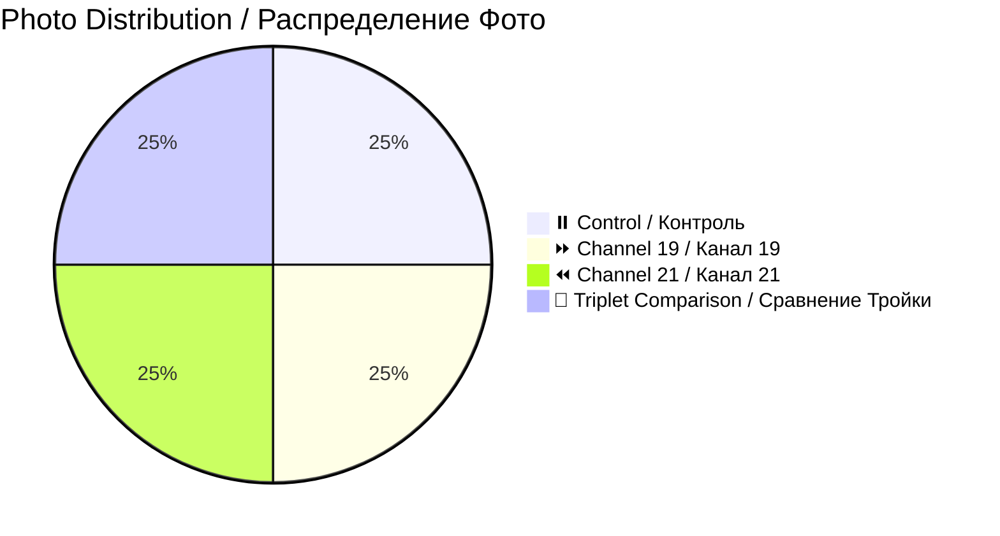

# 📸 Patient 04 Photo Dataset / Фото Dataset Пациента 04

**Experiment Date / Дата Эксперимента:** 2026-01-30 | **Blood Group / Группа Крови:** IV+ | **Total Photos / Всего Фото:** 4

---

## 🎯 NAVIGATION / НАВИГАЦИЯ

[Info / Инфо](#overview) | [Photos / Фото](#photo-inventory) | [Protocol / Протокол](../protocol_part-01.pdf) | [All Patients / Все Пациенты](../../README.md)

---

## 📊 OVERVIEW / ОБЗОР



| Metric / Метрика | Value / Значение |
|------------------|------------------|
| **📸 Photos / Фото** | 4 images / 4 изображения |
| **🩸 Blood / Кровь** | IV+ |
| **🧪 Samples / Образцы** | 4 (2 control, 1 ch19, 1 ch21) |
| **⏰ Duration / Длительность** | ~1h 34min / ~1ч 34мин |

---

## ⏰ TIMELINE / ВРЕМЕННАЯ ШКАЛА

```mermaid
timeline
    title Patient 04 / Пациент 04
    section Afternoon / Послеобеденная Сессия
        16:00 : Centrifuge / Центрифуга
        16:13 : Irradiation / Облучение
        17:36 : Photos (4) / Фото
```

---

## 📁 PHOTOS / ФОТО (4)

| File / Файл | Time / Время | Samples / Образцы | Note / Примечание | Preview / Превью |
|-------------|--------------|-------------------|-------------------|------------------|
| `IMG_3307` | 17:36:05 | 0.4.1 | Control / Контроль | [🖼️](jpg/IMG_3307.jpg) |
| `IMG_3308` | 17:36:33 | 19.4.1 | Channel 19 / Канал 19 | [🖼️](jpg/IMG_3308.jpg) |
| `IMG_3309` | 17:36:57 | 21.4.1 | **No clots / Без сгустков** | [🖼️](jpg/IMG_3309.jpg) |
| `IMG_3310` | 17:39:01 | All three / Все три | Comparison / Сравнение | [🖼️](jpg/IMG_3310.jpg) |

**🎯 Key Finding / Ключевая Находка:** Sample 21.4.1 (Channel 21) showed NO CLOTS - only sample in dataset without visible coagulation / Образец 21.4.1 (Канал 21) не показал СГУСТКОВ - единственный образец без видимого свёртывания

---

## 🔗 OTHERS / ДРУГИЕ

[P01](../../patient-01/) | [P02](../../patient-02/) | [P03](../../patient-03/) | [P05](../../patient-05/) | [P06](../../patient-06/) | [P07](../../patient-07/)

---

**Last Updated / Последнее Обновление:** 2026-03-26
