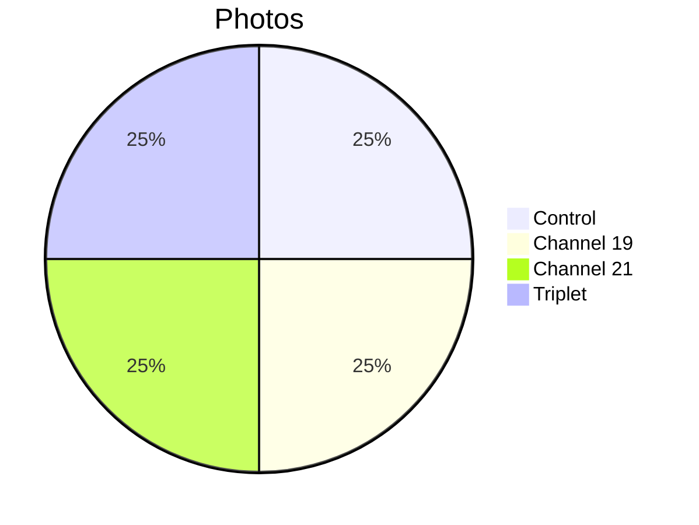

# 📸 Patient 04 Photo Dataset

**Experiment Date: 2026-01-30 | Blood Group: IV+ | Total Photos: 4**

---

## 🎯 NAVIGATION

[Info](#overview) | [Photos](#photo-inventory) | [Protocol](../protocol_part-01.pdf) | [All Patients](../../README.md)

---

## 📊 OVERVIEW



| Metric | Value |
|--------|-------|
| **📸 Photos** | 4 |
| **🩸 Blood** | IV+ |
| **🧪 Samples** | 4 |

---

## ⏰ TIMELINE

```mermaid
timeline
    title Patient 04
    section Afternoon
        16:00 : Centrifuge
        16:13 : Irradiation
        17:36 : Photos (4)
```

---

## 📁 PHOTOS (4)

| File | Time | Samples | Note |
|------|------|---------|------|
| `IMG_3307` | 17:36:05 | 0.4.1 | Control |
| `IMG_3308` | 17:36:33 | 19.4.1 | Channel 19 |
| `IMG_3309` | 17:36:57 | 21.4.1 | Channel 21 - **No clots** |
| `IMG_3310` | 17:39:01 | All three | Comparison |

---

## 🔗 OTHERS

[P01](../../patient-01/) | [P02](../../patient-02/) | [P03](../../patient-03/) | [P05](../../patient-05/) | [P06](../../patient-06/) | [P07](../../patient-07/)

**Last Updated: 2026-03-26**
