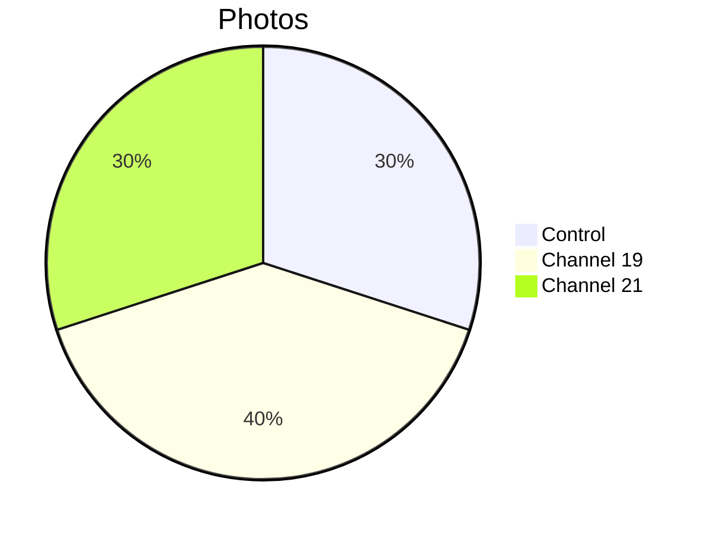

# 📸 Patient 05 Photo Dataset

**Experiment Date: 2026-01-31 | Blood Group: no data | Total Photos: 10**

---

## 🎯 NAVIGATION

[Info](#overview) | [Photos](#photo-inventory) | [Protocol](../protocol_part-01.pdf) | [All Patients](../../README.md)

---

## 📊 OVERVIEW



| Metric | Value |
|--------|-------|
| **📸 Photos** | 10 |
| **🩸 Blood** | no data |
| **🧪 Samples** | 3 |

**Note:** Night session experiment.

---

## ⏰ TIMELINE

```mermaid
timeline
    title Patient 05
    section Night Session
        Late Night : Experiment
        01:21 : Irradiation end
        01:37 : Photos start
```

---

## 📁 PHOTOS (10)

| Files | Count | Description |
|-------|-------|-------------|
| `IMG_3312-3321` | 10 | Petri dish focus, macro shots |

---

## 🔗 OTHERS

[P01](../../patient-01/) | [P02](../../patient-02/) | [P03](../../patient-03/) | [P04](../../patient-04/) | [P06](../../patient-06/) | [P07](../../patient-07/)

**Last Updated: 2026-03-26**
