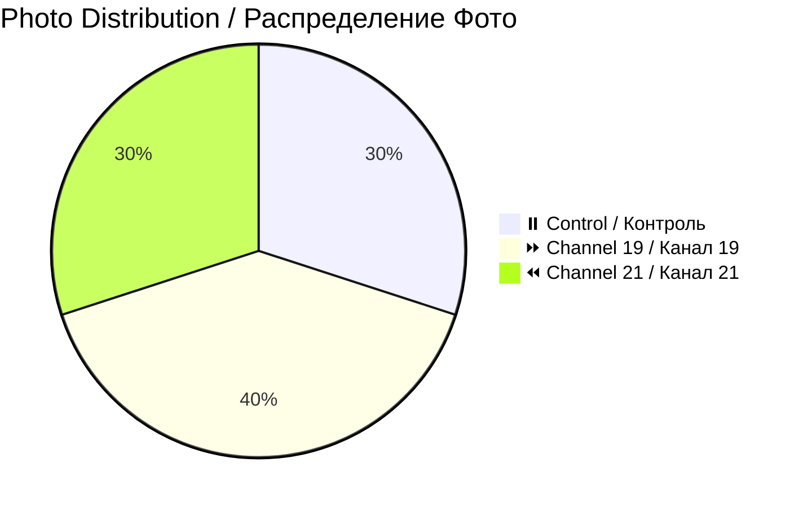

# 📸 Patient 05 Photo Dataset / Фото Dataset Пациента 05

**Experiment Date / Дата Эксперимента:** 2026-01-31 | **Blood Group / Группа Крови:** no data | **Total Photos / Всего Фото:** 10

---

## 🎯 NAVIGATION / НАВИГАЦИЯ

[Info / Инфо](#overview) | [Photos / Фото](#photo-inventory) | [Protocol / Протокол](../protocol_part-01.pdf) | [All Patients / Все Пациенты](../../README.md)

---

## 📊 OVERVIEW / ОБЗОР



| Metric / Метрика | Value / Значение |
|------------------|------------------|
| **📸 Photos / Фото** | 10 images / 10 изображений |
| **🩸 Blood / Кровь** | no data / нет данных |
| **🧪 Samples / Образцы** | 3 (1 control, 1 ch19, 1 ch21) |
| **⏰ Session / Сессия** | Night / Ночная |

**🌙 Note / Примечание:** Night session experiment / Эксперимент ночной сессии

---

## ⏰ TIMELINE / ВРЕМЕННАЯ ШКАЛА

```mermaid
timeline
    title Patient 05 / Пациент 05
    section Night Session / Ночная Сессия
        Late Night : Experiment / Эксперимент
        01:21 : Irradiation end / Конец облучения
        01:37 : Photos start / Начало фото
```

---

## 📁 PHOTOS / ФОТО (10)

| Files / Файлы | Count / Кол-во | Description / Описание | Preview / Превью |
|---------------|----------------|------------------------|------------------|
| `IMG_3312-3321` | 10 | Petri dish focus, macro / Чашка Петри, макро | [🖼️](jpg/) |

---

## 🔗 OTHERS / ДРУГИЕ

[P01](../../patient-01/) | [P02](../../patient-02/) | [P03](../../patient-03/) | [P04](../../patient-04/) | [P06](../../patient-06/) | [P07](../../patient-07/)

---

**Last Updated / Последнее Обновление:** 2026-03-26
