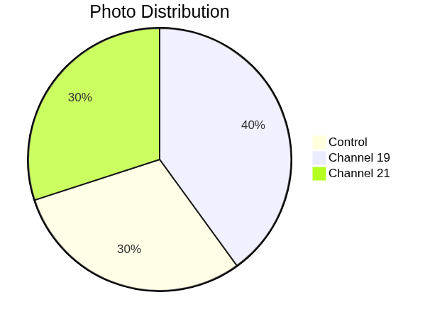
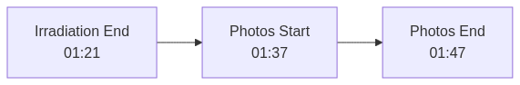

#  Patient 05 Photo Dataset / Фото Dataset Пациента 05

**Experiment Date:** 2026-01-31 | **Blood Group:** no data | **Total Photos:** 10

---

##  NAVIGATION

[Info / Инфо](#overview--обзор) | [Photos / Фото](#photos-10) | [Protocol / Протокол](../protocol_part-01.pdf) | [All Patients / Все Пациенты](../../README.md) | [Data Hub / Хаб Данных](../../README.md)

---

##  OVERVIEW / ОБЗОР

| Metric | Value |
|--------|-------|
| ** Photos** | 10 |
| ** Blood** | no data |
| ** Samples** | 3 |
| ** Session** | Night / Ночная |

---

##  CHANNEL METRICS

### Night Session Timeline

### Photo Distribution

**Patient 05: Photos per Channel**

| Metric | Value |
|---|---|
|  Control | 3 |
|  Ch19 | 4 |
|  Ch21 | 3 |

---

##  PHOTOS (10)

| # | File / Файл | Time / Время | Samples / Образцы | Preview / Превью |
|---|-------------|--------------|-------------------|------------------|
| 1 | `IMG_3312.HEIC` | 01:37:50 | — |  |
| 2 | `IMG_3313.HEIC` | 01:38:02 | — |  |
| 3 | `IMG_3314.HEIC` | 01:41:03 | — |  |
| 4 | `IMG_3315.HEIC` | 01:46:59 | 19.5.1 |  |
| 5 | `IMG_3316.HEIC` | 01:39:23 | — |  |
| 6 | `IMG_3317.HEIC` | 01:40:01 | — |  |
| 7 | `IMG_3318.HEIC` | 01:47:05 | 0.5.1 |  |
| 8 | `IMG_3319.HEIC` | 01:41:56 | — |  |
| 9 | `IMG_3320.HEIC` | 01:42:01 | — |  |
| 10 | `IMG_3321.HEIC` | 01:47:10 | 21.5.1 |  |

---

##  OTHERS

[P01](../../patient-01/) | [P02](../../patient-02/) | [P03](../../patient-03/) | [P04](../../patient-04/) | [P06](../../patient-06/) | [P07](../../patient-07/)

---

**Last Updated:** 2026-03-26
