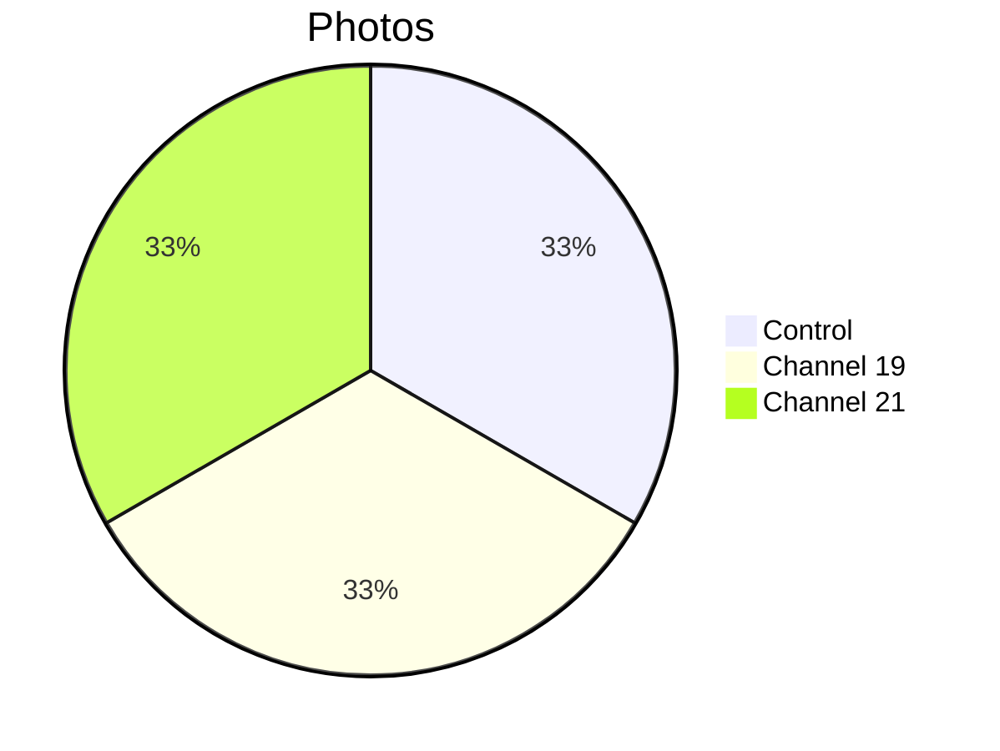

# 📸 Patient 06 Photo Dataset

**Experiment Date: 2026-02-01 | Blood Group: I+ | Total Photos: 3**

---

## 🎯 NAVIGATION

[Info](#overview) | [Photos](#photo-inventory) | [Protocol](../protocol_part-01.pdf) | [All Patients](../../README.md)

---

## 📊 OVERVIEW



| Metric | Value |
|--------|-------|
| **📸 Photos** | 3 |
| **🩸 Blood** | I+ |
| **🧪 Samples** | 6 |

**Note:** Smallest dataset, efficient multi-sample composition.

---

## ⏰ TIMELINE

```mermaid
timeline
    title Patient 06
    section Evening
        Evening : Experiment
        22:17 : Irradiation end
        22:25 : Photos (3)
```

---

## 📁 PHOTOS (3)

| File | Time | Samples |
|------|------|---------|
| `IMG_3323` | 22:29:11 | 21.6.2, 19.6.2 (1.5ml) |
| `IMG_3324` | 22:27:42 | All 6 samples |
| `IMG_3325` | 22:25:48 | 21.6.1, 0.6.1, 19.6.1 (1ml) |

---

## 🔗 OTHERS

[P01](../../patient-01/) | [P02](../../patient-02/) | [P03](../../patient-03/) | [P04](../../patient-04/) | [P05](../../patient-05/) | [P07](../../patient-07/)

**Last Updated: 2026-03-26**
