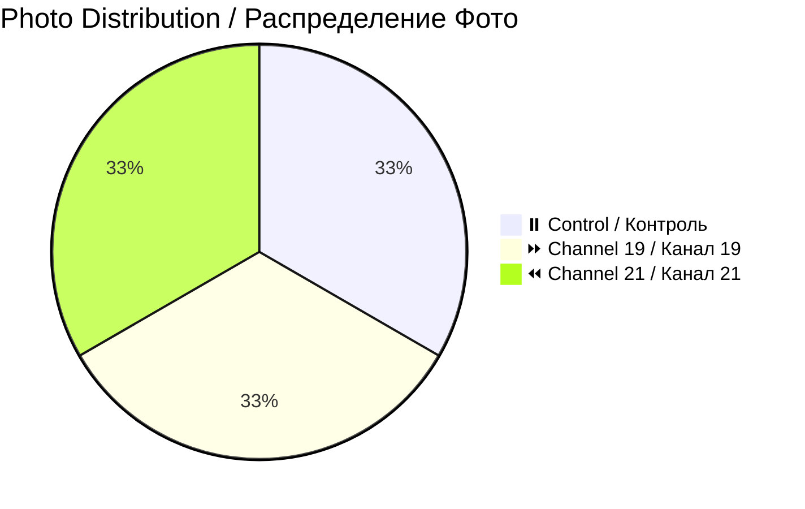

# 📸 Patient 06 Photo Dataset / Фото Dataset Пациента 06

**Experiment Date / Дата Эксперимента:** 2026-02-01 | **Blood Group / Группа Крови:** I+ | **Total Photos / Всего Фото:** 3

---

## 🎯 NAVIGATION / НАВИГАЦИЯ

[Info / Инфо](#overview) | [Photos / Фото](#photo-inventory) | [Protocol / Протокол](../protocol_part-01.pdf) | [All Patients / Все Пациенты](../../README.md)

---

## 📊 OVERVIEW / ОБЗОР



| Metric / Метрика | Value / Значение |
|------------------|------------------|
| **📸 Photos / Фото** | 3 images / 3 изображения |
| **🩸 Blood / Кровь** | I+ (Rh positive / Rh положительный) |
| **🧪 Samples / Образцы** | 6 (2 control, 2 ch19, 2 ch21) |
| **⏰ Session / Сессия** | Evening / Вечерняя |

**📊 Note / Примечание:** Smallest dataset, efficient multi-sample composition / Самый маленький набор, эффективная многообразцовая композиция

---

## ⏰ TIMELINE / ВРЕМЕННАЯ ШКАЛА

```mermaid
timeline
    title Patient 06 / Пациент 06
    section Evening Session / Вечерняя Сессия
        Evening : Experiment / Эксперимент
        22:17 : Irradiation end / Конец облучения
        22:25 : Photos (3) / Фото
```

---

## 📁 PHOTOS / ФОТО (3)

| File / Файл | Time / Время | Samples / Образцы | Description / Описание | Preview / Превью |
|-------------|--------------|-------------------|------------------------|------------------|
| `IMG_3323` | 22:29:11 | 21.6.2, 19.6.2 | 1.5ml samples / Образцы 1.5мл | [🖼️](jpg/IMG_3323.jpg) |
| `IMG_3324` | 22:27:42 | All 6 / Все 6 | Complete set / Полный набор | [🖼️](jpg/IMG_3324.jpg) |
| `IMG_3325` | 22:25:48 | 21.6.1, 0.6.1, 19.6.1 | 1ml samples / Образцы 1мл | [🖼️](jpg/IMG_3325.jpg) |

---

## 🔗 OTHERS / ДРУГИЕ

[P01](../../patient-01/) | [P02](../../patient-02/) | [P03](../../patient-03/) | [P04](../../patient-04/) | [P05](../../patient-05/) | [P07](../../patient-07/)

---

**Last Updated / Последнее Обновление:** 2026-03-26
