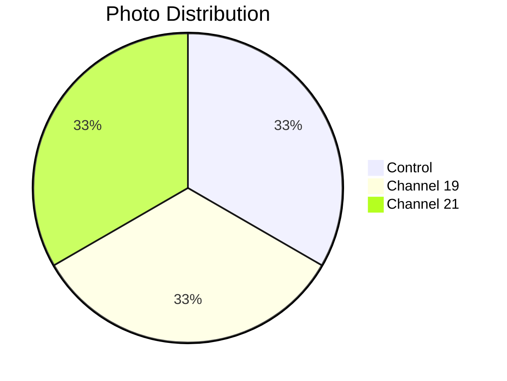
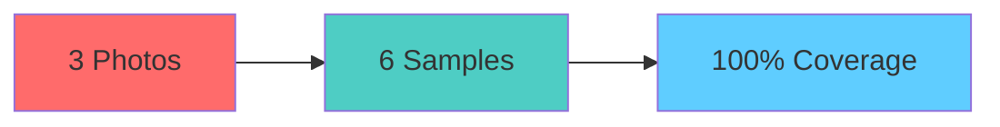

#  Patient 06 Photo Dataset / Фото Dataset Пациента 06

**Experiment Date:** 2026-02-01 | **Blood Group:** I+ | **Total Photos:** 3

---

##  NAVIGATION

[Info / Инфо](#overview--обзор) | [Photos / Фото](#photos-3) | [Protocol / Протокол](../protocol_part-01.pdf) | [All Patients / Все Пациенты](../../README.md) | [Data Hub / Хаб Данных](../../README.md)

---

##  OVERVIEW / ОБЗОР

```mermaid
pie title Photo Distribution
    " Control" : 1
    " Channel 19" : 1
    " Channel 21" : 1
```

| Metric | Value |
|--------|-------|
| ** Photos** | 3 (smallest / самый маленький) |
| ** Blood** | I+ |
| ** Samples** | 6 (2 control, 2 ch19, 2 ch21) |
| ** Session** | Evening / Вечерняя |

---

##  CHANNEL METRICS

### Efficient Multi-Sample Coverage

```mermaid
flowchart LR
    A[ 3 Photos] --> B[ 6 Samples]
    B --> C[ 100% Coverage]
    
    style A fill:#ff6b6b
    style B fill:#4ecdc4
    style C fill:#5fcdff
```

### Photo Distribution

**Patient 06: Photos per Channel**

| Metric | Value |
|---|---|
|  Control | 1 |
|  Ch19 | 1 |
|  Ch21 | 1 |

---

##  PHOTOS (3)

| File | Time | Samples | Description | Preview |
|------|------|---------|-------------|---------|
| `IMG_3323` | 22:29:11 | 21.6.2, 19.6.2 | 1.5ml samples |  |
| `IMG_3324` | 22:27:42 | All 6 | Complete set |  |
| `IMG_3325` | 22:25:48 | 21.6.1, 0.6.1, 19.6.1 | 1ml samples |  |

---

##  OTHERS

[P01](../../patient-01/) | [P02](../../patient-02/) | [P03](../../patient-03/) | [P04](../../patient-04/) | [P05](../../patient-05/) | [P07](../../patient-07/)

---

**Last Updated:** 2026-03-26
