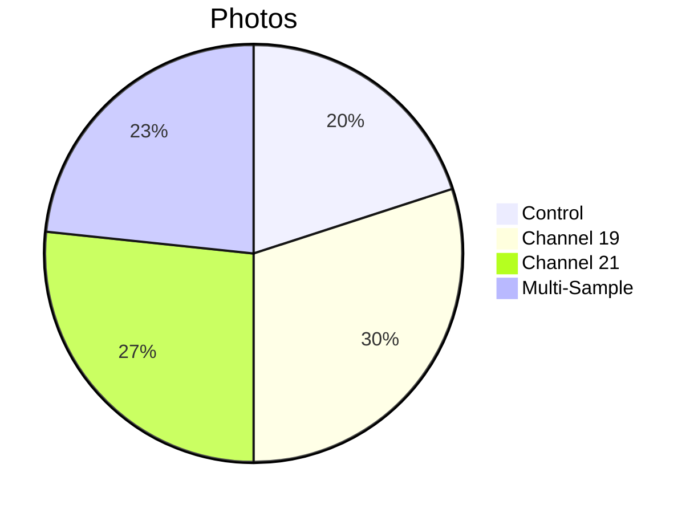

# 📸 Patient 07 Photo Dataset

**Experiment Date: 2026-02-07 | Blood Group: no data | Total Photos: 30**

---

## 🎯 NAVIGATION

[Info](#overview) | [Photos](#photo-inventory) | [Protocol](../protocol_part-01.pdf) | [All Patients](../../README.md)

---

## 📊 OVERVIEW



| Metric | Value |
|--------|-------|
| **📸 Photos** | 30 |
| **🩸 Blood** | no data |
| **🧪 Samples** | 6 |

**Note:** Largest dataset with comprehensive coverage.

---

## ⏰ TIMELINE

```mermaid
timeline
    title Patient 07
    section Evening
        19:57 : Blood
        20:03 : Centrifuge
        20:15 : Irradiation
        19:58 : Photos start
        20:34 : Photos end (30)
```

---

## 📁 PHOTOS (30)

### Part 1 (14 photos)
| Files | Description |
|-------|-------------|
| `IMG_3327-3340` | Individual samples, macro shots |

### Part 2 (16 photos)
| Files | Description |
|-------|-------------|
| `IMG_3341-3356` | Controls, comparisons, time-lapse |

---

## 🔗 OTHERS

[P01](../../patient-01/) | [P02](../../patient-02/) | [P03](../../patient-03/) | [P04](../../patient-04/) | [P05](../../patient-05/) | [P06](../../patient-06/)

**Last Updated: 2026-03-26**
