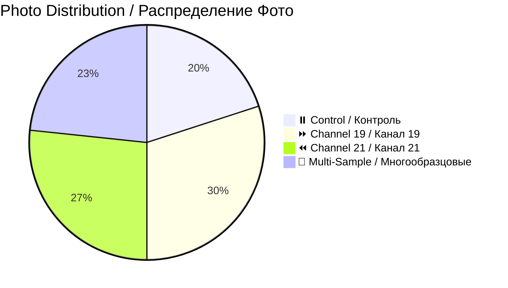

# 📸 Patient 07 Photo Dataset / Фото Dataset Пациента 07

**Experiment Date / Дата Эксперимента:** 2026-02-07 | **Blood Group / Группа Крови:** no data | **Total Photos / Всего Фото:** 30

---

## 🎯 NAVIGATION / НАВИГАЦИЯ

[Info / Инфо](#overview) | [Photos / Фото](#photo-inventory) | [Protocol / Протокол](../protocol_part-01.pdf) | [All Patients / Все Пациенты](../../README.md)

---

## 📊 OVERVIEW / ОБЗОР



| Metric / Метрика | Value / Значение |
|------------------|------------------|
| **📸 Photos / Фото** | 30 images / 30 изображений |
| **🩸 Blood / Кровь** | no data / нет данных |
| **🧪 Samples / Образцы** | 6 (2 control, 2 ch19, 2 ch21) |
| **⏰ Duration / Длительность** | ~1h 21min / ~1ч 21мин |

**📊 Note / Примечание:** Largest dataset with comprehensive coverage / Самый большой набор с полным покрытием

---

## ⏰ TIMELINE / ВРЕМЕННАЯ ШКАЛА

```mermaid
timeline
    title Patient 07 / Пациент 07
    section Evening Session / Вечерняя Сессия
        19:57 : Blood / Кровь
        20:03 : Centrifuge / Центрифуга
        20:15 : Irradiation / Облучение
        19:58 : Photos start / Начало фото
        20:34 : Photos end (30) / Конец фото
```

---

## 📁 PHOTOS / ФОТО (30)

### Part 1 / Часть 1 (14 photos / 14 фото)

| Files / Файлы | Description / Описание | Preview / Превью |
|---------------|------------------------|------------------|
| `IMG_3327-3340` | Individual samples, macro shots / Индивид. образцы, макро | [🖼️](jpg/) |

### Part 2 / Часть 2 (16 photos / 16 фото)

| Files / Файлы | Description / Описание | Preview / Превью |
|---------------|------------------------|------------------|
| `IMG_3341-3356` | Controls, comparisons, time-lapse / Контроль, сравнения | [🖼️](jpg/) |

---

## 🔗 OTHERS / ДРУГИЕ

[P01](../../patient-01/) | [P02](../../patient-02/) | [P03](../../patient-03/) | [P04](../../patient-04/) | [P05](../../patient-05/) | [P06](../../patient-06/)

---

**Last Updated / Последнее Обновление:** 2026-03-26
