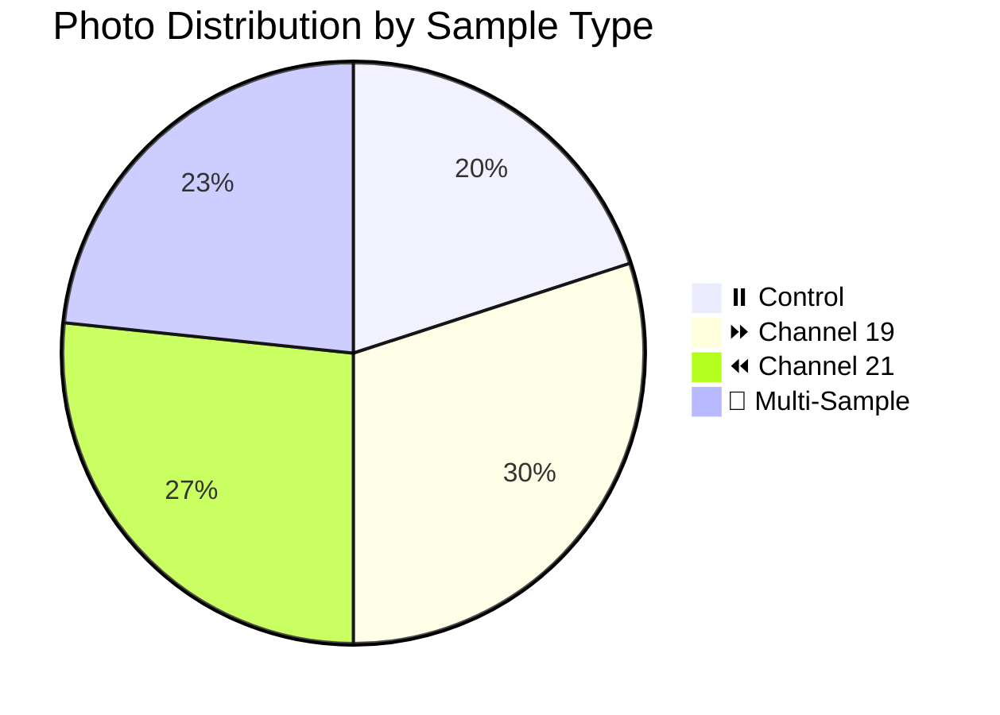

# 📸 Patient 07 Photo Dataset

**Experiment Date:** 2026-02-07 | **Blood Group:** no data | **Total Photos:** 30

---

## 🎯 NAVIGATION

[Info](#overview) | [Photos](#photo-inventory) | [Protocol](../protocol_part-01.pdf) | [All Patients](../../README.md) | [Data Hub](../../README.md)

---

## 📊 OVERVIEW / ОБЗОР



| Metric | Value |
|--------|-------|
| **📸 Photos** | 30 (largest) |
| **🩸 Blood** | no data |
| **🧪 Samples** | 6 |
| **⏰ Duration** | ~1h 21min |

---

## 📈 CHANNEL METRICS

### Photo Distribution Analysis

```mermaid
barChart
    title Patient 07: Photos per Channel
    x-axis "Channel"
    y-axis "Count"
    bar "⏸️ Control" : 6
    bar "⏩ Ch19" : 9
    bar "⏪ Ch21" : 8
    bar "Multi" : 7
```

### Timeline

```mermaid
timeline
    title Patient 07 Timeline
    section Blood
        19:57-20:03 : Collection
    section Centrifuge
        20:03-20:09 : 2000 rpm
    section Irradiation
        20:15-21:36 : Ch19+Ch21
    section Photos
        19:58-20:34 : 30 photos
```

---

## 📁 PHOTOS (30)

### Part 1 (14 photos)

| # | File | Time | Samples | Preview |
|---|------|------|---------|---------|
| 1 | `IMG_3327` | 19:58:17 | — | [🖼️](jpg/IMG_3327.jpg) |
| 2 | `IMG_3328` | 19:59:42 | 19.7.1, 21.7.1 | [🖼️](jpg/IMG_3328.jpg) |
| 3-14 | `IMG_3329-3340` | Various | Individual | [🖼️](jpg/) |

### Part 2 (16 photos)

| # | File | Time | Samples | Preview |
|---|------|------|---------|---------|
| 15-25 | `IMG_3341-3351` | Various | Controls | [🖼️](jpg/) |
| 26 | `IMG_3352` | 20:12:07 | All 6 | [🖼️](jpg/IMG_3352.jpg) |
| 27-30 | `IMG_3353-3356` | 20:30+ | Late | [🖼️](jpg/) |

---

## 🔗 OTHERS

[P01](../../patient-01/) | [P02](../../patient-02/) | [P03](../../patient-03/) | [P04](../../patient-04/) | [P05](../../patient-05/) | [P06](../../patient-06/)

---

**Last Updated:** 2026-03-26
