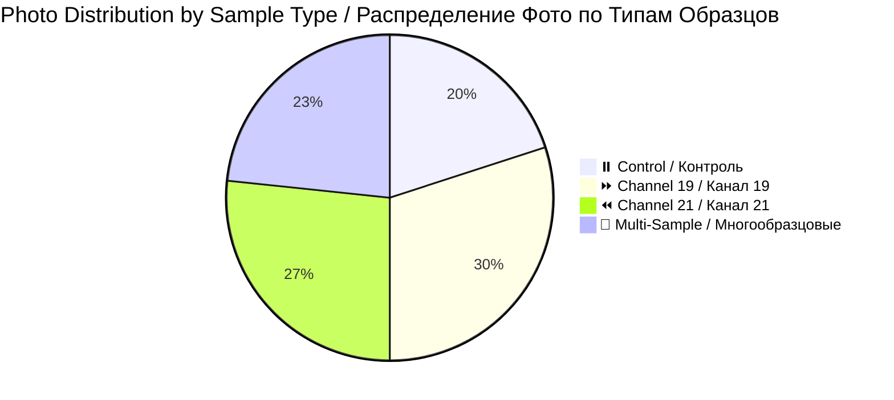
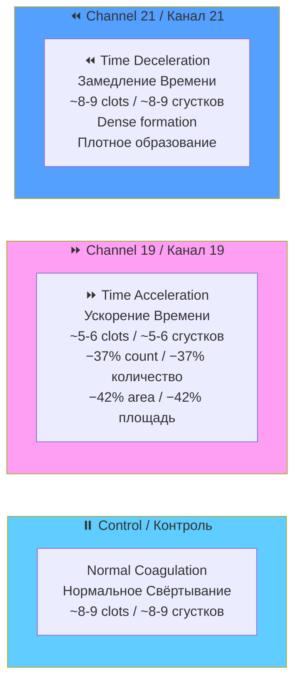
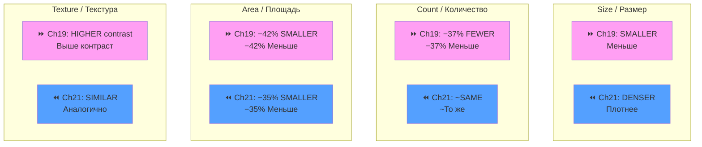
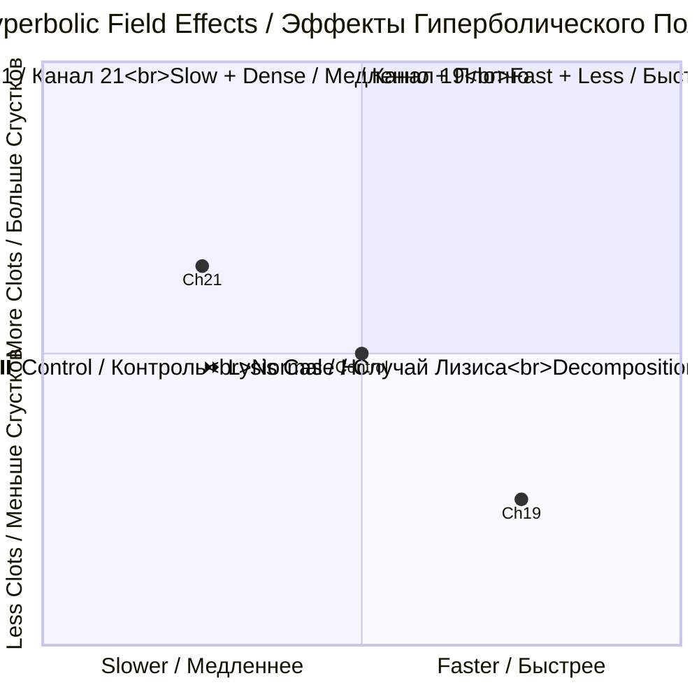

# 📸 Patient 07 Photo Dataset / Фото Dataset Пациента 07

**Experiment Date / Дата Эксперимента:** 2026-02-07 | **Blood Group / Группа Крови:** no data | **Total Photos / Всего Фото:** 30

---

## 🎯 NAVIGATION / НАВИГАЦИЯ

[Info / Инфо](#overview) | [Photos / Фото](#photo-inventory) | [Protocol / Протокол](../protocol_part-01.pdf) | [All Patients / Все Пациенты](../../README.md)

---

## 📊 OVERVIEW / ОБЗОР



| Metric / Метрика | Value / Значение |
|------------------|------------------|
| **📸 Photos / Фото** | 30 images / 30 изображений |
| **🩸 Blood / Кровь** | no data / нет данных |
| **🧪 Samples / Образцы** | 6 (2 control, 2 ch19, 2 ch21) |
| **⏰ Duration / Длительность** | ~1h 21min / ~1ч 21мин |

**📊 Note / Примечание:** Largest dataset with comprehensive coverage / Самый большой набор с полным покрытием

---

## ⏰ TIMELINE / ВРЕМЕННАЯ ШКАЛА

```mermaid
timeline
    title Patient 07 / Пациент 07
    section Blood Collection / Забор Крови
        19:57:47 — 20:03:17 : 🩸 4 tubes / 4 пробирки
    section Centrifugation / Центрифугирование
        20:03:45 — 20:09:15 : 🔄 2000 rpm
    section Sample Prep / Подготовка Образцов
        20:09:59 — 20:11:56 : 🧪 6 samples / 6 образцов
    section Irradiation / Облучение
        20:15:10 — 21:36:07 : ⚡ Ch19 + Ch21
    section Photography / Фотографирование
        19:58:17 — 20:34:35 : 📸 30 photos / 30 фото
```

---

## 🧪 SAMPLES / ОБРАЗЦЫ

| Sample ID | Type / Тип | Volume / Объем | Time / Время |
|-----------|------------|----------------|--------------|
| `0.7.1` | ⏸️ Control / Контроль | 1 ml | 20:10:41 |
| `0.7.2` | ⏸️ Control / Контроль | 1.5 ml | 20:09:59 |
| `19.7.1` | ⏩ Channel 19 | 1.5 ml | 20:10:15 |
| `19.7.2` | ⏩ Channel 19 | 1 ml | 20:11:31 |
| `21.7.1` | ⏪ Channel 21 | 1.5 ml | 20:11:07 |
| `21.7.2` | ⏪ Channel 21 | 1 ml | 20:11:56 |

---

## 📁 PHOTOS / ФОТО (30)

### Part 1 / Часть 1 (14 photos / 14 фото)

| # | File / Файл | Time / Время | Samples / Образцы | PDF Page / Стр. | Preview / Превью |
|---|-------------|--------------|-------------------|-----------------|------------------|
| 1 | `IMG_3327.HEIC` | 19:58:17 | — | Part 1, p.3 | [🖼️](jpg/IMG_3327.jpg) |
| 2 | `IMG_3328.HEIC` | 19:59:42 | 19.7.1, 21.7.1 | Part 1, p.4 | [🖼️](jpg/IMG_3328.jpg) |
| 3 | `IMG_3329.HEIC` | 20:01:42 | — | Part 1, p.5 | [🖼️](jpg/IMG_3329.jpg) |
| 4 | `IMG_3330.HEIC` | 20:01:12 | — | Part 1, p.6 | [🖼️](jpg/IMG_3330.jpg) |
| 5 | `IMG_3331.HEIC` | 20:00:45 | 19.7.1 | Part 1, p.7 | [🖼️](jpg/IMG_3331.jpg) |
| 6 | `IMG_3332.HEIC` | 20:03:46 | — | Part 1, p.8 | [🖼️](jpg/IMG_3332.jpg) |
| 7 | `IMG_3333.HEIC` | 20:03:37 | — | Part 1, p.9 | [🖼️](jpg/IMG_3333.jpg) |
| 8 | `IMG_3334.HEIC` | 20:02:26 | 19.7.2 | Part 1, p.10 | [🖼️](jpg/IMG_3334.jpg) |
| 9 | `IMG_3335.HEIC` | 20:06:30 | — | Part 1, p.11 | [🖼️](jpg/IMG_3335.jpg) |
| 10 | `IMG_3336.HEIC` | 20:06:38 | — | Part 1, p.12 | [🖼️](jpg/IMG_3336.jpg) |
| 11 | `IMG_3337.HEIC` | 20:06:22 | 21.7.1 | Part 1, p.13 | [🖼️](jpg/IMG_3337.jpg) |
| 12 | `IMG_3338.HEIC` | 20:05:29 | — | Part 1, p.14 | [🖼️](jpg/IMG_3338.jpg) |
| 13 | `IMG_3339.HEIC` | 20:05:16 | — | Part 1, p.15 | [🖼️](jpg/IMG_3339.jpg) |
| 14 | `IMG_3340.HEIC` | 20:05:04 | 21.7.2 | Part 1, p.16 | [🖼️](jpg/IMG_3340.jpg) |

### Part 2 / Часть 2 (16 photos / 16 фото)

| # | File / Файл | Time / Время | Samples / Образцы | PDF Page / Стр. | Preview / Превью |
|---|-------------|--------------|-------------------|-----------------|------------------|
| 15 | `IMG_3341.HEIC` | 20:09:55 | — | Part 2, p.1 | [🖼️](jpg/IMG_3341.jpg) |
| 16 | `IMG_3342.HEIC` | 20:09:35 | — | Part 2, p.2 | [🖼️](jpg/IMG_3342.jpg) |
| 17 | `IMG_3343.HEIC` | 20:09:41 | — | Part 2, p.3 | [🖼️](jpg/IMG_3343.jpg) |
| 18 | `IMG_3344.HEIC` | 20:10:01 | 0.7.1 | Part 2, p.4 | [🖼️](jpg/IMG_3344.jpg) |
| 19 | `IMG_3345.HEIC` | 20:09:06 | — | Part 2, p.5 | [🖼️](jpg/IMG_3345.jpg) |
| 20 | `IMG_3346.HEIC` | 20:08:06 | — | Part 2, p.6 | [🖼️](jpg/IMG_3346.jpg) |
| 21 | `IMG_3347.HEIC` | 20:07:48 | — | Part 2, p.7 | [🖼️](jpg/IMG_3347.jpg) |
| 22 | `IMG_3348.HEIC` | 20:08:19 | — | Part 2, p.8 | [🖼️](jpg/IMG_3348.jpg) |
| 23 | `IMG_3349.HEIC` | 20:07:58 | 0.7.2 | Part 2, p.9 | [🖼️](jpg/IMG_3349.jpg) |
| 24 | `IMG_3350.HEIC` | 20:14:07 | — | Part 2, p.10 | [🖼️](jpg/IMG_3350.jpg) |
| 25 | `IMG_3351.HEIC` | 20:11:26 | — | Part 2, p.11 | [🖼️](jpg/IMG_3351.jpg) |
| 26 | `IMG_3352.HEIC` | 20:12:07 | All 6 / Все 6 | Part 2, p.12 | [🖼️](jpg/IMG_3352.jpg) |
| 27 | `IMG_3353.HEIC` | 20:30:48 | — | Part 2, p.13 | [🖼️](jpg/IMG_3353.jpg) |
| 28 | `IMG_3354.HEIC` | 20:32:52 | — | Part 2, p.14 | [🖼️](jpg/IMG_3354.jpg) |
| 29 | `IMG_3355.HEIC` | 20:34:10 | — | Part 2, p.15 | [🖼️](jpg/IMG_3355.jpg) |
| 30 | `IMG_3356.HEIC` | 20:34:35 | 19.7.x, 21.7.x | Part 2, p.16 | [🖼️](jpg/IMG_3356.jpg) |

---

## 🔬 CHANNEL EFFECTS VISUALIZATION / ВИЗУАЛИЗАЦИЯ ЭФФЕКТОВ КАНАЛОВ

### Time Flow Effect / Эффект Потока Времени



### Clot Configuration / Конфигурация Сгустков



### Abstract Time Distortion / Абстрактная Дисторсия Времени



---

## 🔗 OTHERS / ДРУГИЕ

[P01](../../patient-01/) | [P02](../../patient-02/) | [P03](../../patient-03/) | [P04](../../patient-04/) | [P05](../../patient-05/) | [P06](../../patient-06/)

---

**Last Updated / Последнее Обновление:** 2026-03-26 | **Version / Версия:** 2.0
