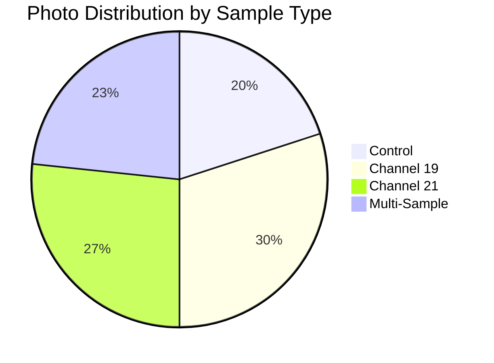
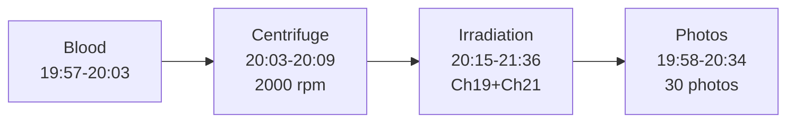

#  Patient 07 Photo Dataset / Фото Dataset Пациента 07

**Experiment Date:** 2026-02-07 | **Blood Group:** no data | **Total Photos:** 30

---

##  NAVIGATION

[Info / Инфо](#overview--обзор) | [Photos / Фото](#photos-30) | [Protocol / Протокол](../protocol_part-01.pdf) | [All Patients / Все Пациенты](../../README.md) | [Data Hub / Хаб Данных](../../README.md)

---

##  OVERVIEW / ОБЗОР

```mermaid
pie title Photo Distribution by Sample Type
    " Control" : 6
    " Channel 19" : 9
    " Channel 21" : 8
    " Multi-Sample" : 7
```

| Metric | Value |
|--------|-------|
| ** Photos** | 30 (largest) |
| ** Blood** | no data |
| ** Samples** | 6 |
| ** Duration** | ~1h 21min |

---

##  CHANNEL METRICS

### Photo Distribution Analysis

**Patient 07: Photos per Channel**

| Metric | Value |
|---|---|
|  Control | 6 |
|  Ch19 | 9 |
|  Ch21 | 8 |
| Multi | 7 |

### Timeline

```mermaid
flowchart LR
    A["Blood<br/>19:57-20:03"] --> B["Centrifuge<br/>20:03-20:09<br/>2000 rpm"]
    B --> C["Irradiation<br/>20:15-21:36<br/>Ch19+Ch21"]
    C --> D["Photos<br/>19:58-20:34<br/>30 photos"]
```

---

##  PHOTOS (30)

### Part 1 (14 photos)

| # | File | Time | Samples | Preview |
|---|------|------|---------|---------|
| 1 | `IMG_3327` | 19:58:17 | — |  |
| 2 | `IMG_3328` | 19:59:42 | 19.7.1, 21.7.1 |  |
| 3 | `IMG_3329.HEIC` | 20:01:42 | — |  |
| 4 | `IMG_3330.HEIC` | 20:01:12 | — |  |
| 5 | `IMG_3331.HEIC` | 20:00:45 | 19.7.1 |  |
| 6 | `IMG_3332.HEIC` | 20:03:46 | — |  |
| 7 | `IMG_3333.HEIC` | 20:03:37 | — |  |
| 8 | `IMG_3334.HEIC` | 20:02:26 | 19.7.2 |  |
| 9 | `IMG_3335.HEIC` | 20:06:30 | — |  |
| 10 | `IMG_3336.HEIC` | 20:06:22 | — |  |
| 11 | `IMG_3337.HEIC` | 20:06:38 | 21.7.1 |  |
| 12 | `IMG_3338.HEIC` | 20:05:29 | — |  |
| 13 | `IMG_3339.HEIC` | 20:05:16 | — |  |
| 14 | `IMG_3340.HEIC` | 20:05:04 | 21.7.2 |  |

### Part 2 (16 photos)

| # | File | Time | Samples | Preview |
|---|------|------|---------|---------|
| 15 | `IMG_3341.HEIC` | 20:09:55 | — |  |
| 16 | `IMG_3342.HEIC` | 20:09:35 | — |  |
| 17 | `IMG_3343.HEIC` | 20:09:41 | — |  |
| 18 | `IMG_3344.HEIC` | 20:10:01 | 0.7.1 |  |
| 19 | `IMG_3345.HEIC` | 20:09:06 | — |  |
| 20 | `IMG_3346.HEIC` | 20:08:06 | — |  |
| 21 | `IMG_3347.HEIC` | 20:07:48 | — |  |
| 22 | `IMG_3348.HEIC` | 20:08:19 | — |  |
| 23 | `IMG_3349.HEIC` | 20:07:58 | 0.7.2 |  |
| 24 | `IMG_3350.HEIC` | 20:14:07 | — |  |
| 25 | `IMG_3351.HEIC` | 20:11:26 | — |  |
| 26 | `IMG_3352` | 20:12:07 | All 6 |  |
| 27 | `IMG_3353.HEIC` | 20:30:48 | — |  |
| 28 | `IMG_3354.HEIC` | 20:32:52 | — |  |
| 29 | `IMG_3355.HEIC` | 20:34:10 | — |  |
| 30 | `IMG_3356.HEIC` | 20:34:35 | 19.7.1, 19.7.2, 21.7.1, 21.7.2 |  |

---

##  OTHERS

[P01](../../patient-01/) | [P02](../../patient-02/) | [P03](../../patient-03/) | [P04](../../patient-04/) | [P05](../../patient-05/) | [P06](../../patient-06/)

---

**Last Updated:** 2026-03-26
