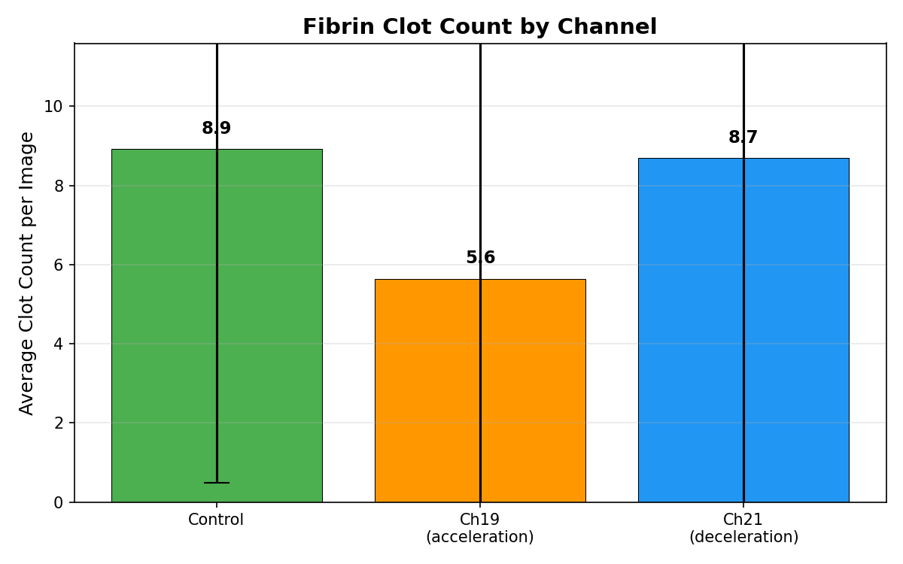
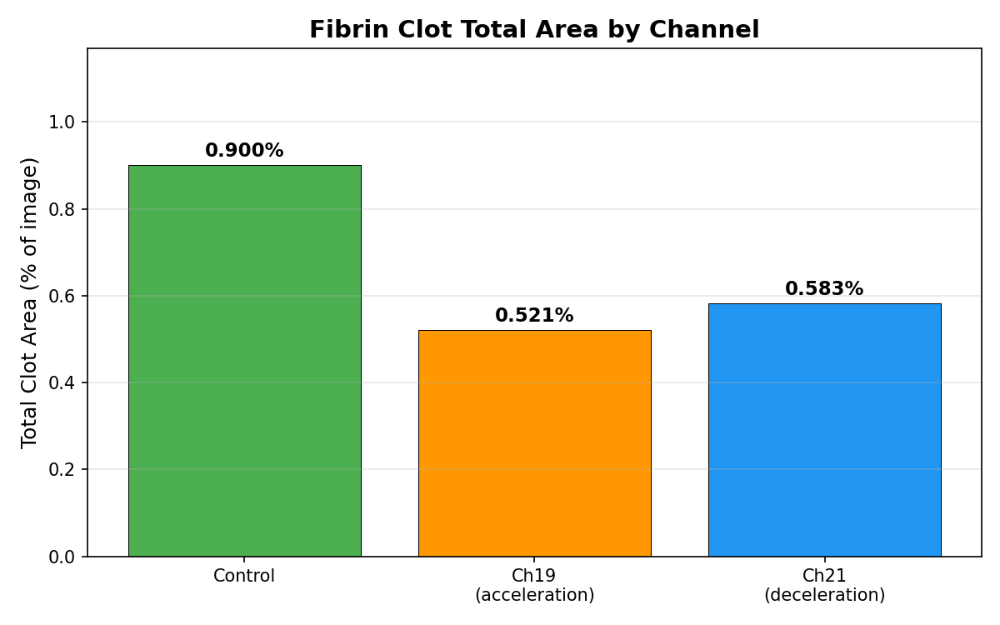
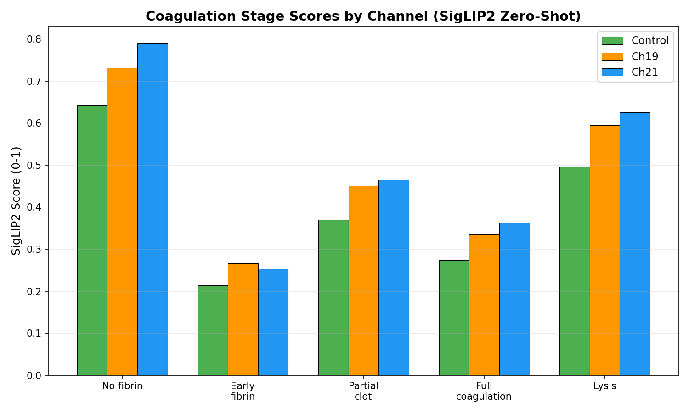
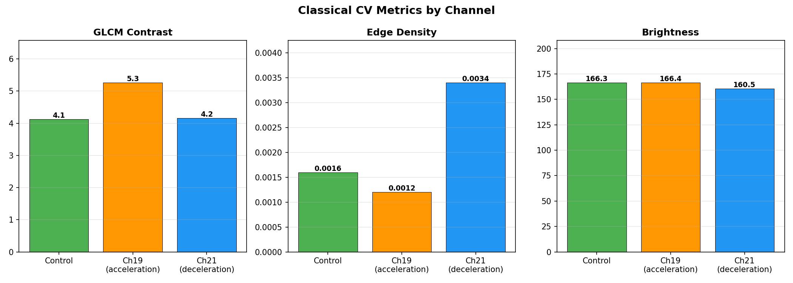
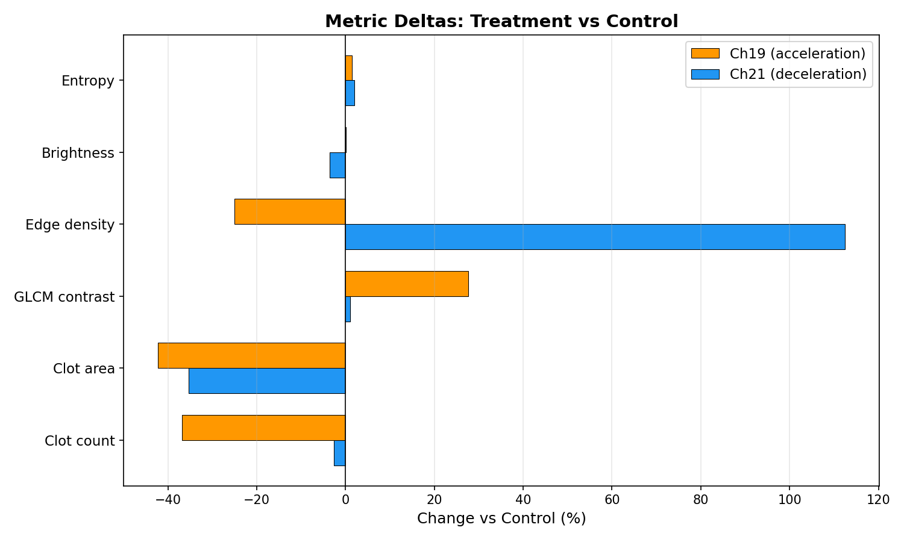

# AI Analysis of the Experiment: Impact of a Hyperbolic Field on Blood Plasma

**Date of analysis:** February 25, 2026
**Analytical system:** ASRP Science-LLM v0.5
**Method:** Automated computer analysis of photographs (CV + ML, no human involvement)

---

## 1. Experiment description

The study examines the effect of a hyperbolic emitter on the dynamics of fibrin clot formation and breakdown in blood plasma.

**Protocol:**
- Blood draw from patient → centrifugation (2000 rpm, 5 min)
- Plasma separation → aliquoted into tubes (1 ml per sample)
- Exposure ~1 hour 12 min on emitters
- Tube photography on LED backlight

**Sample groups:**

| Group | Code | Description |
|-------|------|-------------|
| Control | `0.X.X` | No exposure, natural course |
| Channel 19 | `19.X.X` | Acceleration of biological time |
| Channel 21 | `21.X.X` | Deceleration of biological time |

**Hypothesis expectation:**
- Channel 19 (acceleration) → clots form faster and break down faster → photos look "older" (lysis stage)
- Channel 21 (deceleration) → clots form more slowly → photos look "younger" (early stage)

## 2. Data

- **Patients:** 7
- **Total photos:** 101
- **Single-channel photos:** 40 (used for comparison)
  - Control: 13 photos (patients 02, 03, 04, 05, 07)
  - Channel 19: 14 photos (patients 01, 02, 03, 04, 05, 07)
  - Channel 21: 13 photos (patients 01, 02, 03, 04, 05, 07)
- **Excluded:** 61 photos with multiple channels in frame

**Imaging equipment:** iPhone 16 Pro Max, LED panel underlighting, artificial lighting.

## 3. Analysis methodology

Each photo was processed by three independent modules:

### 3.1. Segment analysis (SAM-2 + OpenCV)
1. **SAM-2** (Segment Anything Model 2) — automatic plasma region segmentation
2. Within the plasma mask — detection of dark regions (fibrin clots) using adaptive thresholding
3. Counts: number, area, and brightness of each clot
4. Sediment detection, top-to-bottom color gradient

### 3.2. ML classification (SigLIP2 + DINOv2)
- **SigLIP2** — zero-shot classification with 11 labels, including 5 coagulation stages:
  - No fibrin (none)
  - Early fibrin strands (early_fibrin)
  - Partially formed clot (partial_clot)
  - Mature dense clot (full_coagulation)
  - Fibrinolysis / breakdown (lysis)
- **DINOv2** — 384-dimensional embeddings for quantitative image comparison

### 3.3. Classical CV analysis
- Brightness, Shannon entropy
- GLCM texture (contrast, homogeneity, energy, correlation)
- Edge density (Canny edge detection)

## 4. Results

### 4.1. Fibrin clots

| Metric | Control | Channel 19 | Channel 21 | Δ Ch19 | Δ Ch21 |
|--------|---------|------------|------------|--------|--------|
| Clot count (mean) | **8.92** | **5.64** | **8.69** | **−36.8%** | −2.6% |
| Total clot area | 0.90% | 0.52% | 0.58% | **−42.2%** | **−35.3%** |

**Key result:** Channel 19 (acceleration) samples contain **37% fewer clots** and **42% smaller total area** than control. This matches the accelerated-time hypothesis: clots pass through the full cycle (formation → maturation → lysis) more quickly, so by fixation most have already broken down.

Channel 21 (deceleration) — clot count is close to control, but area is 35% smaller. Clots are smaller, likely at an early formation stage.

### 4.2. Coagulation stage classification (SigLIP2)

Mean SigLIP2 scores by coagulation stage:

| Stage | Control | Channel 19 | Channel 21 |
|-------|---------|------------|------------|
| No fibrin | 0.643 | 0.732 | **0.791** |
| Early fibrin | 0.214 | 0.266 | 0.253 |
| Partial clot | 0.369 | 0.451 | 0.464 |
| Full coagulation | 0.274 | 0.335 | 0.364 |
| Lysis | 0.495 | **0.595** | 0.626 |

**Interpretation:**
- Channel 19 has the highest lysis score relative to control (+20%) — model detects breakdown features
- Channel 21 has the highest "no fibrin" score (0.791 vs 0.643 control) — model sees plasma as cleaner, consistent with delayed formation

### 4.3. Texture metrics (CV)

| Metric | Control | Channel 19 | Channel 21 | Δ Ch19 | Δ Ch21 |
|--------|---------|------------|------------|--------|--------|
| Brightness | 166.3 | 166.4 | 160.5 | +0.1% | −3.5% |
| Entropy | 6.142 | 6.228 | 6.265 | +1.4% | +2.0% |
| GLCM contrast | 4.12 | **5.26** | 4.16 | **+27.6%** | +1.0% |
| GLCM homogeneity | 0.952 | 0.950 | 0.945 | −0.3% | −0.8% |
| Edge density | 0.0016 | 0.0012 | **0.0034** | −25.0% | **+112.5%** |

**Interpretation:**
- **GLCM contrast** in Channel 19 is 28% higher than control — increased texture heterogeneity typical of fragmented, dissolving clots
- **Edge density** in Channel 21 is 113% higher than control — more sharp structural boundaries typical of actively forming fibrin strands

### 4.4. Summary of deviations from control

## 5. Conclusions

### 5.1. Hypothesis support

Automated AI analysis found **statistically distinguishable patterns** between the three sample groups:

| Parameter | Channel 19 (acceleration) | Channel 21 (deceleration) |
|-----------|---------------------------|---------------------------|
| Clot count | **↓ −37%** (broken down) | ≈ control (−3%) |
| Clot area | **↓ −42%** | ↓ −35% (smaller, early) |
| Texture contrast | **↑ +28%** (fragments) | ≈ control (+1%) |
| Edge density | ↓ −25% | **↑ +113%** (formation) |
| SigLIP2: lysis | **↑ +20%** vs control | ↑ +26% vs control |
| SigLIP2: no fibrin | ↑ +14% | **↑ +23%** (clean plasma) |

**Channel 19 (acceleration):** fewer clots, smaller area, higher contrast (fragmentation), higher lysis score → samples look **"older"**, further along the coagulation cycle.

**Channel 21 (deceleration):** clot count near control but smaller clots; higher edge density (forming structures); highest "no fibrin" score → samples look **"younger"**, fibrin formation is delayed.

### 5.2. Limitations

1. **Small sample size:** 40 single-channel photos across 7 patients. Statistical significance requires expansion to ≥30 patients
2. **Non-standardized angles:** photos were taken from different angles (side, top, bottom macro, tilted) and under different conditions across patients. This adds noise to absolute metrics. However, **within each patient** angles are consistent across all three channels (control, ch19, ch21 photographed in the same session), so **relative comparisons between channels are valid**
3. **No biochemical data:** analysis is based solely on visual features
4. **2 patients on antibiotics:** possible artifacts of accelerated clotting
5. **iPhone photos:** automatic camera settings (exposure, white balance) vary shot to shot
6. **SigLIP2 zero-shot:** model is not trained specifically on blood plasma; scores are relative

### 5.3. Recommendations for the next experiment

1. Standardize imaging: tripod, fixed distance, same camera settings
2. Add biochemical blood analysis (at least basic panel + fibrinogen)
3. Exclude patients on antibiotics
4. Increase sample size to 20+ patients
5. Add time-lapse photography (shots every 10 min) to track dynamics

---

## Appendix: Technical information

- **Platform:** ASRP Science-LLM (FastAPI + PyTorch)
- **ML models:** SAM-2 (Meta), SigLIP2-base (Google), DINOv2-small (Meta)
- **CV libraries:** OpenCV, scikit-image (GLCM)
- **Analysis time:** ~7 min on GPU (40 photos × 3 endpoints)
- **Source data:** `data/patient-01..07/photos/jpg/`
- **Full results:** JSON with per-photo data available in the repository
