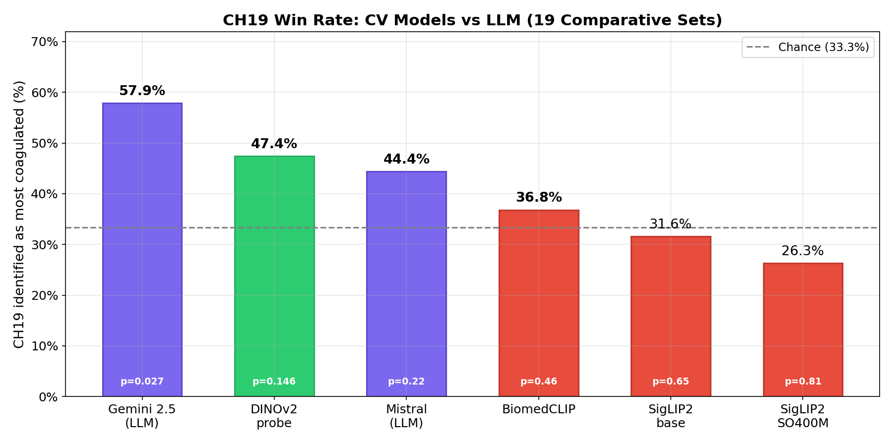
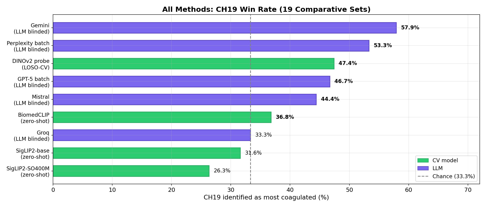
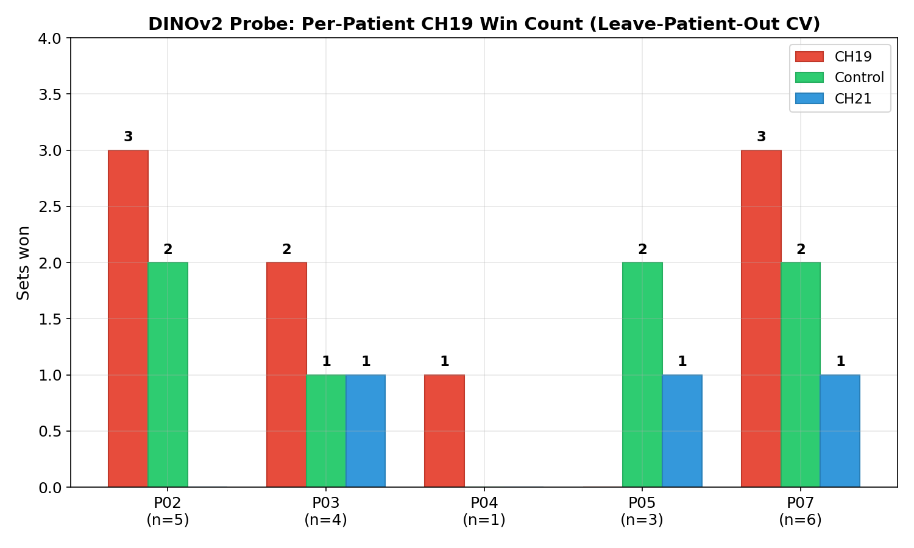
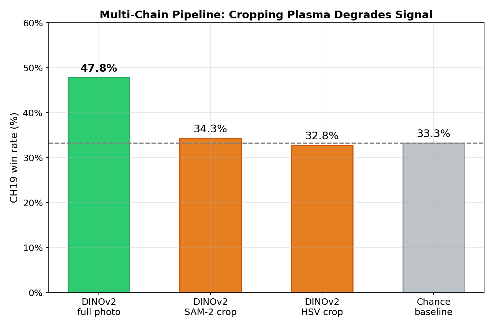

# Анализ компьютерного зрения и ML моделей: коагуляция плазмы крови

**Дата**: 2026-03-14
**Датасет**: 101 фотография, 7 доноров (67 одноканальных, 34 мультитрубочных)
**GPU**: NVIDIA RTX 3060 Laptop (6 ГБ VRAM)
**Предыдущий анализ**: [Мультипровайдерный LLM анализ](../2026-03-12_comparative-llm-analysis/report_ru.md)

---

## 1. Мотивация

[LLM-отчёт](../2026-03-12_comparative-llm-analysis/report_ru.md) показал, что большие языковые модели (Gemini 57.9%, Mistral 44.4%) способны идентифицировать ch19 как наиболее коагулированный образец выше базового уровня случайности 33% в слепом сравнительном анализе по 19 наборам троек.

Данный отчёт исследует, могут ли **специализированные модели компьютерного зрения** — zero-shot классификаторы и экстракторы признаков — обнаружить те же различия. CV-модели детерминированы, быстрее и не требуют инженерии промптов.

Для прямой сравнимости используются те же **19 сравнительных наборов** (тройки control / ch19 / ch21 одного пациента) и тот же **попациентный батч-анализ**, что и в LLM-отчёте.

---

## 2. Методология

### 2.1. Датасет

| Канал | Описание | Одноканальные фото |
|-------|---------|:---:|
| Контроль (ch0) | Без воздействия гиперболического поля | 24 |
| CH19 | Ускорение времени | 23 |
| CH21 | Замедление времени | 20 |
| **Всего размеченных** | | **67** |

34 дополнительных мультитрубочных фото (несколько каналов на одном снимке) исключены из анализа.

Привязка каналов через поле `samples_shown` в [`processed/en/all_patients.json`](../../processed/en/all_patients.json).

### 2.2. Сравнительные наборы (19 троек)

Те же 19 наборов, что и в [LLM-отчёте](../2026-03-12_comparative-llm-analysis/report_ru.md), раздел 3.1:

| Пациент | Наборов | Индексы |
|---------|:---:|---------|
| P02 | 5 | 1–5 |
| P03 | 4 | 6–9 |
| P04 | 1 | 10 |
| P05 | 3 | 11–13 |
| P07 | 6 | 14–19 |

Каждый набор содержит по одному фото на канал (control, ch19, ch21) одного пациента. Модель с наивысшим скором коагуляции «побеждает» в наборе. **Процент побед ch19** — основная метрика, напрямую сравнимая с результатами LLM.

### 2.3. Стратегии анализа

1. **Zero-shot классификация** — модель получает изображение и 11 текстовых меток, описывающих состояния плазмы. Возвращает распределение вероятностей через softmax. **Скор коагуляции** = сумма вероятностей для меток со сгустками/фибрином. Обучение не требуется.

2. **Линейная проба (DINOv2)** — замороженный DINOv2-large извлекает 1024-мерные эмбеддинги. Поверх обучается логистическая регрессия. Веса DINOv2 **не дообучаются** — обучается только линейный классификатор. Оценка: **leave-one-set-out CV** — для каждого из 19 наборов проба обучается на остальных 64 фото и тестируется на 3 отложенных.

3. **Multi-chain pipeline** — SAM-2 сегментирует область плазмы → кроп → DINOv2/SigLIP2 только на вырезанной плазме.

### 2.4. Набор меток (Zero-Shot модели)

11 меток, покрывающих спектр коагуляции:

| Метка | Категория |
|-------|----------|
| clear transparent blood plasma | Нет коагуляции |
| normal blood plasma sample | Нет коагуляции |
| blood plasma with no fibrin formation | Нет коагуляции |
| turbid cloudy blood plasma | Неоднозначно |
| blood plasma with sediment | Неоднозначно |
| hemolyzed blood plasma | Неоднозначно |
| blood plasma with early fibrin strand formation | Коагуляция |
| blood plasma with partially formed fibrin clot | Коагуляция |
| blood plasma with dense mature fibrin clot | Коагуляция |
| blood plasma showing fibrinolysis with dissolving clot | Коагуляция |
| blood plasma with fibrin clots | Коагуляция |

Формат промпта: `"A photo of {label}"`.

---

## 3. Модели

| Модель | Параметры | Тип | Вход | Источник |
|--------|:---:|------|:---:|----------|
| [SigLIP2-base](https://huggingface.co/google/siglip2-base-patch16-224) | 86M | Zero-shot CLIP | 224px | Google |
| [SigLIP2-SO400M](https://huggingface.co/google/siglip2-so400m-patch14-384) | 400M | Zero-shot CLIP | 384px | Google |
| [BiomedCLIP](https://huggingface.co/microsoft/BiomedCLIP-PubMedBERT_256-vit_base_patch16_224) | 200M | Zero-shot CLIP | 224px | Microsoft |
| [MedSigLIP](https://huggingface.co/google/medsiglip-448) | 800M | Zero-shot CLIP | 448px | Google |
| [DINOv2-large](https://huggingface.co/facebook/dinov2-large) | 307M | Экстрактор + проба | 518px | Meta |

**SigLIP2** — вариант CLIP от Google с sigmoid loss. Тестировались Base (86M) и SO400M (400M, в 5 раз больше).

**BiomedCLIP** — CLIP от Microsoft, дообученный на биомедицинских парах изображение-текст из PubMed (датасет PMC-15M).

**MedSigLIP** — медицинский SigLIP от Google, обученный на КТ, МРТ, рентгенах и гистопатологии.

**DINOv2** — self-supervised vision transformer от Meta. Генерирует 1024-мерные эмбеддинги без текстовых промптов. Веса заморожены; обучается только логистическая регрессия поверх эмбеддингов.

---

## 4. Сравнительные результаты (19 наборов)

Для каждого из 19 наборов фото с наивысшим скором коагуляции (zero-shot) или наибольшей вероятностью ch19 (DINOv2 проба) считается «победителем».

### 4.1. DINOv2-large проба (Leave-One-Set-Out CV)

Для каждого набора проба обучается на всех размеченных фото, **кроме** 3 из этого набора — исключая утечку данных.

| Набор | Пациент | ctrl | ch19 | ch21 | Победитель |
|:---:|:---:|:---:|:---:|:---:|-----------|
| 1 | P02 | 0.8881 | **0.9170** | 0.6405 | **ch19** |
| 2 | P02 | 0.0289 | **0.9657** | 0.2113 | **ch19** |
| 3 | P02 | **0.9889** | 0.9855 | 0.5402 | control |
| 4 | P02 | **0.9433** | 0.1960 | 0.9040 | control |
| 5 | P02 | **0.1490** | 0.0532 | 0.0083 | control |
| 6 | P03 | 0.0001 | **0.9633** | 0.1489 | **ch19** |
| 7 | P03 | **0.9791** | 0.7123 | 0.9243 | control |
| 8 | P03 | 0.0000 | 0.5329 | **0.8234** | ch21 |
| 9 | P03 | 0.0287 | **0.9664** | 0.0786 | **ch19** |
| 10 | P04 | 0.0866 | **0.2720** | 0.0524 | **ch19** |
| 11 | P05 | 0.0021 | 0.2765 | **0.8542** | ch21 |
| 12 | P05 | **0.8087** | 0.2150 | 0.3987 | control |
| 13 | P05 | 0.6173 | 0.0018 | **0.7872** | ch21 |
| 14 | P07 | 0.4001 | 0.5597 | **0.9179** | ch21 |
| 15 | P07 | 0.2325 | **0.8625** | 0.8530 | **ch19** |
| 16 | P07 | 0.0797 | **0.8843** | 0.0669 | **ch19** |
| 17 | P07 | **0.5058** | 0.0246 | 0.0001 | control |
| 18 | P07 | 0.0173 | **0.7998** | 0.0278 | **ch19** |
| 19 | P07 | 0.0055 | **0.4184** | 0.0513 | **ch19** |

**Результат: ch19 = 9/19 (47.4%)**, ch21 = 4/19 (21.1%), control = 6/19 (31.6%).

Стабильность: 10 различных random seed дают одинаковый результат 9/19 (логистическая регрессия детерминирована при одинаковом разбиении данных).

### 4.2. Zero-Shot модели

| Набор | Пациент | SigLIP2-base | SigLIP2-SO400M | BiomedCLIP |
|:---:|:---:|:---:|:---:|:---:|
| 1 | P02 | control | ch21 | ch21 |
| 2 | P02 | control | control | ch21 |
| 3 | P02 | control | control | control |
| 4 | P02 | ch21 | **ch19** | **ch19** |
| 5 | P02 | **ch19** | ch21 | ch21 |
| 6 | P03 | **ch19** | control | **ch19** |
| 7 | P03 | **ch19** | **ch19** | ch21 |
| 8 | P03 | control | ch21 | control |
| 9 | P03 | ch21 | ch21 | **ch19** |
| 10 | P04 | ch21 | ch21 | control |
| 11 | P05 | ch21 | ch21 | ch21 |
| 12 | P05 | control | control | **ch19** |
| 13 | P05 | control | ch21 | control |
| 14 | P07 | control | ch21 | control |
| 15 | P07 | **ch19** | **ch19** | control |
| 16 | P07 | **ch19** | **ch19** | **ch19** |
| 17 | P07 | **ch19** | **ch19** | **ch19** |
| 18 | P07 | ch21 | ch21 | **ch19** |
| 19 | P07 | control | control | control |

| Модель | ch19 побед | ch21 побед | ctrl побед | ch19 % |
|--------|:---:|:---:|:---:|:---:|
| **SigLIP2-base** | 6/19 | 5/19 | 8/19 | 31.6% |
| **SigLIP2-SO400M** | 5/19 | 9/19 | 5/19 | 26.3% |
| **BiomedCLIP** | 7/19 | 5/19 | 7/19 | 36.8% |

Все zero-shot модели на уровне или ниже базового шанса 33%. SigLIP2-SO400M показывает **смещение в сторону ch21** (47.4%) вместо детекции ch19.

### 4.3. Сводное сравнение

| Модель | ch19 побед | ch19 % | vs Шанс |
|--------|:---:|:---:|:---:|
| **Gemini 2.5 Flash** (LLM) | 11/19 | **57.9%** | +24.6 пп |
| **DINOv2-large проба** (LOSO-CV) | 9/19 | **47.4%** | +14.1 пп |
| **Mistral Pixtral** (LLM) | 8/18 | **44.4%** | +11.1 пп |
| BiomedCLIP | 7/19 | 36.8% | +3.5 пп |
| SigLIP2-base | 6/19 | 31.6% | −1.7 пп |
| SigLIP2-SO400M | 5/19 | 26.3% | −7.0 пп |
| Базовый шанс | — | 33.3% | — |

---

## 5. Батч-анализ: попациентный вердикт

Аналогично батч-режиму LLM ([LLM-отчёт](../2026-03-12_comparative-llm-analysis/report_ru.md), раздел 4), где все фото пациентов оценивались одновременно.

Для DINOv2 используется **leave-patient-out CV**: проба обучается на фото остальных 4 пациентов и предсказывает на отложенном пациенте. Это обеспечивает полную независимость обучающих и тестовых данных.

### 5.1. Результаты по пациентам

| Пациент | Наборов | DINOv2 (leave-patient-out) | SigLIP2-base | SigLIP2-SO400M | BiomedCLIP |
|---------|:---:|:---:|:---:|:---:|:---:|
| P02 | 5 | **3/5 (60%)** | 1/5 (20%) | 1/5 (20%) | 1/5 (20%) |
| P03 | 4 | 2/4 (50%) | 2/4 (50%) | 1/4 (25%) | 2/4 (50%) |
| P04 | 1 | **1/1 (100%)** | 0/1 (0%) | 0/1 (0%) | 0/1 (0%) |
| P05 | 3 | 0/3 (0%) | 0/3 (0%) | 0/3 (0%) | 1/3 (33%) |
| P07 | 6 | **3/6 (50%)** | 3/6 (50%) | 3/6 (50%) | 3/6 (50%) |

### 5.2. Сводка

| Модель | Всего ch19 | ch19 % | Пациенты с большинством ch19 |
|--------|:---:|:---:|:---:|
| **DINOv2-large** (leave-patient-out) | 9/19 | **47.4%** | **2/5** (P02, P04) |
| BiomedCLIP | 7/19 | 36.8% | 0/5 |
| SigLIP2-base | 6/19 | 31.6% | 0/5 |
| SigLIP2-SO400M | 5/19 | 26.3% | 0/5 |

DINOv2 — единственная CV-модель, где ch19 побеждает в большинстве наборов хотя бы у одного пациента. Zero-shot модели не достигают большинства ch19 ни для одного пациента.

Для справки, LLM батч-анализ ([LLM-отчёт](../2026-03-12_comparative-llm-analysis/report_ru.md), раздел 4.2): GPT-5 слепой батч = 46.7%, Perplexity слепой батч = 53.3%.

### 5.3. Аномалия P05

Все модели дают 0% ch19 для P05 (3 набора). У этого пациента могут быть более слабые визуальные различия между каналами или мешающие факторы (освещение, время). P05 сложен и для LLM — Gemini набрал 33% (1/3) по P05, ниже общего показателя 57.9%.

---

## 6. Статистическая значимость

Биномиальный тест (H₀: процент побед ch19 = 33.3%, односторонний):

| Модель | ch19 побед | p-value | Значимость |
|--------|:---:|:---:|:---:|
| **DINOv2-large проба** | 9/19 (47.4%) | 0.1462 | не значимо |
| BiomedCLIP | 7/19 (36.8%) | 0.4569 | не значимо |
| SigLIP2-base | 6/19 (31.6%) | 0.6481 | не значимо |
| SigLIP2-SO400M | 5/19 (26.3%) | 0.8121 | не значимо |

**Ни одна CV-модель не достигает статистической значимости** при p < 0.05. DINOv2 с 47.4% (p = 0.15) ближе всего, но при всего 19 наборах даже реальный эффект в 47% не может достичь значимости — выборка слишком мала.

Для сравнения: Gemini с 11/19 (57.9%) даёт p = 0.027 (значимо на уровне 5%). LLM-анализ компенсирует малое число наборов многократным повторением (3 прогона × 19 наборов = 57 вердиктов для Groq/GPT-5).

### 6.1. Стабильность DINOv2 пробы

10 различных random seed для логистической регрессии дают идентичный результат: **9/19** (47.4%). Проба детерминирована — сигнал стабилен, но слаб.

### 6.2. 47.4% — это реальный сигнал или случайность?

Аргументы **за** реальный сигнал:
- 47.4% на 14.1 пп выше шанса — не тривиально
- Результат абсолютно стабилен при разных seed
- DINOv2 — единственная модель с сигналом; zero-shot модели кластеризуются на 26–37%
- Leave-one-set-out CV исключает утечку данных

Аргументы **против**:
- p = 0.15 — не статистически значимо
- Всего 19 наборов — недостаточная мощность для детекции умеренного эффекта
- Нет консистентного паттерна по пациентам (P05 = 0%, P02 = 60%)
- Эмбеддинги DINOv2 кодируют все визуальные признаки (освещение, положение пробирки, фон) — сигнал может быть не специфичен для коагуляции

**Вердикт**: DINOv2 проба детектирует **предположительный, но неубедительный** сигнал. Для подтверждения или опровержения эффекта необходимо больше данных (больше пациентов, больше фотографий).

---

## 7. Multi-chain pipeline: SAM-2 сегментация → извлечение признаков

### 7.1. Гипотеза

Стандартные CV-модели получают **полную фотографию** — пробирку, фон, этикетку, поверхность стола. Если предварительно сегментировать и вырезать область плазмы, экстракторы признаков должны получить более чистый сигнал.

### 7.2. Реализация

| Метод | Подход | Покрытие |
|-------|--------|:---:|
| **HSV пороговая** | Плазма определяется по цветовому диапазону (H:12–50, S:35–255, V:60–230), морфологическая очистка, наибольшая компонента | 98/98 (100%) |
| **SAM-2** | `facebook/sam2.1-hiera-tiny` генерация масок → выбор маски плазмы по HSV скорингу | ~70% (HSV fallback для остальных) |

После сегментации вырезается bounding box плазмы. Кроп подаётся в DINOv2-large (проба) и SigLIP2-SO400M (zero-shot).

### 7.3. Результаты

| Pipeline | Accuracy (5-fold CV) | vs Шанс |
|----------|:---:|:---:|
| DINOv2-large **полное фото** | **47.8%** | **+14.5 пп** |
| DINOv2-large **SAM-2 кроп** | 34.3% | +1.0 пп |
| DINOv2-large **HSV кроп** | 32.8% | −0.5 пп |
| Базовый шанс | 33.3% | — |

SigLIP2-SO400M на кропнутой плазме: нет дискриминации каналов (скоры коагуляции: control 0.31, ch19 0.28, ch21 0.34).

*Примечание: DINOv2 на полном фото показывает 47.8% (5-fold CV) vs 47.4% в секции 4.1 (leave-one-set-out CV) из-за разных границ фолдов. Обе схемы оценивают на отложенных данных без утечки.*

### 7.4. Почему multi-chain не помог

1. **Контекст пробирки несёт сигнал.** Проба на полном фото (47.8%) использует информацию о форме мениска, уровне жидкости, отражениях. Кропание удаляет этот контекст.
2. **Плазма в изоляции выглядит одинаково.** Тонкие различия между каналами исчезают, когда видна только область жидкости.
3. **Несоответствие домена.** Multi-chain pipeline работает для клинической визуализации (КТ/МРТ), где патология визуально отлична от окружающей ткани. Для фотографий пробирок ROI — почти однородная жидкость.

---

## 8. Ограничения

1. **Малый размер выборки**: 5 пациентов, 19 сравнительных наборов, 67 размеченных фото. Недостаточно для формальной статистической значимости при умеренных размерах эффекта.
2. **Нет экспертной верификации**: Нет оценки гематолога — метки коагуляции определены протоколом эксперимента, а не независимой клинической оценкой.
3. **Чувствительность к набору меток**: Результаты zero-shot зависят от выбранных 11 текстовых меток. Альтернативные формулировки систематически не тестировались.
4. **Ограничение GPU**: Все модели запускались на RTX 3060 Laptop (6 ГБ VRAM), что ограничивает тестируемые размеры моделей (например, SigLIP2-SO400M-896 исключён).
5. **MedSigLIP исключён**: Крупнейшая модель (800M) оказалась вне распределения для фотографий лабораторных пробирок, уменьшая число сравнимых моделей до 4.

---

## 9. Заключение

**Zero-shot CV-модели не различают экспериментальные каналы.** SigLIP2-base (31.6%), SigLIP2-SO400M (26.3%) и BiomedCLIP (36.8%) — все на уровне или ниже шанса на 19 сравнительных наборах. Увеличение модели в 5 раз или использование биомедицинского предобучения не помогает.

**DINOv2 линейная проба показывает предположительный сигнал** — 9/19 наборов (47.4%), выше шанса (33.3%), но не статистически значимо (p = 0.15). Результат стабилен при разных seed. Проба определяет ch19 как наиболее коагулированный у 2 из 5 пациентов (P02: 60%, P04: 100%), но полностью ошибается на P05 (0%).

**Multi-chain pipeline (SAM-2 → DINOv2) ухудшает результаты** с 47.8% до 34.3%. Контекст пробирки (мениск, отражения) вносит вклад в сигнал — кропание его удаляет.

**LLM превосходит CV-модели.** Gemini (57.9%, p = 0.027) — единственный метод, достигающий статистической значимости на 19 наборах. DINOv2 проба (47.4%) сопоставима с Mistral (44.4%) и GPT-5 батч (46.7%), но ни один из них не достигает значимости индивидуально.

**Совокупные данные**: Результат DINOv2 пробы согласуется с находками LLM — ch19 показывает повышенный сигнал коагуляции — но CV-модели в одиночку не могут подтвердить или количественно оценить этот эффект на текущем датасете из 67 фото.

---

## Файлы данных

| Файл | Содержимое |
|------|-----------|
| [`scripts/cv_analysis/ml_results/`](../../scripts/cv_analysis/ml_results/) | Результаты 4 базовых моделей (101 файл + `all_results.json`) |
| [`scripts/cv_analysis/ml_results_v2/siglip2_so400m.json`](../../scripts/cv_analysis/ml_results_v2/siglip2_so400m.json) | Zero-shot результаты SigLIP2-SO400M (98 фото) |
| [`scripts/cv_analysis/ml_results_v2/dinov2_large_probe.json`](../../scripts/cv_analysis/ml_results_v2/dinov2_large_probe.json) | Предсказания DINOv2-large пробы (98 фото) |
| [`scripts/cv_analysis/ml_results_v3_multichain/`](../../scripts/cv_analysis/ml_results_v3_multichain/) | Результаты multi-chain pipeline (SAM-2/HSV кроп → DINOv2/SigLIP2) |

### Скрипты

| Скрипт | Назначение |
|--------|-----------|
| [`scripts/cv_analysis/run_ml_models.py`](../../scripts/cv_analysis/run_ml_models.py) | Запуск 4 базовых моделей (DINOv2, SigLIP2, BiomedCLIP, MedSigLIP) |
| [`scripts/cv_analysis/run_upgraded_models.py`](../../scripts/cv_analysis/run_upgraded_models.py) | SigLIP2-SO400M + DINOv2-large линейная проба с анализом каналов |
| [`scripts/cv_analysis/run_multichain.py`](../../scripts/cv_analysis/run_multichain.py) | Multi-chain: SAM-2/HSV сегментация → DINOv2/SigLIP2 на кропе плазмы |
| [`scripts/cv_analysis/segment.py`](../../scripts/cv_analysis/segment.py) | SAM-2 сегментация + детекция маски плазмы + анализ сгустков |

### Исходные данные

- [`processed/en/all_patients.json`](../../processed/en/all_patients.json) — маппинг фото-канал (101 фото, 7 пациентов)
- [`data/patient-*/photos/jpg/`](../../data/) — оригинальные фотографии (3024x4032 JPEG)

### Зависимости

- Python окружение: `.venv-cv` (torch 2.7.1+cu118, scikit-learn 1.8.0)
- Обёртки моделей: [`scripts/cv_analysis/ml_models.py`](../../scripts/cv_analysis/ml_models.py) — DINOv2, SigLIP2, BiomedCLIP, MedSigLIP
